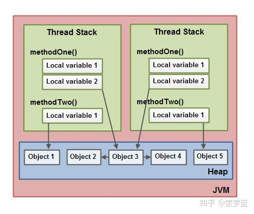

# 1、什么是JMM
Java Memory Model，java内存模型。

（图片来源：参考链接2，写的太好了，直接抄过来）


# 2、解决什么问题
用于模拟CPU真实处理数据交换，为了`消除`不同系统之间的`内存访问差异`（原理：系统不同，CPU结构大致相同）

（图片来源：参考链接1，写的太好了，直接抄过来）




如参考链接1所说：
* CPU数据流转，有寄存器 -> 缓存（L1,L2,L3） -> 主存。
* JMM数据流转，有 stack（线程工作内存） -> heap（JVM堆内存）。 

果然优秀的设计，都是`相似的`。

# 3、会带来什么问题
为了提升速度所以出现了一些存取数据不一致的问题，表现在Java里就是`线程安全`问题。

# 4、怎么解决上述问题

保证多线程共享内存：`3个原则`。

可见性：
```text
多线程操作线程工作内存（共享内存的副本）时，执行结果能及时同步到共享内存，确保其他多线程对此结果及时可见。
```
原子性：
```text
对共享内存的操作，要么不执行，要执行必须要全部执行结束，不能中途而废。
```
有序性：
```
单线程：程序的执行顺序按照代码顺序执行。、
多线程：几乎有序，但是JMM为了性能优化，允许指令重排序，可能会无序。
```

用什么保证3个原则：
* synchronized：
    * 同时保证以上三点，告诉程序，我这一组操作是一个操作，你CPU时间片内必须要把我这整组指令都做完才可以释放时间片。
* volatile:
    * 轻量级synchronized，告诉程序，`数据必须从内存里获取`，不走缓存！！这样就避免了寄存器缓存里有脏数据并且被其他线程获取的可能。
* Lock：
    * 并发包里面的东东
    

# 5、参考
* [知乎：由JMM看线程不安全的原因](https://zhuanlan.zhihu.com/p/70361897)
* [掘金: 图解Java线程安全](https://juejin.cn/post/6844903890224152584?share_token=5a50f615-9135-4e98-83a8-a062ff673f7b)

    
    
    