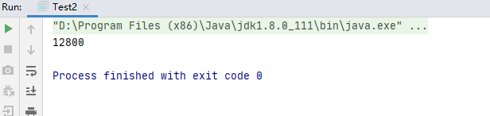
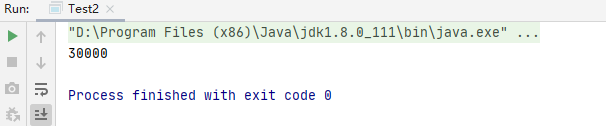
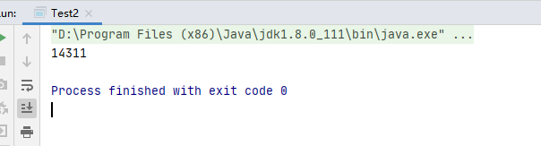
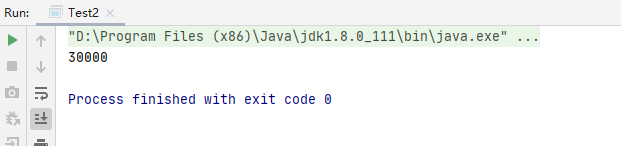
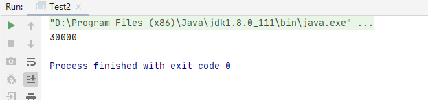

# 1、背景
嗯，最近我面试一个候选人，因为他不是搞web的，对中间件，spring都不熟，那么我就想，考察考察线程吧，这个总不能不熟吧。

面试题：帮忙写个程序，让3个线程各自累加10000（这个数字不能小，小了容易隐藏问题）。

# 2、解法1
```java
public class Test2 {
    private static int cnt = 0;
    public static void main(String[] args) {

        int threadNum = 3;
        Thread[] threads = new Thread[threadNum];
        for (int i = 0; i < threadNum; i++) {

            Thread t1 = new Thread(()->{
                for (int j = 0; j < 10000; j++) {
                    cnt ++;
                }
            });
            threads[i] = t1;
        }

        for (int i = 0; i < threadNum; i++) {
            threads[i].start();
        }

        for (int i = 0; i < threadNum; i++) {
            try {
                threads[i].join();
            } catch (InterruptedException e) {
                e.printStackTrace();
            }
        }
        System.out.println(cnt);
    }
}
```

结果：



明显候选人慌了，为啥不是30000，而是12800, 看来他对于共享内存这一套的坑，没踩过啊。

# 3、解法2
```java
public class Test2 {
    private static int cnt = 0;

    public static void main(String[] args) {

        int threadNum = 3;
        Thread[] threads = new Thread[threadNum];
        for (int i = 0; i < threadNum; i++) {

            Thread t1 = new Thread(() -> {
                synchronized (Test2.class) {
                    for (int j = 0; j < 10000; j++) {
                        cnt++;
                    }
                }
            });
            threads[i] = t1;
        }

        for (int i = 0; i < threadNum; i++) {
            threads[i].start();
        }

        for (int i = 0; i < threadNum; i++) {
            try {
                threads[i].join();
            } catch (InterruptedException e) {
                e.printStackTrace();
            }
        }
        System.out.println(cnt);
    }
}

```

结果：



这次舒了口气，总算是对了，毕竟加上了 `synchronized`。

但是我追问，能不能不用 `synchronized`呢？

# 4、解法3
他试了下，去掉了`synchronized`，改用`volatile`，看来这位候选人还是有一定的技术积累的。

```java
public class Test2 {
    private static volatile int cnt = 0;

    public static void main(String[] args) {

        int threadNum = 3;
        Thread[] threads = new Thread[threadNum];
        for (int i = 0; i < threadNum; i++) {

            Thread t1 = new Thread(() -> {
                for (int j = 0; j < 10000; j++) {
                    cnt++;
                }
            });
            threads[i] = t1;
        }

        for (int i = 0; i < threadNum; i++) {
            threads[i].start();
        }

        for (int i = 0; i < threadNum; i++) {
            try {
                threads[i].join();
            } catch (InterruptedException e) {
                e.printStackTrace();
            }
        }
        System.out.println(cnt);
    }
}
```
但很可惜，结果错了：



我追问他，你觉得是什么原因，`volatile`保证的是什么？
他说：`可见性`和`有序性`，禁止指令重排序什么的。

但是对于复合指令（如i++），它执行一半就跑去别的线程执行了，这怎么说理去？

我说，别想了，单靠 `volatile` 做不出这道题的。

# 5、解法4

```java
import java.util.concurrent.atomic.AtomicInteger;

public class Test2 {
    private static AtomicInteger atomicInteger = new AtomicInteger();

    public static void main(String[] args) {

        int threadNum = 3;
        Thread[] threads = new Thread[threadNum];
        for (int i = 0; i < threadNum; i++) {

            Thread t1 = new Thread(() -> {
                for (int j = 0; j < 10000; j++) {
                    atomicInteger.getAndIncrement();
                }
            });
            threads[i] = t1;
        }

        for (int i = 0; i < threadNum; i++) {
            threads[i].start();
        }

        for (int i = 0; i < threadNum; i++) {
            try {
                threads[i].join();
            } catch (InterruptedException e) {
                e.printStackTrace();
            }
        }
        System.out.println(atomicInteger.get());
    }
}
```
结果：



并发包的`AtomicInteger`有点意思，可行，这个本质上也是轻量级锁：CAS。

CAS保证了`串行操作`。

# 6、解法5
```java
import java.util.concurrent.locks.ReentrantReadWriteLock;

public class Test2 {
    private static ReentrantReadWriteLock lock = new ReentrantReadWriteLock();
    private static int cnt = 0;

    public static void main(String[] args) {
        ReentrantReadWriteLock.WriteLock writeLock = lock.writeLock();

        int threadNum = 3;
        Thread[] threads = new Thread[threadNum];
        for (int i = 0; i < threadNum; i++) {

            Thread t1 = new Thread(() -> {
                for (int j = 0; j < 10000; j++) {
                    writeLock.lock();
                    cnt++;
                    writeLock.unlock();
                }
            });
            threads[i] = t1;
        }

        for (int i = 0; i < threadNum; i++) {
            threads[i].start();
        }

        for (int i = 0; i < threadNum; i++) {
            try {
                threads[i].join();
            } catch (InterruptedException e) {
                e.printStackTrace();
            }
        }
        System.out.println(cnt);
    }
}
```
输出结果：



并发包的`ReentrantReadWriteLock`也是可行的，据说哈，JDK1.6后，`synchronized`和`ReentrantReadWriteLock` 性能差不多。

这个`ReentrantReadWriteLock`本质上也是一个CAS。

`synchronized` 逼急了，还能`锁升级`，请内核爸爸来处理，这一点比并发包的锁强一些。

# 7、总结下
基本上用`synchronized` 和 `AtomicInteger` 和 `ReentrantReadWriteLock` 都算是过关。

这道题明显用 `AtomicInteger` 是最佳实践。

# 8、打个小广告

* 更多的synchronized知识可以看 [synchronized是什么](https://fatpo.github.io/#/JVM/Java线程/synchronized是什么)。
* 更多的volatile知识可以看 [volatile是什么](https://fatpo.github.io/#/JVM/Java线程/volatile是什么)