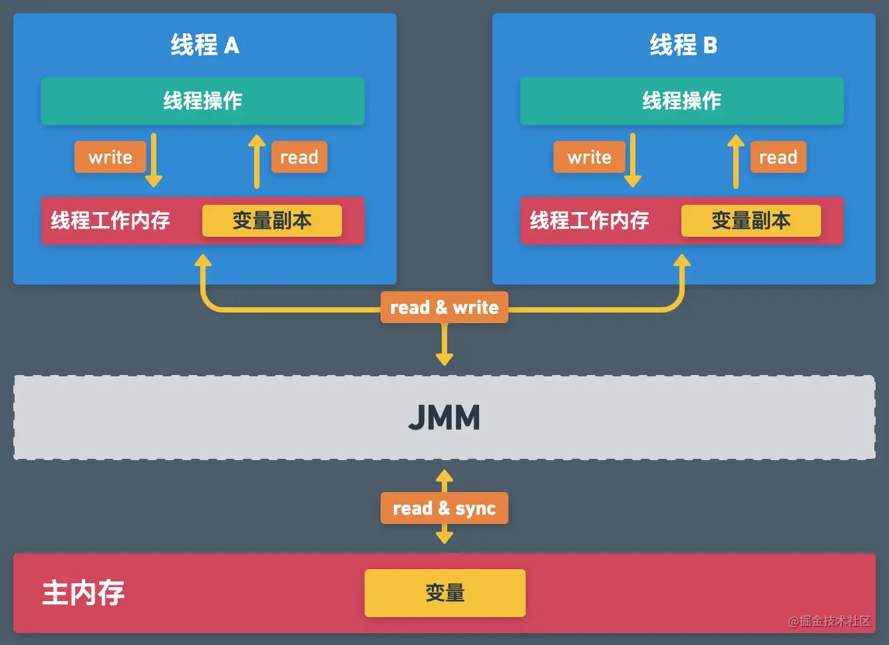

# 1、Java线程

## 1.1、简单聊聊线程与进程
教科书上最经典的话：
```
进程是资源分配的最小单位，线程是CPU调度的最小单位。
```
我们想想，实际上不用线程是不是也可以，`是的`。

光靠进程也能满足很多的业务。

但是`慢`啊，因为进程切换来切换去，内核做的事，比线程切换多得多，所以慢。

感兴趣的话可以看看国哥写的另外一篇，Linux线程状态图，[传送门](https://fatpo.github.io/#/并发编程/线程/Linux线程状态转移图) 。

## 1.2、简单聊聊java线程模型

要了解Java的线程，需要知道内核的线程，Java线程和操作系统内核的线程是什么关系？

* KLT(Kernel Level Threads)：
    * 操作系统内核提供一个应用程序设计接口API，供开发者使用KLT
    * 凡事用到线程的地方就切换用户态到内核态，让内核来处理
    * `java线程就采用KLT`，因为只需要调用API，代码简单，跨平台
* ULT(User Level Threads)：
    * 不用切换用户态到内核态，速度快
    * 要自己控制线程的各个状态流转，代码麻烦
    * 不同操作系统，要自己写不同的ULT代码

具体看国哥写的另外一篇线程模型的笔记：[传送门](https://fatpo.github.io/#/并发编程/线程/线程模型KLT和ULT)


# 2、JMM（Java内存模型） 

Java Memory Model，Java内存模型。

（图片来源参考链接1，画的太好了，情不自禁就抄过来。）



JMM算是个逻辑概念，并没有这么一个具体的东西。

它也不算是一个模型，严格上来说是一个`标准`，不同的厂商有不同的实现，比如openJdk，oracleJdk实现不同。

直接目标是：
```text
屏蔽了各种硬件和操作系统的访问差异的，保证了Java程序在各种平台下对内存的访问都能保证效果一致的机制及规范。
```

更多JMM的介绍，国哥另外一篇笔记有提到：[JMM内存模型](https://fatpo.github.io/#/JVM/JVM整体架构/JMM内存模型) 。

我们需要知道的一点，JMM模型为了提升速度所以出现了一些存取数据不一致的问题，可能会导致`线程不安全`。

# 3、线程安全的本质

国哥自己总结过，线程安全的本质，就一句话：`操作共享内存时，不是串行操作，导致运算结果不符合预期`。

嗯，这句话是自己瞎想的，看了很多技术文章，讲了一大堆，但`国哥自己认为`哈，本质就这句话。

你想想看嘛，同时处理同一个东东，`安全和性能肯定是牺牲一个`的。

那个经典多线程累加的例子我就不举了，在国哥的笔记中有提到：[Java多线程累加int的最佳实践](https://fatpo.github.io/#/JVM/Java线程/Java多线程累加int的最佳实践)

# 4、如何保证线程安全

既然知道了本质，没有`串行操作`，那么保证的方法，就是让它串行。

其实就3个法宝：
* synchronized，更多的synchronized知识可以看 [synchronized是什么](https://fatpo.github.io/#/JVM/Java线程/synchronized是什么)
* volatile（复合指令闹不住，简单的类型赋值、获取还是可以保证的），更多的volatile知识可以看 [volatile是什么](https://fatpo.github.io/#/JVM/Java线程/volatile是什么)
* CAS 自旋锁，又称轻量级锁，又称无锁，还是叫`自旋`比较恰当:
    * AtomicInteger
    * ReentrantReadWriteLock

# 5、参考
* [掘金: 图解Java线程安全](https://juejin.cn/post/6844903890224152584?share_token=5a50f615-9135-4e98-83a8-a062ff673f7b)
* [CSDN: 内核级线程（KLT）和用户级线程（ULT）](https://blog.csdn.net/winterfeng123/article/details/79788714)