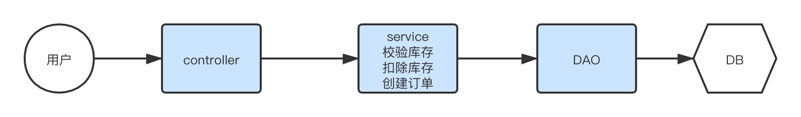
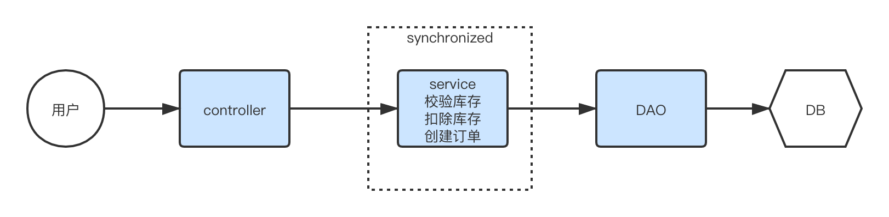
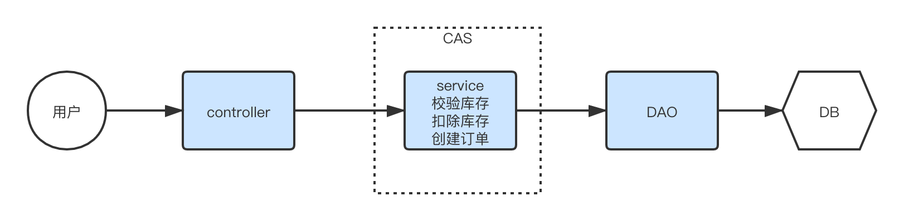
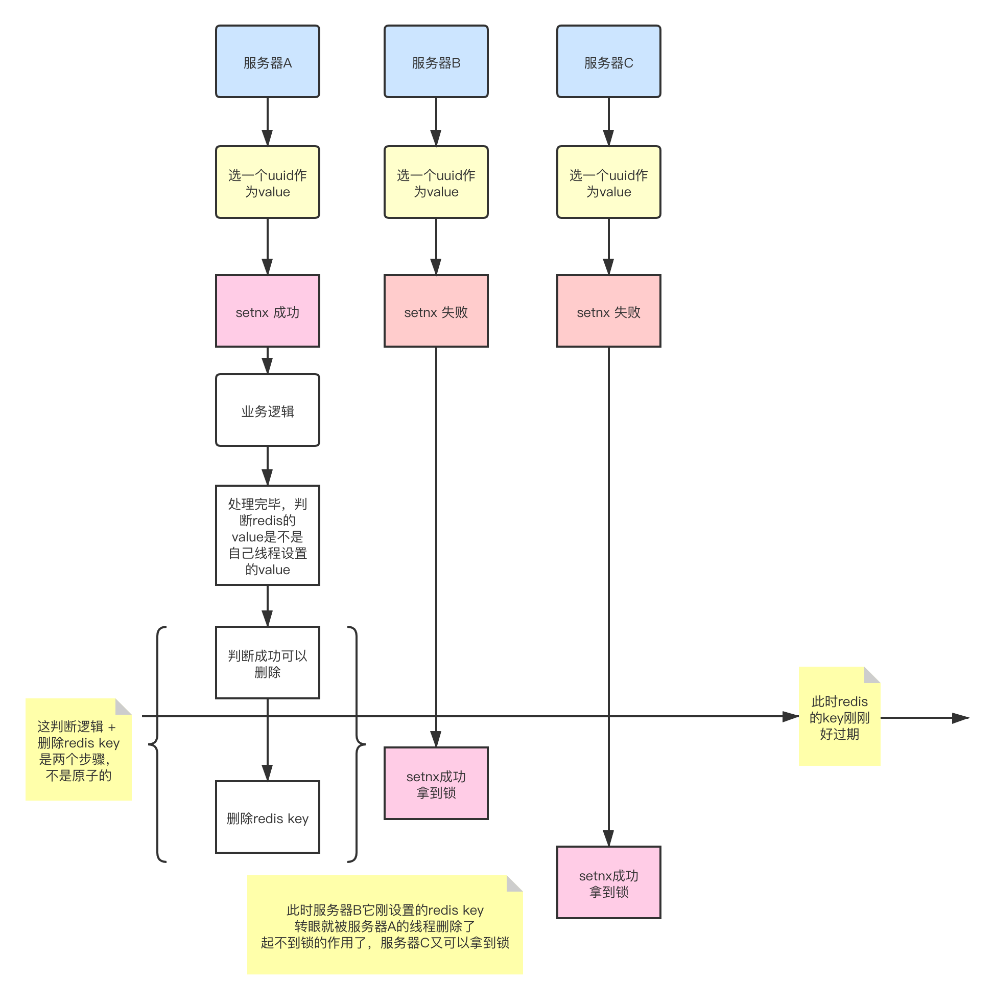
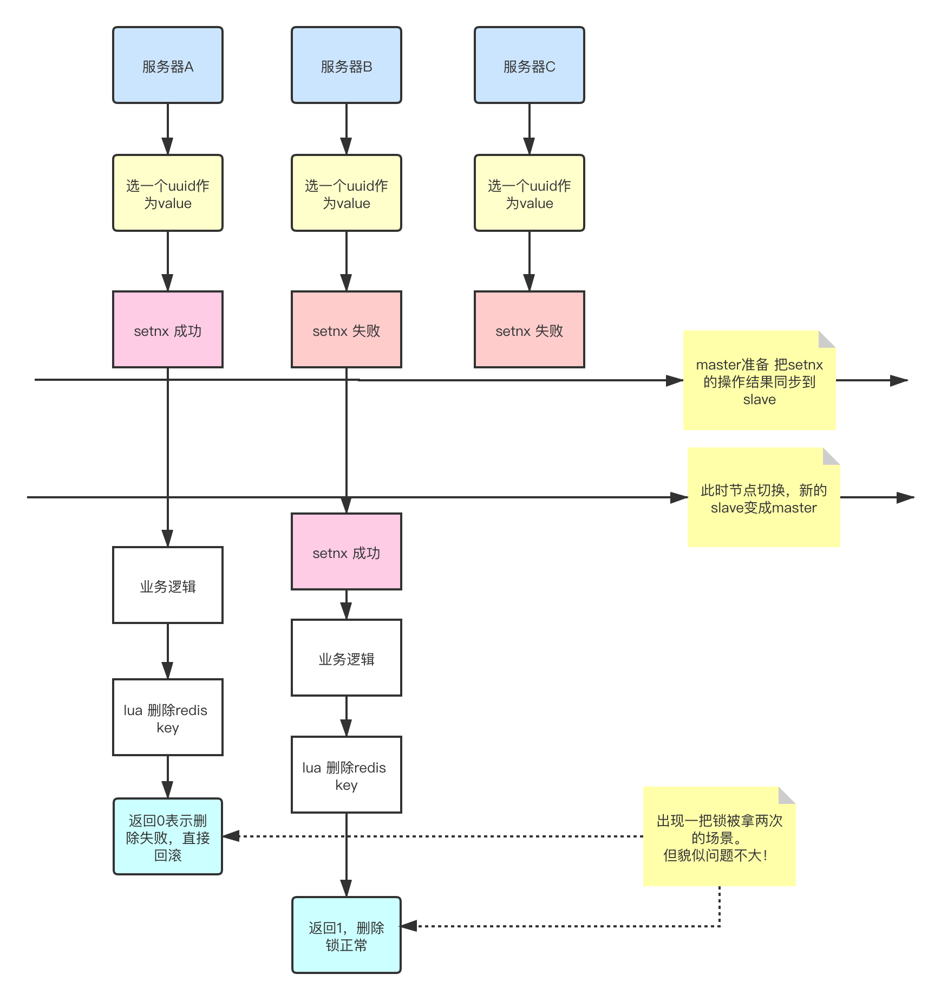

## 秒杀场景
* 12306火车票
* 1499买茅台
* 歌神演唱会门票
* 双十一秒杀


## 秒杀关注点
- <b>严格防止超卖</b>： 如果只有1件商品，卖出了120件，厂商直接爆炸，防止超卖是秒杀系统设计的<font color='red'>最核心</font>部分。
- <b>防止黑产羊毛</b>： 薅羊毛，秃了皮。
- <b>保证体验</b>: 在前两点保证的情况下，尽可能给用户友善的购物体验

## 基础版本1.0 - 裸奔


SpringBoot + mybatis 裸奔流程：
- controller层获得用户请求后调用service层
- service层检查订单，检查库存和已售数量是否一致，不一致说明还能卖，则已售数量+1后，创建订单
- dao层直接通过mybatis操作数据库实现已售数量+1和订单创建

裸奔问题：
- A用户进行了请求，此时已售数量64，库存100，已售数量64+1和订单创建
- B用户同时进行了请求，此时已售数量64，库存100，已售数量64+1和订单创建
- 此时库存-1却创建了2个订单

结果就：
```
超卖了！
```

## 升级版本2.0 - 单机悲观锁


单机悲观锁流程：
- 在基础版本上面，增加synchronized关键字，大家都串行化执行

问题：
- 串行化执行，极大的伤害用户体验

## 升级版本3.0 - 单机乐观锁


单机乐观锁流程：
- 在基础版本上面，增加`CAS`，失败后由业务层重复尝试

CAS：
```sql
update tableName set saleCount = saleCount + 1, version = version+1 where id=xxx and version = xxx
```

该方案保证了<font color='red'>至少不会超卖</font>，有一定的用户体验，麻烦点可能在于秒杀的随机性导致可能最后几个没卖出去，不过问题不大。

## 升级版本4.0 - Redis分布式锁-setnx
上面几个方案都是基于单机的，但实际上生产业务都是集群。

基于集群，势必要引入第三方组件，比如redis。

redis 的 `setnx` 是一个好东西：
```
它表示设置一个key-value，如果key不存在就能设置成功，如果key存在则设置失败。
```
但为啥有一些程序员会说setnx不顶用，要配合`lua脚本`，这其中有历史原因：
```
因为在老版本之前 setnx 命令语法为「setnx key value」，并不支持同时设置过期时间的操作，
那么就需要再执行 expire 过期时间的命令，这样的话加锁就成了两个命令，原子性就得不到保障，
所以通常需要配合 Lua 脚本使用，
而从 Redis 2.6.12 版本后，set 命令开始整合了 setex 的功能，并且 set 本身就已经包含了设置过期时间，
因此常说的 setnx 命令实则只用 set 命令就可以实现了，只是参数上加上了 NX 等参数。
```
伪代码：
```java
// value = 随机字符串也行，线程ID也行
String value = UUID.randomUUID().toString().replace("-","");

// 设置20秒过期
Boolean flag = redisTemplate.opsForValue().setIfAbsent(key, value, 20000, TimeUnit.MILLISECONDS);
if (flag) {
    log.info("{} 锁定成功，开始处理业务", key);
    try {
        // 模拟处理业务逻辑
        Thread.sleep(1000 * 30);
    } catch (InterruptedException e) {
        e.printStackTrace();
    }

    // 判断是否是key对应的value
    String lockValue = redisTemplate.opsForValue().get(key);
    if (lockValue != null && lockValue.equals(value)) {
     redisTemplate.delete(key);
     log.info("{} 解锁成功，结束处理业务", key);
    }
    return "SUCCESS";
} else {
    log.info("{} 获取锁失败", key);
    return "请稍后再试...";
}
```
这个设计几乎完美了，又简单，但是有一个异常情况没考虑到：


## 升级版本5.0 - Redis分布式锁-lua
吐槽：
```
搞了半天还是要上lua，那帮程序员说的没错。
```
什么是`lua`: 一段可以在redis中被当成一条语句执行的脚本，天然具备`原子性`。

弃用 `升级版本4.0 - Redis分布式锁-setnx` 的核心点在于`判断删除key`和`通知redis删除key`这两个操作`不是原子操作`， 那么我们就保证原子操作即可！

恰好lua脚本的天然原子性，那么我们是不是可以把这两个步骤放到lua脚本`delete.lua`中: 
```lua
-- lua删除锁：
-- KEYS和ARGV分别是以集合方式传入的参数，对应上文的Test和uuid。
-- 如果对应的value等于传入的uuid。
if redis.call('get', KEYS[1]) == ARGV[1] 
    then 
 -- 执行删除操作
        return redis.call('del', KEYS[1]) 
    else 
 -- 不成功，返回0
        return 0 
end
```
把`delete.lua`放到`resources文件夹`后，看springBoot怎么加载lua脚本：
```java
    @PostConstruct
    public void init(){
        script = new DefaultRedisScript<Long>();
        script.setResultType(Long.class);
        script.setScriptSource(new ResourceScriptSource(new ClassPathResource("delete.lua")));
    }
```
怎么使用lua脚本：
```java
// keys 只能支持列表，把key包装成keys后传入
// execute 返回1表示删除成功，返回0表示删除失败
Long execute = redisTemplate.execute(script, keys, lockValue);
```


然后我们调整下新的伪代码：
```java
@Slf4j
@RestController
@RequestMapping("/test")
public class TestController {

    @Resource
    private RedisTemplate<String,Object> redisTemplate;

    private DefaultRedisScript<Long> script;

    @PostConstruct
    public void init(){
        script = new DefaultRedisScript<Long>();
        script.setResultType(Long.class);
        script.setScriptSource(new ResourceScriptSource(new ClassPathResource("delete.lua")));
    }

    @PostMapping(value = "/sell")
    @Transactional(propagation=Propagation.REQUIRED)
    public String createOrder(User user) {

        String key = user.getUsername();
        String value = UUID.randomUUID().toString().replace("-","");

        Boolean flag = redisTemplate.opsForValue().setIfAbsent(key, value, 20000, TimeUnit.MILLISECONDS);
        if (flag) {
            log.info("{} 锁定成功，开始处理业务", key);
            try {
                // 模拟处理业务逻辑
                Thread.sleep(1000 * 10);
            } catch (InterruptedException e) {
                e.printStackTrace();
            }

            // 业务逻辑处理完毕，lua脚本 释放锁
            String lockValue = (String) redisTemplate.opsForValue().get(key);
            if (lockValue != null && lockValue.equals(value)) {
                System.out.println("lockValue========：" + lockValue);
                List<String> keys = new ArrayList<>();
                keys.add(key);
                Long execute = redisTemplate.execute(script, keys, lockValue);
                System.out.println("execute执行结果，1表示执行del，0表示未执行 ===== " + execute);
                log.info("{} 解锁成功，结束处理业务", key);
            }else{
                 // 说明本线程已经把锁拱手让人了。
                 // 可能性1： 业务执行太久了，比如20秒的锁，它执行了30秒，锁失效了，被别的机器的线程抢到了。
                 // 可能性2： 业务本来还行，结果被Stop the world，恢复后发现时间过去了30秒，又失效了，被别的机器的线程抢到了。
                 // 本线程没任何资格操作数据了。。直接报错回滚吧
                throw new Exception("没资格秒杀了");
            }
            return "SUCCESS";
        } else {
            log.info("{} 获取锁失败", key);
            return "请稍后再试...";
        }
    }
}
```

该方案几乎完美。但是依旧有4个问题：
- 问题1：redis的setnx如果slave还没同步时就故障转移slave成为新的master，导致同时有2个线程拿到锁怎么办？
- 问题2：怎么实现可重入锁！？
- 问题3：如果业务逻辑的执行时间比超时时间长怎么办？
- 问题4：拿不到锁的客户端一直CAS浪费性能怎么办？

### 问题1 - master-slave未同步setnx的结果就故障转移
其实我觉得`问题1`好像可以`升级版本5.0 - Redis分布式锁-lua`可以解决呀。

一旦发现lua删除失败，所以锁不在当前线程控制了，那就直接回滚。


### 问题2 - 怎么可重入锁
这个可以通过改变lua脚本来实现，不赘言。

### 问题3 - 如果业务逻辑的执行时间比超时时间长怎么办？
这个可以开一个守护线程，watch-dog来续命。

### 问题4 - 拿不到锁的客户端一直CAS浪费性能怎么办
这个可以用redis的订阅。

## 秒杀还要考虑的问题

### 限时抢购 - 秒杀要有时间范围，不能在任意时刻都接受秒杀请求

* 接口增加时间范围判断
* redis 设置过期时间

### 隐藏接口 - 被脚本秒杀
* 秒杀开始之前，先去请求接口获取秒杀地址
* 接口改造，带上@pathVariable参数（MD5(UUID)）
* 添加生成地址的接口
* 秒杀收到请求，先验证@pathVariable参数


### 频率控制 - 每个用户单位时间内访问次数控制
* 通过前面请求后根据用户ID生成redis的key，value为访问次数，默认为0，并且设置好该KV的过期时间。
* 用户在验证是否通过秒杀隐藏接口验证前，先看下他的单位时间内访问次数，超过阈值就直接拒绝，不用再去进行隐藏接口的验证


### 流量控制 - 海量流量怎么应对
* 前端页面置灰
* html静态页面CDN缓存
* 限流
    * 漏桶算法
    * 令牌桶算法


# 参考链接：
- [知乎：怎样实现redis分布式锁](https://www.zhihu.com/question/300767410/answer/523116598)
- [Redis分布式锁—SETNX+Lua脚本实现篇](https://www.cnblogs.com/niceyoo/p/13711149.html)