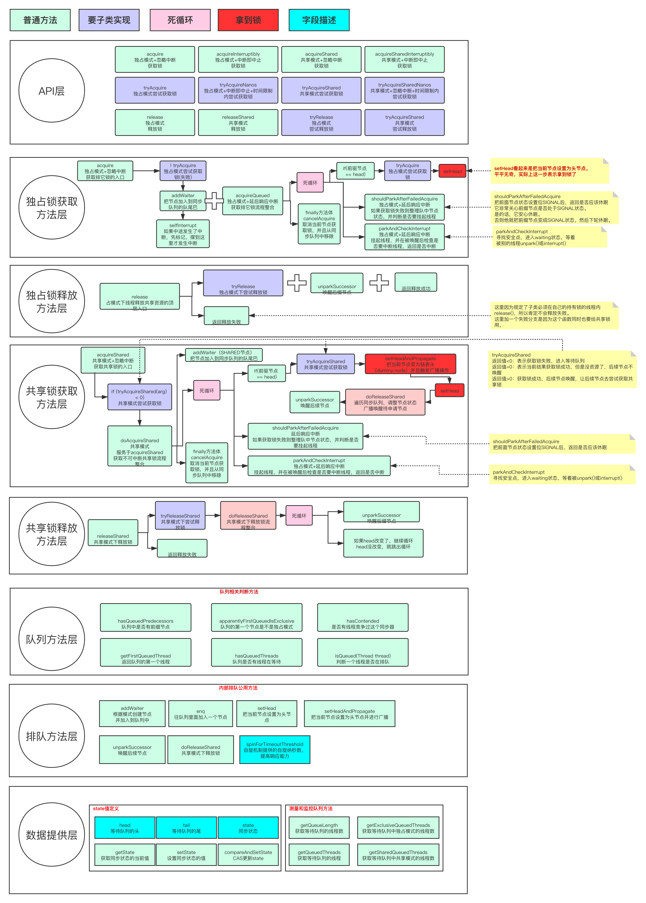

## AQS链表的Node
AQS虽然号称队列，但实际是个链表，链表中的`节点`非常关键：
```java
static final class Node {
    static final Node SHARED = new Node();
    static final Node EXCLUSIVE = null;

    static final int CANCELLED =  1;
    static final int SIGNAL    = -1;
    static final int CONDITION = -2;
    static final int PROPAGATE = -3;

    volatile int waitStatus;
    volatile Node prev;
    volatile Node next;
    volatile Thread thread;

    Node nextWaiter;
}
```

node里面放了很多元素，有同步队列、等待队列、队列状态、共享状态、独占状态。

涉及到`队列`的是：
```java
static final class Node {
    volatile Node prev;
    volatile Node next;
}
```
涉及到`同步队列`的是：
```java
static final class Node {
    volatile int waitStatus;
    volatile Thread thread;

    static final int CANCELLED =  1;  // 取消
    static final int SIGNAL    = -1;  // 等待
}
```
涉及到`等待队列`的是：
```java
static final class Node {
    Node nextWaiter;
    volatile Thread thread;

    static final int CONDITION = -2;  // 条件等待
}
```

## AQS的抽象方法
既然`AQS`是一个抽象队列同步器，它毕竟是个抽象类嘛，有一堆抽象方法需要子类去实现。

这里针对`AQS`出现的方法，做了个粗略的统计和划分：


国哥吐槽：
```dtd
明明在 processOn.com 好好的图弄出来就变了形，果然图形压力太大了。
```
processOn分享链接： [AQS方法总览图](https://www.processon.com/view/link/606d88815653bb5cea08e74b)


## 参考链接
[知乎：面试必考AQS-AQS源码全局分析](https://zhuanlan.zhihu.com/p/111264273)