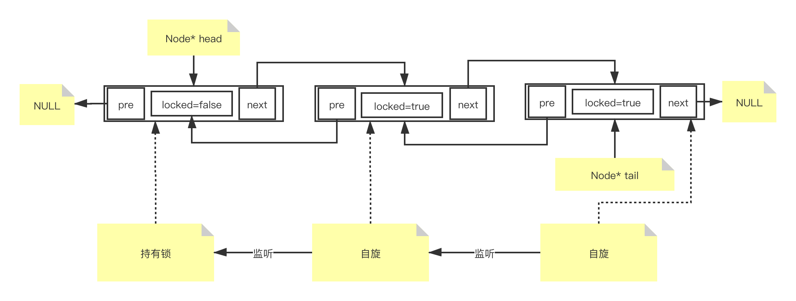

## 写在前面
`AQS`
--
- <b>全称</b>： `java.util.concurrent.locks.AbstractQueuedSynchronizer`
- <b>中文名字</b>：抽象队列同步器
- <b>目的</b>：提供一个大多数并发工具包的基础框架
- <b>应用</b>：
    - `ReentrantLock`
    - `ReentrantReadWriteLock`
    - `CountDownLatch`
    - `CyclicBarrier`
    - `StampedLock`

## CLH锁模型 vs MCS锁模型

锁模型是根据系统架构的特点来设计的。

要了解2个锁模型需先知道系统架构可以分为3种：

|SMP架构 | NUMA架构 | MPP架构 |
|:---|:---|:---|
|`Symmetric Multi-Processor`|`Non-uniform memory access`| `Massive Parallel Processing`|
|多处理器结构|非一致存储访问| 大量并行架构，就是刀片服务器！|
| 一台计算机由多个CPU组成，并共享内存和其他资源，所有的CPU都可以平等的访问内存、I/O等 | 等于多个SMP  每个SMP有CPU模块+独立内存+IO  SMP之间的连接通过互联模块| 等于多个SMP  每个SMP有CPU模块+独立内存+IO  SMP之间的连接要通过networking | 
| 简单，拓展性差| 解决了SMP的拓展问题  但是因为互联模块的存在，导致无法通过加CPU模块来线性增加系统性能 |  各个SMP之间完全无共享，因而扩展能力最好  理论上其扩展无限制，目前的技术可实现512个节点互联，数千个 CPU。|

CLH和MCS这两个锁模型非常相似，仅仅是自旋时监听哪个节点状态的这一点不同。

|CLH锁模型 | MCS锁模型|
|:--|---|
|作者是：`Craig，Landin and Hagersten`| 作者是: `MellorCrummey and Scott`| 
|链表上的每个节点监听上一个节点的锁状态 | 链表上的每个节点监听当前节点锁状态|
|适用于SMP架构|更适用于 NUMA 架构，因为大量时间在监听当前节点，不用跨SMP，本地访问性能很好，少数时间处理上一个节点的通知|

## AQS 是对CLH锁模型的实现

- static final class <b>Node</b> {...} // 链表节点
- public class <b>ConditionObject</b> implements Condition, java.io.Serializable {...} // 条件对象
- private transient volatile Node <b>head</b>; // 链表头
- private transient volatile Node <b>tail</b>; // 链表尾
- private volatile int <b>state</b>; // 资源
- private static final Unsafe <b>unsafe</b> = Unsafe.getUnsafe();// 用于cas操作的变量
- private static final long <b>stateOffset,headOffset,tailOffset,waitStatusOffset,nextOffset</b>; // 用于cas操作的变量
- 一些实例方法操作链表及资源
- 一些抽象方法等待被实现，交给子类实现，来决定同步状态。

## 参考链接
[知乎：面试必考AQS-AQS概览](https://zhuanlan.zhihu.com/p/110949366)