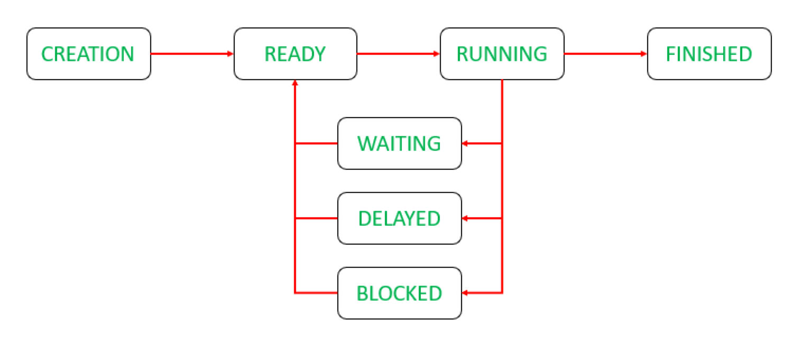

## linux 线程状态

- <b> CREATION </b> - 线程开辟
- <b> Ready </b> - 就绪
- <b> Running </b> - 正在占用处理器执行
- <b> Waiting </b> - 等待
- <b> Delayed </b> - 延迟
- <b> Blocked </b> - 阻塞
- <b> FINISHED </b> - 线程结束



接下来是线程的前世今生：
- When an application is to be processed, then it <b>creates</b> a thread.
- It is then allocated the required resources(such as a network) and it comes in the <b>READY</b> queue.
- When the thread scheduler (like a process scheduler) assign the thread with processor, it comes in <b>RUNNING</b> queue.
- When the process needs some other event to be triggered, which is outsides it’s control (like another process to be completed), it transitions from <b>RUNNING</b> to <b>WAITING</b> queue.
- When the application has the capability to delay the processing of the thread, it when needed can <b>delay</b> the thread and put it to sleep for a specific amount of time. The thread then transitions from <b>RUNNING</b> to <b>DELAYED</b> queue.
- An example of delaying of thread is snoozing of an alarm. After it rings for the first time and is not switched off by the user, it rings again after a specific amount of time. During that time, the thread is put to <b>sleep</b>.
- When thread generates an I/O request and cannot move further till it’s done, it transitions from RUNNING to BLOCKED queue.
- After the process has completed, the thread transitions from <b>RUNNING</b> to FINISHED.

我们可以重点关注下 Linux 线程的`Blocked`状态:
```
When thread generates an I/O request and cannot move further till it’s done, 
it transitions from RUNNING to BLOCKED queue.
```
言外之意就是：
```
你如果去搞I/O操作，那么就会进入BLOCKED状态。
```

但当我们和`JAVA 线程流状图`对比下，不难发现一个很关键的点：
```
Java线程的RUNNABLE = OS线程的Ready + OS线程的Running + OS线程的Blocked
```
那么`Java线程的Blocked`是什么：
```
是被synchronized同步块获取不到临界资源阻塞住的线程状态！
```
至此，国哥悟了。


思考：为啥JAVA的waiting状态在Linux中看到的是S？
---
```java
public class A {

    public static void main(String[] args) throws InterruptedException {
        Object object = new Object();
        synchronized (object){
            object.wait();
        }
    }

}
```
然后用jstack看java线程状态：
```
"main" #1 prio=5 os_prio=31 tid=0x00007f88bd003000 nid=0x1a03 in Object.wait() [0x000070000a3c7000]
   java.lang.Thread.State: WAITING (on object monitor)
        at java.lang.Object.wait(Native Method)
        - waiting on <0x000000079582efd0> (a java.lang.Object)
        at java.lang.Object.wait(Object.java:502)
        at A.main(A.java:6)
        - locked <0x000000079582efd0> (a java.lang.Object)
```
可以看到java线程状态是符合期望的：
```
WAITING
```
但丢到linux中执行，通过`top -H -p {pid}` 可以看到操作系统中的线程状态：
```
PID    SPID    PSR  TTY    STAT  TIME  COMMAND
290387 290387  21   pts/5  Sl+   0:00  java A
```
事情开始变得有趣起来了，这个`s`不会是sleep吧，先查一下top的STAT有多少种状态：
```
D 不可中断的休眠。通常是IO。
R 运行。正在运行或者在运行队列中等待。
S 休眠。在等待某个事件，信号。
T 停止。进程接收到信息SIGSTOP，SIGSTP，SIGTIN，SIGTOU信号。
W paging，在2.6之后不用。
X 死掉的进程，不应该出现。
Z 僵死进程。
```
还可以带更详细的状态：
```
< 高优先级
N 低优先级
L 有pages在内存中locked。用于实时或者自定义IO。
s 进程领导者，其有子进程。
l 多线程
+ 位于前台进程组。
```
至此，我们知道`Sl+`是`位于前台进程组的休眠的多线程`，但`休眠`是啥意思？
再说了，也和我们一开始`写在前面`的7个状态对不上啊，估计是各个厂商有不同的实现，我们看看linux关于线程状态的源码：
```
在include/linux/sched.h中，进程状态的定义并没有那么少：

#define TASK_RUNNING            0
#define TASK_INTERRUPTIBLE      1
#define TASK_UNINTERRUPTIBLE    2
#define __TASK_STOPPED          4
#define __TASK_TRACED           8
/* in tsk->exit_state */
#define EXIT_DEAD               16
#define EXIT_ZOMBIE             32
#define EXIT_TRACE              (EXIT_ZOMBIE | EXIT_DEAD)
/* in tsk->state again */
#define TASK_DEAD               64
#define TASK_WAKEKILL           128
#define TASK_WAKING             256
#define TASK_PARKED             512
#define TASK_NOLOAD             1024
#define TASK_NEW                2048
#define TASK_STATE_MAX          4096

#define TASK_STATE_TO_CHAR_STR "RSDTtXZxKWPNn"

extern char ___assert_task_state[1 - 2*!!(
                sizeof(TASK_STATE_TO_CHAR_STR)-1 != ilog2(TASK_STATE_MAX)+1)];

/* Convenience macros for the sake of set_task_state */
#define TASK_KILLABLE           (TASK_WAKEKILL | TASK_UNINTERRUPTIBLE)
#define TASK_STOPPED            (TASK_WAKEKILL | __TASK_STOPPED)
#define TASK_TRACED             (TASK_WAKEKILL | __TASK_TRACED)

#define TASK_IDLE               (TASK_UNINTERRUPTIBLE | TASK_NOLOAD)

/* Convenience macros for the sake of wake_up */
#define TASK_NORMAL             (TASK_INTERRUPTIBLE | TASK_UNINTERRUPTIBLE)
#define TASK_ALL                (TASK_NORMAL | __TASK_STOPPED | __TASK_TRACED)

/* get_task_state() */
#define TASK_REPORT             (TASK_RUNNING | TASK_INTERRUPTIBLE | \
                                 TASK_UNINTERRUPTIBLE | __TASK_STOPPED | \
                                 __TASK_TRACED | EXIT_ZOMBIE | EXIT_DEAD)
```
小编有话说：
```
这尼玛不止7种啊，你说17种，我都信了！果然7种状态只是理想的协议吗，真正厂商实现的时候都八仙过海。
```
重点关注下：
```
TASK_RUNNING = READY + RUNNING
```
`参考2` 这么写：
```
教科书中两种状态的结合，一种是正在占用CPU事件的RUNNING状态，一种是RUNNING状态的进程时间片耗尽或者主动让出CPU，或者被更高优先级进程抢占后，进入的READY状态。
处于TASK_RUNNING状态的进程要么正在CPU上运行，要么随时都可以投入运行，只不过CPU资源有限，调度器暂时没有选中他们。
```
行吧，自此，国哥有必要重新调整下话术，我们把开头写的7状态称之为`教科书的线程7状态`，其他的我们成为`linux线程状态`。
那么：
```
linux的线程状态TASK_RUNNING = 教科书的线程状态RUNNING +  教科书的线程状态READY
```
并且：
```
java的线程状态RUNNABLE = 教科书的线程状态RUNNING + 教科书的线程状态READY
```
好的，重新梳理好上面的关系后，我们继续看linux的`S`休眠：
```
Linux进程状态：S (TASK_INTERRUPTIBLE)，可中断的睡眠状态。
Linux进程状态：D (TASK_UNINTERRUPTIBLE)，不可中断的睡眠状态。
```
学习不能陷入细节，应把握脉络，不再继续深究中断，有空再额外开篇来学习下`《linux内核异步中断浅析》`。


## 参考链接
* [Thread States in Operating Systems](https://www.geeksforgeeks.org/thread-states-in-operating-systems/)
* [linux 中进程的状态](https://quant67.com/post/linux/taskstatus.html)
* [Linux进程状态解析 之 R、S、D、T、Z、X (主要有三个状态)](https://blog.csdn.net/wudebao5220150/article/details/12919453)