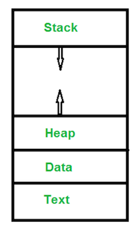
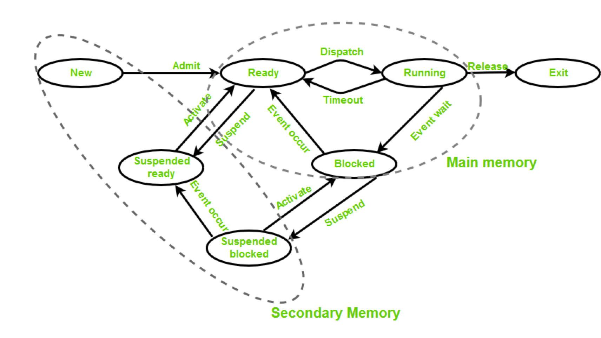

## 写在前面

先看看linux中进程长什么样子：



解释下：
- <b> Text Section </b>: 放代码（我记得以前上课的时候说是放代码...） 
- <b> Stack </b>: 放一些临时的数据如返回地址、局部变量、函数入参（类似JVM的栈）
- <b> Data Section </b>: 全局数据（类似JVM的方法区）
- <b> Heap Section </b>: 动态分配的内存（类似JVM的堆）


## linux 进程状态
- <b> New (Create) </b> – In this step, the process is about to be created but not yet created, it is the program which is present in secondary memory that will be picked up by OS to create the process.
- <b> Ready </b> – New -> Ready to run. After the creation of a process, the process enters the ready state i.e. the process is loaded into the main memory. The process here is ready to run and is waiting to get the CPU time for its execution. Processes that are ready for execution by the CPU are maintained in a queue for ready processes.
- <b> Run </b> – The process is chosen by CPU for execution and the instructions within the process are executed by any one of the available CPU cores.
- <b> Blocked or wait </b> – Whenever the process requests access to I/O or needs input from the user or needs access to a critical region(the lock for which is already acquired) it enters the blocked or wait state. The process continues to wait in the main memory and does not require CPU. Once the I/O operation is completed the process goes to the ready state.
- <b> Terminated or completed  </b>– Process is killed as well as PCB is deleted.
- <b> Suspend ready </b> – Process that was initially in the ready state but were swapped out of main memory(refer Virtual Memory topic) and placed onto external storage by scheduler are said to be in suspend ready state. The process will transition back to ready state whenever the process is again brought onto the main memory.
- <b> Suspend wait or suspend blocked </b> – Similar to suspend ready but uses the process which was performing I/O operation and lack of main memory caused them to move to secondary memory. When work is finished it may go to suspend ready.

小编有话说：
```
上面虽然密密麻麻，但仍强烈建议阅读英文doc，因各厂商设计不同，可能状态不一致，但是基本上大同小异：开始、等待运行、运行、等待、结束。
```
`linux进程状态` vs `java 线程状态`：
```
1、都有开始和结束

2、java线程的runnable = linux进程的ready + running

3、linux进程多了： Suspended Ready + Suspended Block
```

linux进程状态转移图：


看了上图，你可能注意到了，进程可以划分为2个大的状态：
```
main memory vs secondary memory
```
再看那个`New`状态的描述：
```
New (Create) – In this step, the process is about to be created but not yet created, it is the program which is present in secondary memory that will be picked up by OS to create the process.
刚创建的进程，就在 secondary memory
```
关于`secondary momery`还要再看`Suspended Ready` 和 `Suspended Block`:
```
进程状态本来处于ready状态，但是被切换到 secondary momery 后，就变成了 Suspended Ready。
```
类似的 `Suspended Block`：
```
performing I/O operation and lack of main memory caused them to move to secondary memory.
```
如果它在执行IO操作又不在 `main memory` 那么就是 `suspended block`状态。

思考题：为啥要分main memory和secondary memory？
---
我们先问一个问题：
```
什么是 main memory 和 secondary memory？ 
```
- <b>主内存（Primary Memory）</b> : 随机存取内存(RAM)
- <b>辅助存储器（Secondary Memory) </b>：计算机的外部存储器，机械硬盘（HDD）、固态硬盘（SSD）、磁带、指状储存器和光盘

原来是这两个货，搞这么神秘。

--- 

那么我不禁好奇起来了，进程刚开始创建出来，在`Secondary Memory`，莫非是在硬盘？？
```
New (Create) – In this step, the process is about to be created but not yet created, it is the program which is present in secondary memory that will be picked up by OS to create the process.
```
既然已经知道了  main memory 和 secondary memory ，那么我盲猜一波原因：
```
受限于CPU物理大小，主存空间有限，否则它巴不得所有的东西都在主存。
所以必然要分一个主次，暂时还没用到的先放到secondary memory也能理解。
```