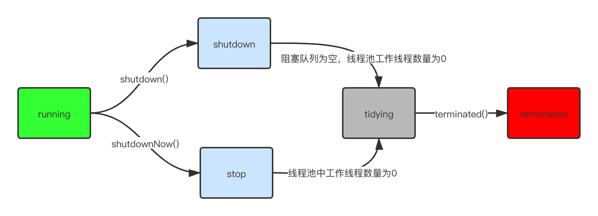
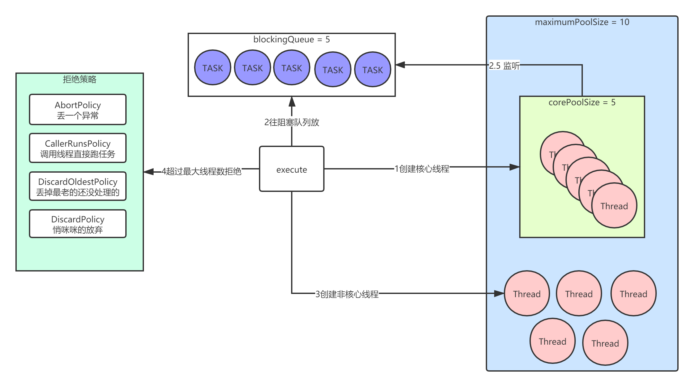

## 1 线程、协程、线程池详解

### 1.1 线程
线程是`调度CPU资源`的最小单位。

---

java采用`KLT(Kernel Level Thread) 模型`和OS的线程保持`1:1`的映射关系。

更多关于`KLT和ULT`的介绍，可以参考 fatpo 之前写的：[线程模型KLT和ULT](https://fatpo.github.io/#/并发编程/线程/线程模型KLT和ULT)

---

java线程有多个生命状态：
```dtd
NEW 新建
RUNNABLE 运行
BLOCKED 阻塞 
WAITING 等待
TIMED_WAITING 超时等待
TERMINATED 终结
```
更多关于java线程的生命状态转换图，可以参考 fatpo 之前写的：[Java线程状态转移图](https://fatpo.github.io/#/并发编程/线程/Java线程状态转移图)


### 1.2 协程
`协程` = `纤程` = `用户级线程`

---

目的：最大力度发挥硬件性能和提升软件速度。

---

基本原理：在某个点`挂起`当前任务，并`保留`栈信息，去执行另外一个任务，等完成或者达到某个条件，再`还原`原来的栈信息并继续执行。

整个过程中`线程没有上下文切换`。

--- 

jdk8 是不支持协程的，要借助第三方包quasar，但是如果要玩quasar，需要请求链自上而下都要支持协程，改造难度较大。

比如假设你是一个web服务器，然后：
```text
你要请求redis，那么就要有一个支持协程的redis客户端，
你要请求mysql，就要有一个支持协程的mysql客户端，
你要请求第三方微服务，就要有一个支持协程的http、grpc客户端
...
```

## 2 线程与线程池的生命状态

线程状态上面已经讲了，不再赘言。

### 2.2 线程池的生命状态



## 3 线程池7个关键组件

### 3.1 核心线程数
- 看下图的corePoolSize

### 3.2 最大线程数
- 看下图的maximumPoolSize

### 3.3 最大执行时间
```java
/**
 * Timeout in nanoseconds for idle threads waiting for work.
 * Threads use this timeout when there are more than corePoolSize
 * present or if allowCoreThreadTimeOut. Otherwise they wait
 * forever for new work.
 */
private volatile long keepAliveTime;
```
顾名思义，允许线程休息的最大时间。超过这个时间，那些超过`corePoolSize`的非核心线程就危险了，嘿嘿。
     
### 3.4 执行时间单位
对 `keepAliveTime` 的时间单位补充

### 3.5 阻塞队列
放待执行的任务，被核心线程池监听

### 3.6 创建线程工厂
### 3.7 拒绝策略
- 直接报错
- 调用的生产者线程直接执行任务
- 抛弃最老的任务
- 默默地抛弃任务

## 4 线程重用原理与源码分析



流程如下：
- 1、看`corePool`满了没，没有满则创建一个新线程，此时这个新线程是`核心线程`
- 2、`corePool`满了后，新来的任务往`blockingQueue`中丢
- 3、所有的corePool的线程们去`blockingQueue`中取任务执行
- 4、如果`blockingQueue满了`，则开创新的线程去执行任务，最多允许创建 `maximumPoolSize` 个线程，这些后面新开的线程就是`非核心线程`
- 5、如果达到了线程数达到了`maximumPoolSize`，则开始执行`拒绝策略`