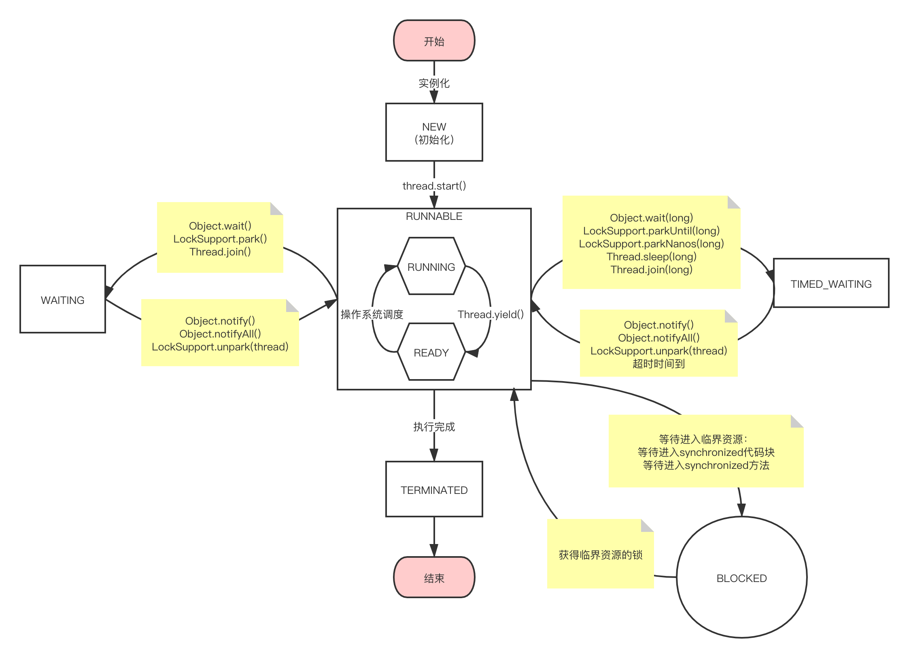

# 写在前面
建议先看 [课程一：Linux操作系统线程状态转移图](https://fatpo.github.io/#/并发编程/线程/课程一：Linux操作系统线程状态转移图) ，否则您可能会对下面的几个状态感到懵逼~

特别是 JVM的 RUNNABLE 和 操作系统里面的 RUNNING + READY 的关系。

---

# 枚举java线程状态

- <b>NEW</b> - this state represents a new thread which is not yet started.
- <b>RUNNABLE</b> - this state represents a thread which is executing in the underlying JVM. Here executing in JVM doesn't mean that the thread is always executing in the OS as well - it may wait for a resource from the Operating system like the processor while being in this state.
- <b>BLOCKED</b> - this state represents a thread which has been blocked and is waiting for a moniotor to enter/re-enter a synchronized block/method. A thread gets into this state after calling Object.wait method.
- <b>WAITING</b> - this state represnts a thread in the waiting state and this wait is over only when some other thread performs some appropriate action. A thread can get into this state either by calling - Object.wait (without timeout), Thread.join (without timeout), or LockSupport.park methods.
- <b>TIMED_WAITING</b> - this state represents a thread which is required to wait at max for a specified time limit. A thread can get into this state by calling either of these methods: Thread.sleep, Object.wait (with timeout specified), Thread.join (with timeout specified), LockSupport.parkNanos, LockSupport.parkUntil
- <b>TERMINATED</b> - this state reprents a thread which has completed its execution either by returning from the run() method after completing the execution OR by throwing an exception which propagated from the run() method and hence caused the termination of the thread.

小编有话说:
```
这一段请务必看英文doc，很多中文资料翻译都怪怪的。
```

---
这里有意思的点是 RUNNABLE 它并不是表示线程一直在占用处理器执行：
```
doesn't mean that the thread is always executing in the OS as well
```
它还能表示等待某些资源，如等待CPU调度，等待IO响应：
```
it may wait for a resource from the Operating system like the processor
```
所以JAVA竟然把非WAITING和非BLOCKED的线程状态都当成RUNNABLE了，这里和操作系统的线程状态，还真的不一样呢！（具体哪里不一样，看后续~）

---

NEW 和 TERMINATED 就不说了，一个开始一个结束，但是有些朋友可能会对WAITING 和 BLOCKED 表示疑惑：
```
看起来两个都是在等sth ？ 那么它们的区别是啥呢？
```
具体区别看后续的状态转移图~

# 状态转移图




---

思考： WAITING 和 BLOCKED 的区别？
---

看了状态转移图后，这里解答下 WAITING (TIMED_WAITING同理，我们就不赘言) 和 BLOCKED的区别。
先说为啥有人会问两者的区别：
```
他们觉得这2个状态很像，所以容易迷惑。
```
为啥这2个状态很像：
```
都是在等待着什么。
```
但如果看懂状态转移图后，你就会发现，其实两者内在逻辑是完全不同的：
```
WAITING: 业务逻辑层面的调度（程序员可以控制），理论上来说等一个信号（condition）的触发，可以等待很久。

BLOCKED: 因为并发临界资源的争夺，导致只有一个线程能占用资源，其它线程只能干等着，它巴不得能马上占用处理器，越快越好。
         不会有程序员专门让一个线程来BLOCKED住，程序员巴不得马上、立刻都给爷执行完毕，所以无法控制。
         严格上来说，一般并发程度不高的话，BLOCKED的时间不会太久。
```


思考： Thread.sleep(long) 和 Thread.yield()的区别？
---
- 相同：都是让出CPU，Thread.sleep()到时间后会进入就绪队列，yield是马上进入就绪队列。
- 相同：如果持有锁，在等待过程中，并不会释放锁。
- 不同：sleep是进入WAITING状态，yield依旧是RUNNABLE状态
- 不同：sleep可以控制休眠时间，而yield是马上进入就绪队列等待调度
- 不同：sleep可以被中断，抛出中断异常

---
那么Thread.sleep(0)和Thread.yield()的区别呢？
```
这，陷入了沉思...
是都进入了就绪队列？还是说sleep走一下流程，先WAITING再进入READY?
这都是sleep 0 了，还能中断吗？
```
看到了 《java concurrency in practice》 关于这两货的讨论 ：
```
The semantics of Thread.yield and Thread.sleep(0) are undefined [JLS17.9]; 
the JVM is free to implement them as no-ops or treat them as scheduling hints. 
In particular, they are not required to have the semantics of sleep(0) on Unix systems
— put the current thread at the end of the run queue for that priority, 
  yielding to other threads of the same priority 
— though some JVMs implement yield in this way.

```
小编提示：
```
强烈建议阅读英文doc
```
大概的意思是：
```
JVM各个厂商想怎么实现就怎么实现，反正JDK协议没有规定Thread.sleep(0)的具体含义。
不过linux的sleep(0)都是直接让他进入ready就绪队列（根据优先级），有些jvm就是这么实现Thread.sleep(0)的。
```
