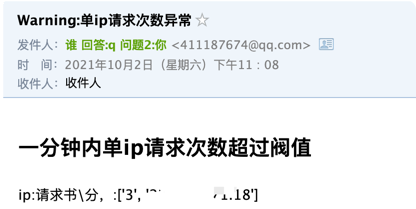

# 1、背景
2021年10月01日，凌晨四点多，我的服务器被黑了，损失了800美金。

在这里感恩下我的宝宝，他的哭声让我惊醒，否则我可能要损失几千美金。

# 2、django限流
版本号：
```
> pip3 freeze | grep django
django-ratelimit==3.0.1
django-redis==4.12.1
djangorestframework==3.12.4
```
主要是这个 `django-ratelimit`： [传送门](https://django-ratelimit.readthedocs.io/en/stable/usage.html)

默认用法：
```dtd
from django.utils.decorators import method_decorator
from django.views.generic import View

class MyView(View):
    @method_decorator(ratelimit(key='ip', rate='1/m', method='GET'))
    def get(self, request):
        pass

@method_decorator(ratelimit(key='ip', rate='1/m', method='GET'), name='get')
class MyOtherView(View):
    def get(self, request):
        pass
```

这里要介绍下 `ip`，其实还能有好几种配置方式：
```dtd
Common keys
    The following string values for key= provide shortcuts to commonly used ratelimit keys:
    'ip' - Use the request IP address (i.e. request.META['REMOTE_ADDR'])
Note
    If you are using a reverse proxy, make sure this value is correct or use an appropriate header: value. See the security notes.
    'get:X' - Use the value of request.GET.get('X', '').
    'post:X' - Use the value of request.POST.get('X', '').
    'header:x-x' - Use the value of request.META.get('HTTP_X_X', '').
Note
    The value right of the colon will be translated to all-caps and any dashes will be replaced with underscores, e.g.: x-client-ip => X_CLIENT_IP.
    'user' - Use an appropriate value from request.user. Do not use with unauthenticated users.
    'user_or_ip' - Use an appropriate value from request.user if the user is authenticated, otherwise use request.META['REMOTE_ADDR'] (see the note above about reverse proxies).
```
这里还要介绍下`rate`，限流控制频率，主要用法：
```dtd
rate – ‘5/m’ The number of requests per unit time allowed. Valid units are:
s - seconds
m - minutes
h - hours
d - days
```
还可以这么用：
```dtd
rate='1/m'
rate='1/2m'
rate='10/3h'
rate='100/3d'
rate='20/d'
```

国哥都是这么用的：
```dtd
from django.utils.decorators import method_decorator
from ratelimit.decorators import ratelimit

class MyAPI(MyView):

    @method_decorator(ratelimit(key='header:X_REAL_IP', rate='20/1h', block=True))
    @method_decorator(ratelimit(key='header:X_REAL_IP', rate='1/10s', block=True))
    def get(self, request):
        pass
```
有两个限制：
```dtd
1小时内只能请求20次 并且 10秒内只能请求1次
```

这里为什么我的配置不用`ip`而用`header:X_REAL_IP`，因为生产环境都是配置了nginx等东东的。`ip`拿到的都是代理IP，比如`127.0.0.1`，而我们要的是真实IP。

所以我们需要先在nginx的配置中加以下配置，这样子django的`ratelimit`才能识别到`header:X_REAL_IP`。
```dtd
location / {
    proxy_set_header   X-Real-IP        $remote_addr;
}
```


# 3、nginx限流
nginx版本：
```dtd
1.14.0
```
在`/etc/nginx/nginx.conf`的http结构体中增加：
```dtd
http {
    # 创建一个10MB大小的请求记录zone, 限制同一IP的访问每分钟10次
    limit_req_zone $binary_remote_addr zone=req_perip:10m rate=10r/m;
    
    # 创建一个10MB大小的连接数记录zone, 记录同一IP的同时连接数
    limit_conn_zone $binary_remote_addr zone=con_perip:10m;
    
    # 同一个IP只能发起1个并发连接数
    limit_conn con_perip 1;
    
    # 对指定的zone, 设置突发余量限制为128, 不延迟直接返回503, 否则会让请求等待
    limit_req zone=req_perip burst=128 nodelay;
}
```
记得重启下nginx:
```dtd
nginx -t
nginx -s reload
```

# 4、增加IP异常报警邮件
先写一个发送邮件的python脚本，放到 `/etc/nginx/send_mail.py` ：
```dtd
# -*- coding: utf-8 -*-
import smtplib
from email.header import Header
from email.mime.multipart import MIMEMultipart
from email.mime.text import MIMEText
from email.utils import parseaddr, formataddr


def _format_addr(s):
    name, addr = parseaddr(s)
    return formataddr((Header(name, 'utf-8').encode(), addr))


# 邮箱定义
smtp_server = 'smtp.qq.com'
smtp_port = 25
from_addr = 'FROM_EMAIL@qq.com'
password = 'FROM_EMAIL_KEY'
to_addr = ['TO_EMAIL@qq.com']

# 邮件对象
msg = MIMEMultipart()
msg['From'] = _format_addr('发件人 <%s>' % from_addr)
msg['To'] = _format_addr('收件人 <%s>' % to_addr)
msg['Subject'] = Header('Warning:单ip请求次数异常', 'utf-8').encode()

# 获取系统中要发送的文本内容
txt = ""
with open('/var/log/nginx/log_ip_top10', 'r') as f:
    lines = f.readlines()
    txt += '\r\n; '.join(lines)

# 邮件正文是MIMEText:
html = '<html><body><h2>一分钟内单ip请求次数超过阀值</h2>' + \
       '<p>ip:请求数\分\n: %s</p>' % (txt) + \
       '</body></html>'
msg.attach(MIMEText(html, 'html', 'utf-8'))

# 发送
server = smtplib.SMTP(smtp_server, smtp_port)
server.login(from_addr, password)
server.sendmail(from_addr, to_addr, msg.as_string())
server.quit()
```


ps：
```dtd
这里的 邮箱password 不是邮箱的密码，是授权码哦。
```

再写一个sh脚本，放到 `/etc/nginx/nginx_log_monitor.sh`: 
```dtd
#!/bin/bash
#日志文件
logfile=/var/log/nginx

#开始时间
start_time=`date -d"$last_minutes minutes ago" +"%H:%M:%S"`

#结束时间
stop_time=`date +"%H:%M:%S"`

echo $start_time, $stop_time

#过滤出单位之间内的日志并统计最高ip数
tac $logfile/access.log | awk -v st="$start_time" -v et="$stop_time" '{t=substr($4,RSTART+14,21);if(t>=st && t<=et) {print $0}}' \
| awk '{print $1}' | sort | uniq -c | sort -nr > $logfile/log_ip_top10
ip_top=`cat $logfile/log_ip_top10 | head -1 | awk '{print $1}'`
# 单位时间[1分钟]内单ip访问次数超过10次，则触发邮件报警
if [[ $ip_top -gt 10 ]];then
 /usr/bin/python3 /etc/nginx/send_mail.py &
fi
```

再配置好定时任务：`一分钟一次`。
```dtd
root@fatpo:/etc/nginx# crontab -l
*/1 * * * * /bin/bash /etc/nginx/nginx_log_monitor.sh
```

效果还不错：




# 5、参考
*[官网: django-ratelimit](https://django-ratelimit.readthedocs.io/en/stable/keys.html#keys-chapter)
*[CSDN: Django Nginx反代 获取真实ip](https://blog.csdn.net/weixin_43064185/article/details/104935777)
*[张生荣: Nginx日志实现访问异常报警详解](https://www.zhangshengrong.com/p/Ap1Z32ra0M/)
