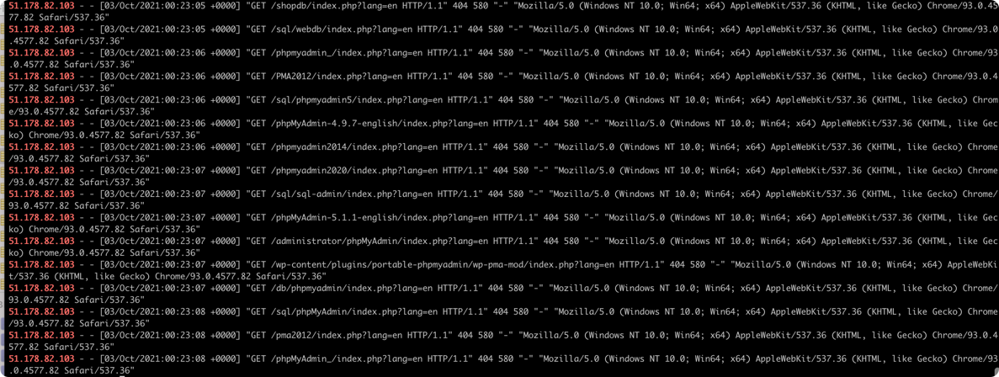

# 1、背景
2021年10月01日，凌晨四点多，我的服务器被黑了，损失了800美金。

在这里感恩下我的宝宝，他的哭声让我惊醒，否则我可能要损失几千美金。

更多细节可以看国哥另外一篇，[传送门](https://fatpo.github.io/#/我干运维那些事/django服务器IP限流的最佳实践)

我可能被人盯上了，有人开扫描器：


# 2、nginx黑名单
版本号：
```
# nginx -v
nginx version: nginx/1.14.0 (Ubuntu)
```
在 `/etc/nginx/ip.black`下写入：
```dtd
# cat /etc/nginx/ip.black
deny 45.130.97.193;
deny 206.62.4.242;
deny 206.62.22.156;
deny 206.62.27.10;
deny 206.62.22.50;
deny 68.114.159.20;
```
这些IP全是坏人来的，一分钟请求大几十次的，我也不`打码`了。

在`/etc/nginx/nginx.conf`的http结构体下增加配置：
```dtd
http {
    #黑名单
    include ip.black;
}
```

重启下：
```dtd
nginx -t
nginx -s reload
```

# 3、自动黑名单
写个脚本`/etc/nginx/auto_black_ip.sh`：
```dtd
#!/bin/bash
tail -n10000 /var/log/nginx/access.log |awk '{print $1,$7,$9}' | grep -i -v -E "google|yahoo|baidu|msnbot|FeedSky|sogou|360|bing|soso|403|api" | awk '{print  $1}' | sort | uniq -c | sort -rn \
|awk '{if($1>=100)print "deny "$2";"}' >> /etc/nginx/ip.black ; sort -u /etc/nginx/ip.black  -o /etc/nginx/ip.black ; /usr/sbin/nginx  -s reload
```
给它加执行权限：
```dtd
chmod +x /etc/nginx/auto_black_ip.sh
```

写一个`crontab -e`，一分钟执行一次：
```dtd
*/1 * * * * /bin/bash /etc/nginx/auto_black_ip.sh > /etc/nginx/alert.log 2>&1
```

效果不错，反正是叠加后去重，国哥不在电脑前，也能自动抓黑名单了。

# 4、参考

* [CSDN: Nginx基础配置之设置IP黑名单](https://blog.csdn.net/snow____man/article/details/83545922)
