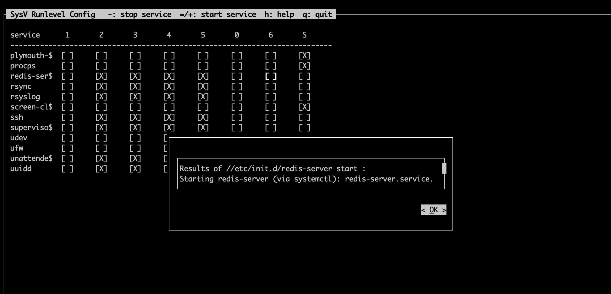
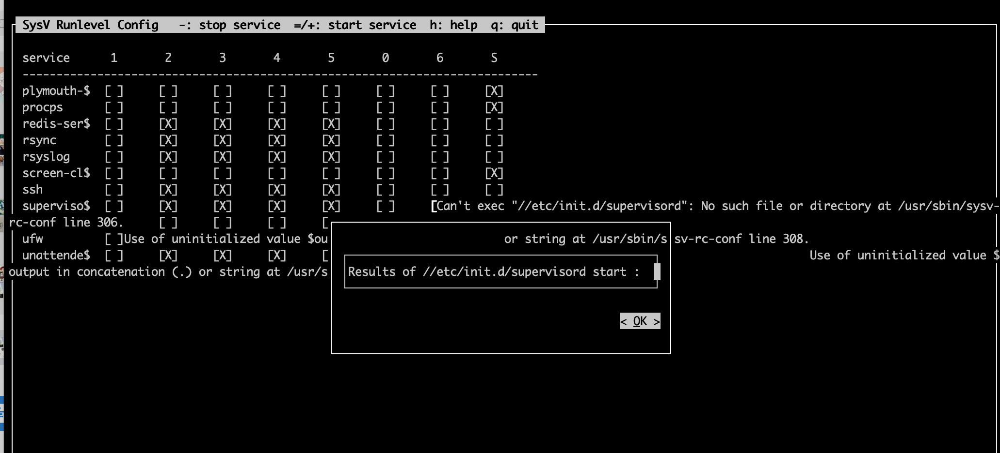

# 1、背景
最近不是搞了个小项目嘛，当一回运维，在测试开机自启动。

之前发现了一个神器：sysc-rc-conf，[传送门](https://fatpo.github.io/#/我干运维那些事/ubuntu18.04用sysv-rc-conf管理开机自启动)

这波啊，这波是`学以致用`。

supervisor 版本：
```
supervisor==4.2.2
```

# 2、测试效果
重启后，supervisord竟然没有开机自启动，但是明明我用了：
```
sudo sysv-rc-conf --level 2345 supervisord on
```
看了下界面：
```
root@fatpo:~# sysv-rc-conf --list supervisord
supervisord        0:off    1:off    2:on    3:on    4:on    5:on    6:off
```

# 3、找到答案
索性就继续研究下这个软件：`sysv-rc-conf`，是不是哪里没弄对。

看到help有一个说明： +/= 表示启动一下，好家伙，试了下，发现异常。

redis服务是成功的：


supervisord服务是失败的，而且有明显的错误提示：`找不到/etc/init.d/supervisord`：


所以这个`sysv-rc-conf`就是帮忙管理一下`/etc/init.d/`文件夹下的启动服务脚本。。。

# 4、解决方案
先在百度找一个`/etc/init.d/supervisor` 的文件：

root@fatpo:~# cat /etc/init.d/supervisor 
```
#! /bin/sh
#
# skeleton      example file to build /etc/init.d/ scripts.
#               This file should be used to construct scripts for /etc/init.d.
#
#               Written by Miquel van Smoorenburg <miquels@cistron.nl>.
#               Modified for Debian
#               by Ian Murdock <imurdock@gnu.ai.mit.edu>.
#               Further changes by Javier Fernandez-Sanguino <jfs@debian.org>
#
# Version:      @(#)skeleton  1.9  26-Feb-2001  miquels@cistron.nl
#
### BEGIN INIT INFO
# Provides:          supervisor
# Required-Start:    $remote_fs $network $named
# Required-Stop:     $remote_fs $network $named
# Default-Start:     2 3 4 5
# Default-Stop:      0 1 6
# Short-Description: Start/stop supervisor
# Description:       Start/stop supervisor daemon and its configured
#                    subprocesses.
### END INIT INFO

. /lib/lsb/init-functions

PATH=/usr/local/sbin:/usr/local/bin:/sbin:/bin:/usr/sbin:/usr/bin
DAEMON=/usr/local/bin/supervisord
NAME=supervisord
DESC=supervisor

test -x $DAEMON || exit 0

LOGDIR=/var/log/supervisor
PIDFILE=/var/run/$NAME.pid
DODTIME=5                   # Time to wait for the server to die, in seconds
                            # If this value is set too low you might not
                            # let some servers to die gracefully and
                            # 'restart' will not work

# Include supervisor defaults if available
if [ -f /etc/default/supervisor ] ; then
        . /etc/default/supervisor
fi
DAEMON_OPTS="-c /etc/supervisord.conf $DAEMON_OPTS"

set -e

running_pid()
{
    # Check if a given process pid's cmdline matches a given name
    pid=$1
    name=$2
    [ -z "$pid" ] && return 1
    [ ! -d /proc/$pid ] &&  return 1
    (cat /proc/$pid/cmdline | tr "\000" "\n"|grep -q $name) || return 1
    return 0
}

running()
{
# Check if the process is running looking at /proc
# (works for all users)

    # No pidfile, probably no daemon present
    [ ! -f "$PIDFILE" ] && return 1
    # Obtain the pid and check it against the binary name
    pid=`cat $PIDFILE`
    running_pid $pid $DAEMON || return 1
    return 0
}

force_stop() {
# Forcefully kill the process
    [ ! -f "$PIDFILE" ] && return
    if running ; then
        kill -15 $pid
        # Is it really dead?
        [ -n "$DODTIME" ] && sleep "$DODTIME"s
        if running ; then
            kill -9 $pid
            [ -n "$DODTIME" ] && sleep "$DODTIME"s
            if running ; then
                echo "Cannot kill $LABEL (pid=$pid)!"
                exit 1
            fi
        fi
    fi
    rm -f $PIDFILE
    return 0
}

case "$1" in
  start)
        echo -n "Starting $DESC: "
        start-stop-daemon --start --quiet --pidfile $PIDFILE \
                --startas $DAEMON -- $DAEMON_OPTS
        test -f $PIDFILE || sleep 1
        if running ; then
            echo "$NAME."
        else
            echo " ERROR."
        fi
        ;;
  stop)
        echo -n "Stopping $DESC: "
        start-stop-daemon --stop --quiet --oknodo --pidfile $PIDFILE
        echo "$NAME."
        ;;
  force-stop)
        echo -n "Forcefully stopping $DESC: "
        force_stop
        if ! running ; then
            echo "$NAME."
        else
            echo " ERROR."
        fi
        ;;
  #reload)
        #
        #       If the daemon can reload its config files on the fly
        #       for example by sending it SIGHUP, do it here.
        #
        #       If the daemon responds to changes in its config file
        #       directly anyway, make this a do-nothing entry.
        #
        # echo "Reloading $DESC configuration files."
        # start-stop-daemon --stop --signal 1 --quiet --pidfile \
        #       /var/run/$NAME.pid --exec $DAEMON
  #;;
  force-reload)
        #
        #       If the "reload" option is implemented, move the "force-reload"
        #       option to the "reload" entry above. If not, "force-reload" is
        #       just the same as "restart" except that it does nothing if the
        #   daemon isn't already running.
        # check wether $DAEMON is running. If so, restart
        start-stop-daemon --stop --test --quiet --pidfile $PIDFILE \
        --startas $DAEMON \
        && $0 restart \
        || exit 0
        ;;
  restart)
    echo -n "Restarting $DESC: "
    start-stop-daemon --stop --quiet --oknodo --pidfile $PIDFILE
        [ -n "$DODTIME" ] && sleep $DODTIME
        start-stop-daemon --start --quiet --pidfile $PIDFILE \
                --startas $DAEMON -- $DAEMON_OPTS
        echo "$NAME."
        ;;
  status)
    echo -n "$LABEL is "
    if running ;  then
        echo "running"
    else
        echo " not running."
        exit 1
    fi
    ;;
  *)
        N=/etc/init.d/$NAME
        # echo "Usage: $N {start|stop|restart|reload|force-reload}" >&2
        echo "Usage: $N {start|stop|restart|force-reload|status|force-stop}" >&2
        exit 1
        ;;
esac

exit 0
```

注意配置文件要改成自己的路径：
```
DAEMON_OPTS="-c /etc/supervisord.conf $DAEMON_OPTS"
```
添加执行权限：
```text
chmod +x /etc/init.d/supervisor
```

再一次:`reboot`发现supervisord服务启动成功。

# 5、反思

反思1：
``` 
为什么我觉得一个  sysv-rc-conf 软件的命令就能帮我搞定全部呢？

我甚至没有去检查下 ll /etc/rc2.d/ 里面是否真的有 supervisord 服务。
```

反思2：
```
/etc/init.d/ 和 /etc/rc2.d/ 的关系没弄明白。

我能看到的就是当我写完 /etc/init.d/supervisor 并且用 sysc-rc-conf 命令后， /etc/rc2.d/ 也出现了supervisor 脚本。
```

反思3：
```
第一时间想去google，明明身上有很多检查手段，浪费一个晚上去谷歌，哎。
```

# 参考
* [华为云-精选文章-安装supervisor(4.0.3)](https://www.huaweicloud.com/articles/e6fb6bb33b16ecfec6e02c0e611e4f03.html)


写于 2021年09月04日11:11:16。
