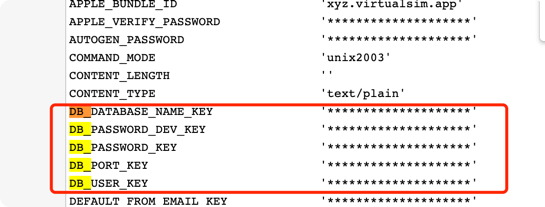

# 1、背景
众所周知，django的配置文件都写在 `settings.py`。

里面放的可都是明文密码啊！ 如果不小心开了`DEBUG=True` + 刚好发了个`50X错误`，底裤都给人看光了。

# 2、django-environ 帮你加密
版本号：
```dtd
#  pip3 freeze | grep environ             
django-environ==0.7.0
```
在`settings.py`同一个目录下，新建一个`.env`文件：
```dtd
# DB
DB_USER_KEY=root
DB_PASSWORD_KEY=12345
DB_PASSWORD_DEV_KEY=123456
DB_DATABASE_NAME_KEY=mydb
DB_PORT_KEY=3306
```

修改下`settings.py`文件：
```dtd
import environ
from split_settings.tools import include

# 环境变量
env = environ.Env()
environ.Env.read_env()

LOCAL_DEV = True

include(
    'settings_base.py',
    'settings_security.py',
    'settings_logger.py',
    'settings_mail.py',
    'settings_biz.py',
    'settings_cache.py',
    'settings_database.py',
)
```
在 `settings_database.py`这么用：
```dtd
from SecPhone.settings import LOCAL_DEV
from SecPhone.settings import env

DATABASES = {
    'default': {
        'ENGINE': 'django.db.backends.mysql',
        'NAME': env('DB_DATABASE_NAME_KEY'),
        'USER': env('DB_USER_KEY'),
        'PASSWORD': env('DB_PASSWORD_KEY'),
        'HOST': '127.0.0.1',
        'PORT': env('DB_PORT_KEY'),
        'OPTIONS': {'charset': 'utf8mb4'}
    }
}
```

这样子，当我们不小心把`DEBUG=True`打开，并且不小心触发了ERROR日志，返回信息中携带的配置文件，看到的KEY是：



# 3、小坑
* 1、放在`.env`的配置的等号双边不能有空格！
* 2、放在`.env`的配置必须携带`KEY`或者`TOKEN`或者`PASSWORD`或者`SECRET` 才能变成***。

# 4、参考
* [django-environ 官网](https://django-environ.readthedocs.io/en/latest/getting-started.html)
