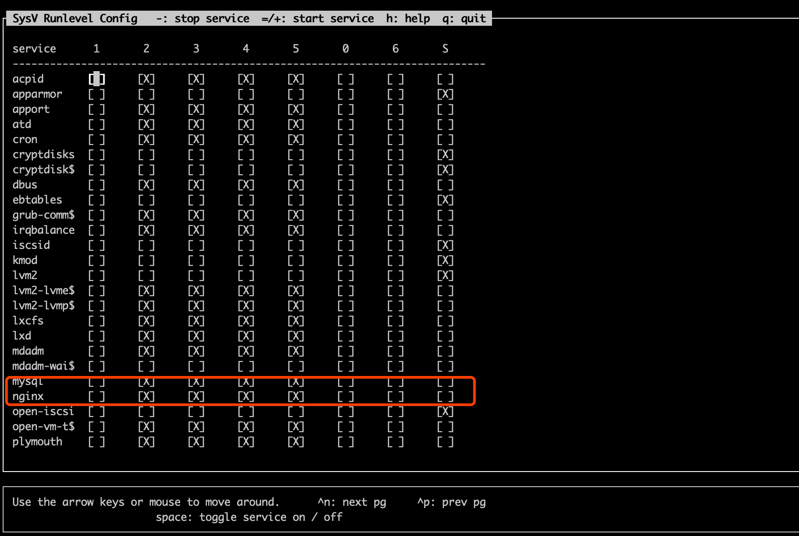
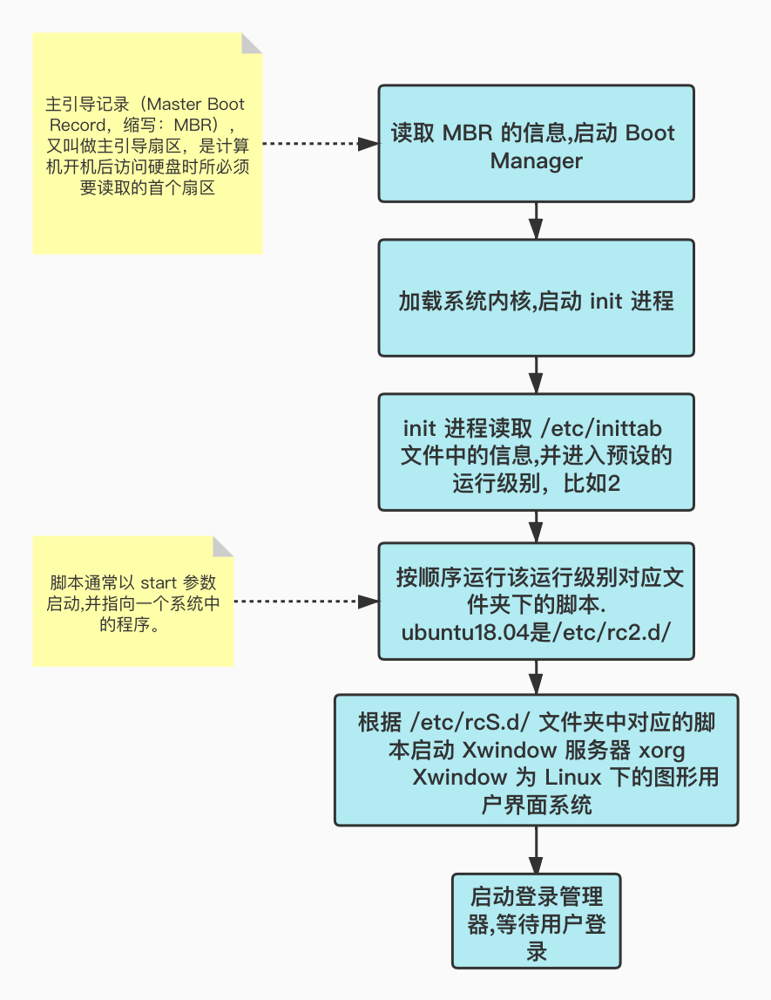

# 1、sysv-rc-conf简介
简单来说，就是linux上面一个很好用的管理开机启动的软件。

安装：
```
sudo apt-get install sysv-rc-conf
```
如果没有源：
```
编辑软件源列表：sudo vim /etc/apt/sources.list
末尾添加软件源：deb http://archive.ubuntu.com/ubuntu/ trusty main universe restricted multiverse
更新apt-get：sudo apt-get update
```

启动：
```
sudo sysv-rc-conf
```



# 2、查看是否开机启动
```
root@fatpo:~# sysv-rc-conf --list mysql
mysql        0:off	1:off	2:on	3:on	4:on	5:on	6:off
root@fatpo:~# sysv-rc-conf --list redis-server
redis-server 0:off	1:off	2:on	3:on	4:on	5:on	6:off
root@fatpo:~# sysv-rc-conf --list nginx
nginx        0:off	1:off	2:on	3:on	4:on	5:on	6:off
```
至此，看到3个关键的服务`nginx`,`mysql`,`redis`，都有`2，3，4，5`级别的开机启动，就很安心啦~

看来ubuntu18.04之前安装这些软件时，已经帮我们这些小白顺便搞定了开启启动，没这么蠢~

# 3、添加开机启动
```
sudo sysv-rc-conf --level 2345 mysql on
```
# 4、研究下包括开机的7个运行级别

## 4.1、7个级别
首先，linux有7个运行级别：
* 0 停机
* 1 单用户，Does not configure network interfaces, start daemons, or allow non-root logins
* 2 多用户，无网络连接 Does not configure network interfaces or start daemons
* 3 多用户，启动网络连接 Starts the system normally.
* 4 用户自定义
* 5 多用户带图形界面
* 6 重启

看到这里一脸懵逼，先不急，看看自己的当前的运行级别：
```
root@home:~# runlevel
N 5
```
看来我们当前处于`多用户带图形界面`这个级别。

切换级别：
```
用 init 0 命令关机
用 init 6 命令重新启动
```

## 4.2、启动顺序

提前给大家看看几个目录，换个脸熟，国哥不说他们是干嘛的：
```
root@fatpo:~# ll /etc/rc
rc0.d/ rc1.d/ rc2.d/ rc3.d/ rc4.d/ rc5.d/ rc6.d/ rcS.d/
```

开机启动顺序：



至此，现在对于Debian/Ubuntu Linux的启动过程大家应该有所了解，总结一下：
```
在/etc/rc0.d~rc6.d目录下存放的分别是运行在0~6个运行级时要启动的服务有关的文件，

由于Ubuntu默认是在runlevel 2启动的，所以开机启动的服务都在 /etc/rc2.d/中。
```


## 4.3、ubuntu18.04启动文件夹
ubuntu18.04开机自启动脚本是都放到级别为2的文件夹，也就是/etc/rc2.d/目录：
```
root@fatpo:~# ll /etc/rc2.d/
total 12
drwxr-xr-x  2 root root 4096 Aug 31 09:34 ./
drwxr-xr-x 99 root root 4096 Aug 31 09:34 ../
-rw-r--r--  1 root root  677 Mar 13  2014 README
lrwxrwxrwx  1 root root   15 Jan 15  2021 S01acpid -> ../init.d/acpid*
lrwxrwxrwx  1 root root   16 Jan 15  2021 S01apport -> ../init.d/apport*
lrwxrwxrwx  1 root root   13 Jan 15  2021 S01atd -> ../init.d/atd*
lrwxrwxrwx  1 root root   26 Jan 15  2021 S01console-setup.sh -> ../init.d/console-setup.sh*
lrwxrwxrwx  1 root root   14 Jan 15  2021 S01cron -> ../init.d/cron*
lrwxrwxrwx  1 root root   14 Jan 15  2021 S01dbus -> ../init.d/dbus*
lrwxrwxrwx  1 root root   21 Jan 15  2021 S01grub-common -> ../init.d/grub-common*
lrwxrwxrwx  1 root root   20 Jan 15  2021 S01irqbalance -> ../init.d/irqbalance*
lrwxrwxrwx  1 root root   22 Jan 15  2021 S01lvm2-lvmetad -> ../init.d/lvm2-lvmetad*
lrwxrwxrwx  1 root root   23 Jan 15  2021 S01lvm2-lvmpolld -> ../init.d/lvm2-lvmpolld*
lrwxrwxrwx  1 root root   15 Jan 15  2021 S01lxcfs -> ../init.d/lxcfs*
lrwxrwxrwx  1 root root   13 Jan 15  2021 S01lxd -> ../init.d/lxd*
lrwxrwxrwx  1 root root   15 Jan 15  2021 S01mdadm -> ../init.d/mdadm*
lrwxrwxrwx  1 root root   15 Aug 30 13:15 S01mysql -> ../init.d/mysql*
lrwxrwxrwx  1 root root   15 Apr 29 14:00 S01nginx -> ../init.d/nginx*
lrwxrwxrwx  1 root root   23 Jan 15  2021 S01open-vm-tools -> ../init.d/open-vm-tools*
lrwxrwxrwx  1 root root   18 Jan 15  2021 S01plymouth -> ../init.d/plymouth*
lrwxrwxrwx  1 root root   22 Apr 30 07:38 S01redis-server -> ../init.d/redis-server*
lrwxrwxrwx  1 root root   15 Jan 15  2021 S01rsync -> ../init.d/rsync*
lrwxrwxrwx  1 root root   17 Jan 15  2021 S01rsyslog -> ../init.d/rsyslog*
lrwxrwxrwx  1 root root   13 Jan 15  2021 S01ssh -> ../init.d/ssh*
lrwxrwxrwx  1 root root   29 Jan 15  2021 S01unattended-upgrades -> ../init.d/unattended-upgrades*
lrwxrwxrwx  1 root root   15 Jan 15  2021 S01uuidd -> ../init.d/uuidd*
```

文件说明：
* 以S开头的文件，系统将启动对应的服务。（常见）
* 以K开头的文件，系统将关闭对应的服务。（少见）

嗯，确实看到了 `mysql`,`nginx`, `redis-server`，那和我们之前的`sysv-rc-conf`看到的结果相互佐证。

# 5、参考
* [Ubuntu18 设置mysql开机自启动](https://blog.csdn.net/weixin_41760738/article/details/109598657)
* [Ubuntu下使用sysv-rc-conf管理服务](https://blog.csdn.net/gatieme/article/details/45251389)