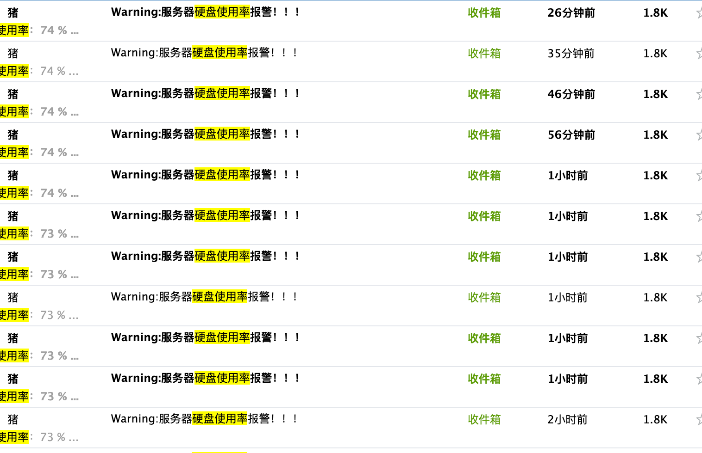

# 1、背景
一大早就收到好几个磁盘报警邮件：


但实际上很奇怪啊，又没什么日志，怎么会快速增长呢？

# 2、定位

```
root@fatpo:~# du -hsx /var | sort -rh | head -10
14G	/var
```
看来是`/var`的问题，再跟一步：
```
root@fatpo:~# du -hsx /var/* | sort -rh | head -10
12G	/var/log
1.1G	/var/lib
547M	/var/snap
185M	/var/cache
152M	/var/spool
2.0M	/var/backups
548K	/var/mail
28K	/var/tmp
12K	/var/www
4.0K	/var/opt
```
看来是`/var/log`的问题，再跟一步：
```
root@fatpo:/var/log# du -hsx /var/log/* | sort -rh | head -10
3.1G	/var/log/mail.log
2.5G	/var/log/journal
2.1G	/var/log/mail.log.1
1.1G	/var/log/syslog.1
990M	/var/log/syslog
897M	/var/log/mail.err
623M	/var/log/mail.err.1
108M	/var/log/btmp.1
51M	/var/log/syslog.2.gz
49M	/var/log/btmp
```
好吧，什么鬼，这些是mail的日志？

# 2、解决 /var/log/journal
先看看 `/var/log/journal`，它是什么呢？ 根据参考1的博客所言：
```
Linux 两个日志服务，分别是传统的 rsyslog 和 systemd-journal

systemd-journald是一个改进型日志管理服务，可以收集来自内核、系统早期启动阶段的日志、系统守护进程在启动和运行中的标准输出和错误信息，还有syslog的日志。

该日志服务仅仅把日志集中保存在单一结构的日志文件/run/log中，由于日志是经历过压缩和格式化的二进制数据，所以在查看和定位的时候很迅速。

本文转自米扑博客：Linux 系统 /var/log/journal/ 垃圾日志清理

默认情况下并不会持久化保存日志，只会保留一个月的日志。另外，一些rsyslog无法收集的日志也会被journal记录到。

rsyslog作为传统的系统日志服务，把所有收集到的日志都记录到/var/log/目录下的各个日志文件中。
```
好吧，就是一个日志服务，可以设置命令自动维护：
```
1）只保留近一周的日志

journalctl --vacuum-time=1w

2）只保留500MB的日志

journalctl --vacuum-size=500M

3）直接删除 /var/log/journal/ 目录下的日志文件

rm -rf /var/log/journal/f9d400c5e1e8c3a8209e990d887d4ac1
```

# 3、解决 /var/log/mail.log
这个是ubuntu的`Postfix`服务导致的日志，`Postfix`是什么呢？ 根据参考2：
```
Postfix 是一种 Mail Transfer Agent 邮件传送代理 (MTA) 是 Ubuntu 缺省的邮件代理程序. 

它在 Ubuntu 的 main 仓库, 意味着它将接收到安全方面的升级。 

这个指南说明了如何安装和配置 postfix 和设置为一个使用安全连接的 SMTP 服务器。
```
不管了，就是一个搞mail的服务，我们可以通过crontab重写入清空日志。

不过我先把这个服务停了再说：
```
service postfix stop
```
好像不影响我发邮件，有趣。
再把 `sendmail`也停了：
```
service sendmail stop
```
也不影响我发邮件，太好了。

直接卸载sendmail：
```
apt-get purge sendmail*
```
然后把`/var/log/mail*`日志干掉，完美，发现使用率下降了:
```
root@fatpo:~# df -h
Filesystem      Size  Used Avail Use% Mounted on
udev            462M     0  462M   0% /dev
tmpfs            99M 1012K   98M   2% /run
/dev/vda1        24G  5.5G   17G  25% /
```


# 4、参考
* [Linux 系统 /var/log/journal/ 垃圾日志清理](https://cloud.tencent.com/developer/article/1423873)
* [Postfix 快速指南](https://wiki.ubuntu.org.cn/Postfix_%E5%BF%AB%E9%80%9F%E6%8C%87%E5%8D%97)
* [Completely remove sendmail](https://askubuntu.com/questions/460820/completely-remove-sendmail)