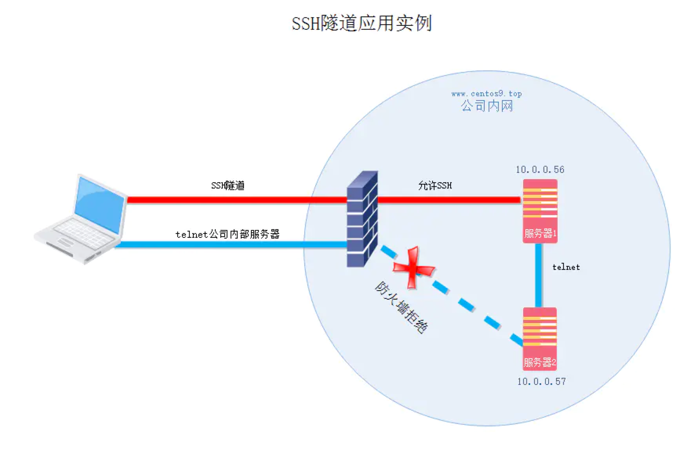
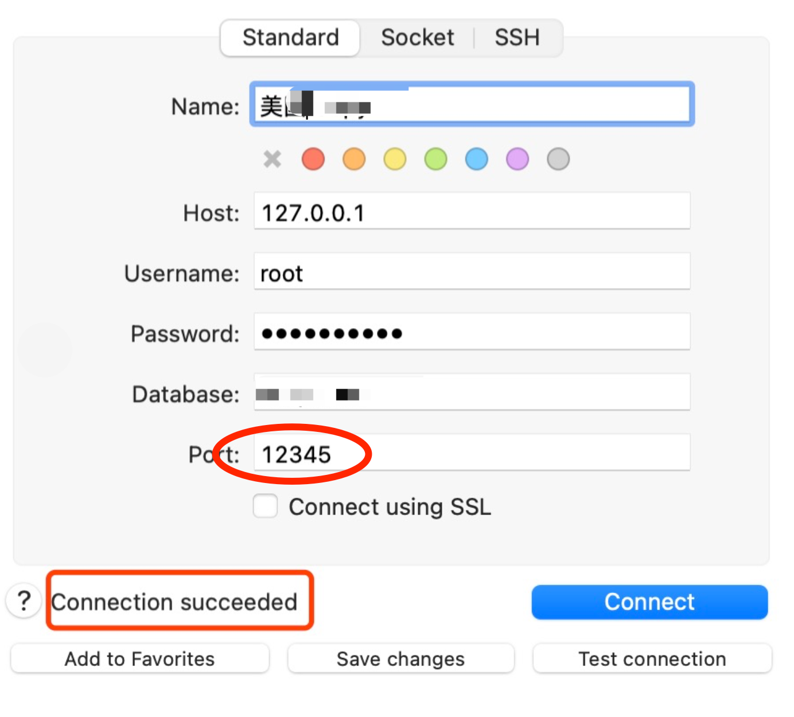

# 1、背景
mysql version:
```
5.7
```
cat /etc/mysql/mysql.cnf:
```text
#
# The MySQL database server configuration file.
#
# You can copy this to one of:
# - "/etc/mysql/my.cnf" to set global options,
# - "~/.my.cnf" to set user-specific options.
#
# One can use all long options that the program supports.
# Run program with --help to get a list of available options and with
# --print-defaults to see which it would actually understand and use.
#
# For explanations see
# http://dev.mysql.com/doc/mysql/en/server-system-variables.html

#
# * IMPORTANT: Additional settings that can override those from this file!
#   The files must end with '.cnf', otherwise they'll be ignored.
#

!includedir /etc/mysql/conf.d/
!includedir /etc/mysql/mysql.conf.d/

[mysqld]
#bind-address=127.0.0.1
```

端口因为安全原因，关闭3306远程访问：
```
ssh - 22 - open
mysql - 3306 - closed
```

# 2、mac连接mysql软件SequelPro连接成功
现在想用ssh来连接mysql，用macos的 SequelPro 能连接成功，配置截图：


# 3、windows连接mysql软件navicat连接失败
相同的配置在windows用navicat就一定报错：
```
Lost connection to MySQL server at 'reading initial communication packet', system error: 0
```

我想了下，既然我的mac能连通，肯定是`链路ok`，那么很可能是客户端的问题。

我就抛开SequelPro和navicat，我用最原始的ssh来试试看：
```
ssh -L13306:127.0.0.1:3306 root@ip.address -i my/private/key.pem
```
竟然可以成功，我突然悟了，navicat的mysql服务器配置的host地址`不能是远程服务器IP地址`，而应该是`127.0.0.1`，它监听本机。
试了下，果然ok。

奇怪为啥 SequelPro 可以配置远程地址？我猜测这个软件应该是帮我们做点小trick，而ssh原始客户端和navicat是直男，就没有帮我们做小trick，就硬报错。

# 4、深挖ssh隧道原理

介绍隧道之前，科普下ssh几个参数：
```
-N 不执行任何指令
-f 后台执行
-R 使用远程端口转发
-L 绑定地址（-L address）
```


## 4.1、本地隧道

```
SSH -L 6666:10.0.0.57:23 -Nf 10.0.0.56
# -L 将本地6666端与远程服务器2（10.0.0.57）的23端口建立映射关系
# -N 不执行命令或者脚本，否则会等待用户输入命令
# -f  不登录到主机，一般-Nf搭配使用即后台运行且不登录
```




## 4.2、本地隧道还原navicat错误现场

解析下我们的navicat为啥失败，首先要通过ssh连接mysql需要配置2个地方：
* ssh配置
    * 这个我们配置是ok的，用户名密码都是正确的（对）
    * 连接成功（对）
* mysql配置
    * 我们配置了服务器的IP地址（`错误，改为127.0.0.1`）
    * 我们配置了服务器的端口（对）
    * 我们配置了mysql的用户名（对）
    * 我们配置了mysql的password（对）

这里唯一的点就在于，我们的mysql配置了`服务器的IP地址是错的`，因为ssh隧道打通后：
* 我们本地的navicat应该连接本地隧道端口（这个端口被SequelPro软件屏蔽了，我们不用关心）
* ssh会帮我们把本地隧道端口的数据传输到配置的`mysql服务器IP:mysql服务器端口`。
* 那么对于`mysql服务器IP:mysql服务器端口`应该是相对远程服务器而言的。
* 很凑巧的是，我们的mysql就安装在ssh远程服务器上面，所以它应该是`127.0.0.1:3306`。

## 4.3、怎么手动创建隧道后用mysql连接

第一步，我们手动创建一个隧道端口：12345（如果用软件的话，这个端口其实我们不关心，软件会屏蔽这个细节）
```
➜  ~ ssh -L 12345:127.0.0.1:3306 -N root@140.82.61.236

```
第二步，我们在配置端：
* mysql配置
    * 我们配置了 127.0.0.1
    * 我们配置了 12345 端口
    * 我们配置了mysql的用户名（对）
    * 我们配置了mysql的password（对）

成功：



# 5、ssh参数
```
usage: ssh [-46AaCfGgKkMNnqsTtVvXxYy] [-B bind_interface]
           [-b bind_address] [-c cipher_spec] [-D [bind_address:]port]
           [-E log_file] [-e escape_char] [-F configfile] [-I pkcs11]
           [-i identity_file] [-J [user@]host[:port]] [-L address]
           [-l login_name] [-m mac_spec] [-O ctl_cmd] [-o option] [-p port]
           [-Q query_option] [-R address] [-S ctl_path] [-W host:port]
           [-w local_tun[:remote_tun]] destination [command]

-1：强制使用ssh协议版本1；

-2：强制使用ssh协议版本2；

-4：强制使用IPv4地址；

-6：强制使用IPv6地址；

-A：开启认证代理连接转发功能；

-a：关闭认证代理连接转发功能；

-b：使用本机指定地址作为对应连接的源ip地址；

-C：请求压缩所有数据；

-F：指定ssh指令的配置文件；

-f：后台执行ssh指令；

-g：允许远程主机连接主机的转发端口；

-i：指定身份文件；

-l：指定连接远程服务器登录用户名；

-N：不执行远程指令；

-o：指定配置选项；

-p：指定远程服务器上的端口；

-q：静默模式；

-X：开启X11转发功能；

-x：关闭X11转发功能；

-y：开启信任X11转发功能。
```

end.