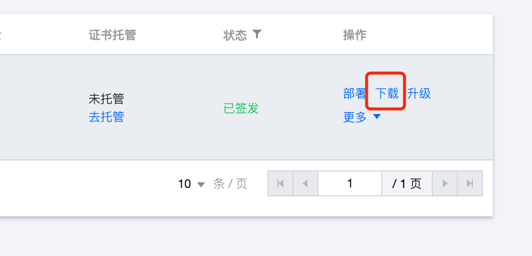
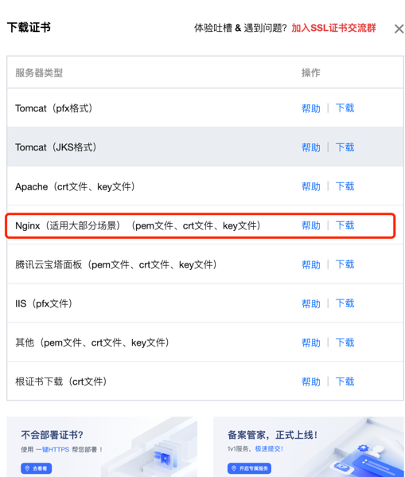

## 提前申请好证书
点点点： https://console.cloud.tencent.com/ssl

## 下载证书


选择 nginx 格式：


## 上传证书到服务器
上传 zip 包后解压：
```text
root@VM-20-8-ubuntu:/etc/nginx/conf.d/haha.com_nginx# pwd
/etc/nginx/conf.d/haha.com_nginx
root@VM-20-8-ubuntu:/etc/nginx/conf.d/haha.com_nginx# ll
-rw-rw-rw- 1 root root 4113 Sep 15 16:08 haha.com_bundle.crt
-rw-rw-rw- 1 root root 4113 Sep 15 16:08 haha.com_bundle.pem
-rw-rw-rw- 1 root root 1004 Sep 15 16:08 haha.com.csr
-rw-rw-rw- 1 root root 1702 Sep 15 16:08 haha.com.key
```

## 配置 nginx
vi /etc/nginx/conf.d/website.conf
```text
server {
     #SSL 默认访问端口号为 443
     listen 443 ssl;
     #请填写绑定证书的域名
     server_name haha.com www.haha.com;
     #请填写证书文件的相对路径或绝对路径
     ssl_certificate /etc/nginx/conf.d/haha.com_nginx/haha.com_bundle.crt;
     #请填写私钥文件的相对路径或绝对路径
     ssl_certificate_key /etc/nginx/conf.d/haha.com_nginx/haha.com.key;
     ssl_session_timeout 5m;
     #请按照以下协议配置
     ssl_protocols TLSv1.2 TLSv1.3;
     #请按照以下套件配置，配置加密套件，写法遵循 openssl 标准。
     ssl_ciphers ECDHE-RSA-AES128-GCM-SHA256:HIGH:!aNULL:!MD5:!RC4:!DHE;
     ssl_prefer_server_ciphers on;
     location / {
         #网站主页路径。此路径仅供参考，具体请您按照实际目录操作。
         #例如，您的网站主页在 Nginx 服务器的 /etc/www 目录下，则请修改 root 后面的 html 为 /etc/www。
         root /var/www/html;
         index  index.html index.htm;
     }
 }
```
ps: 假设你的 html+js+css 文件都放到了`/var/www/html`目录下。

## 重启nginx
```text
nginx -t
nginx -s reload
```
