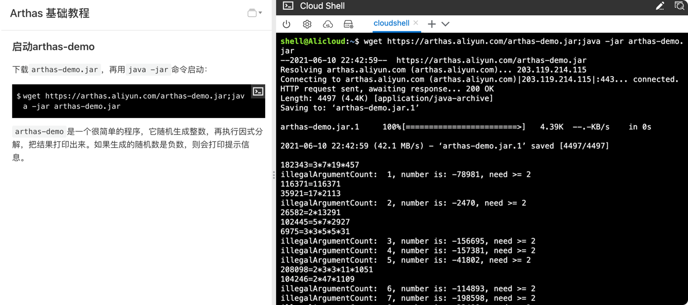
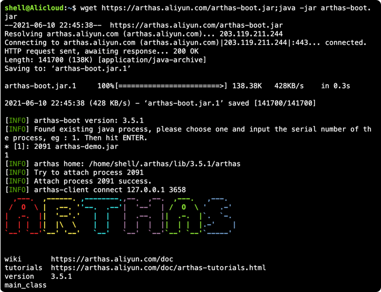
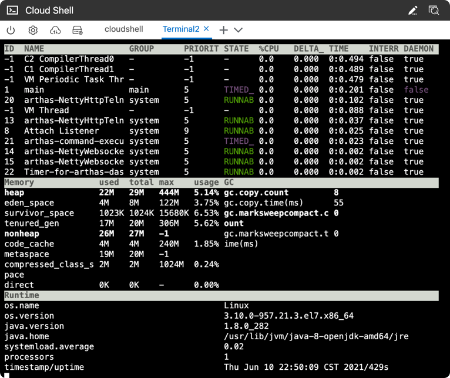
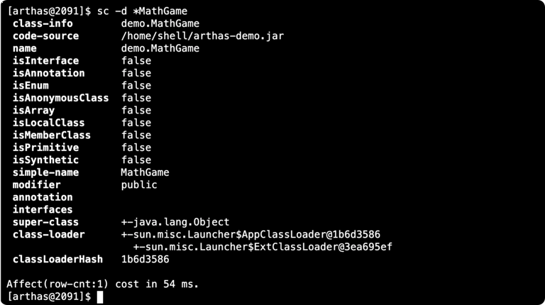
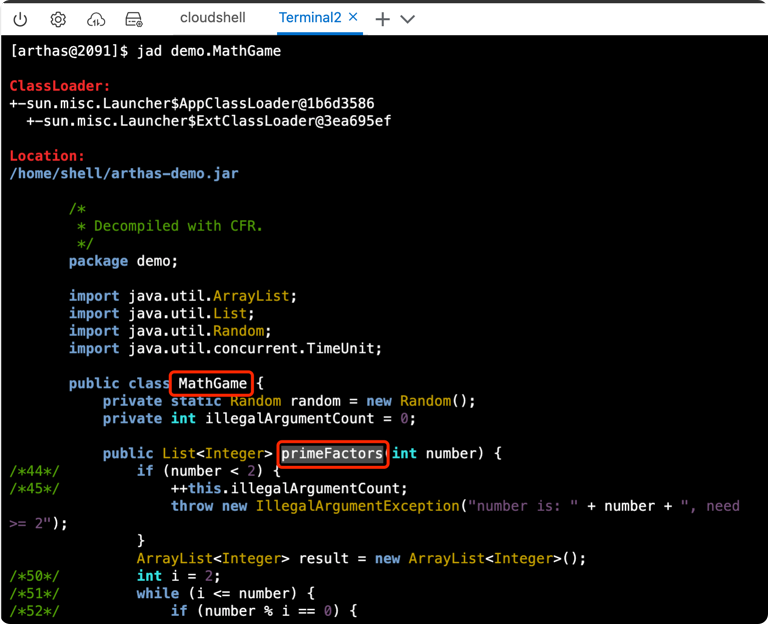
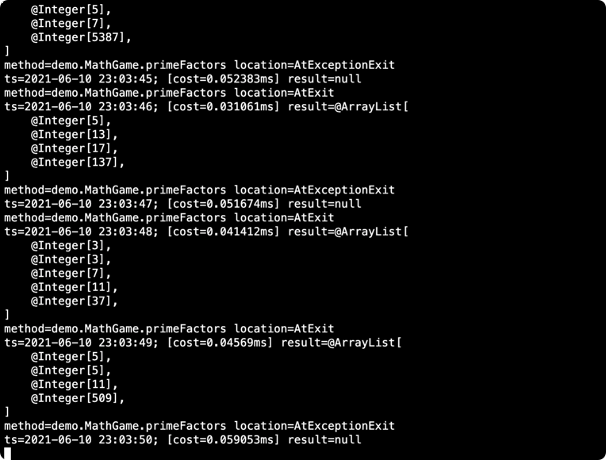

# 1、启动arthas-demo
下载`arthas-demo.jar`，再用`java -jar`命令启动：
```dtd
wget https://arthas.aliyun.com/arthas-demo.jar;java -jar arthas-demo.jar
```
`arthas-demo`是一个很简单的程序，它随机生成整数，再执行因式分解，把结果打印出来。如果生成的随机数是负数，则会打印提示信息。



# 2、启动arthas-boot
在新的Terminal 2里，下载`arthas-boot.jar`，再用`java -jar`命令启动：
```dtd
wget https://arthas.aliyun.com/arthas-boot.jar;java -jar arthas-boot.jar
```
arthas-boot是Arthas的启动程序，它启动后，会列出所有的Java进程，用户可以选择需要诊断的目标进程。

选择第一个进程，输入 `1` ，再`Enter/回车`：
```dtd
1
```
Attach成功之后，会打印Arthas LOGO。输入 `help` 可以获取到更多的帮助信息。



# 3、打开Dashboard
`dashboard` 命令可以查看当前系统的实时数据面板。
```dtd
dashboard
```
输入 `q` 或者 `Ctrl+C` 可以退出dashboard命令。



# 4、thread查看线程
`thread 1` 可以看`ID=1`的线程：


# 5、sc查看JVM里已加载的类
可以通过 sc 命令来查找JVM里已加载的类：
```dtd
sc -d *MathGame
```



# 6、Jad反编译类

可以通过 jad 命令来反编译代码：
```dtd
jad demo.MathGame
```



# 7、watch看函数返回值
通过watch命令可以查看函数的参数/返回值/异常信息。
```dtd
watch demo.MathGame primeFactors returnObj
```
输入 `q` 或者 `Ctrl+C` 退出`watch`命令。



# 8、watch查看入参
```dtd
watch demo.MathGame primeFactors params -x 2
```

其中 `-x 2` 表示打印对象的深度，x越大，打印越详细。

# 9、trace查看链路调用
trace {fullPathClassName} {function}
```
[arthas@431] trace demo.MathGame run
Press Q or Ctrl+C to abort.
Affect(class-cnt:1 , method-cnt:1) cost in 28 ms.
`---ts=2019-12-04 00:45:08;thread_name=main;id=1;is_daemon=false;priority=5;TCCL=sun.misc.Launcher$AppClassLoader@3d4eac69
    `---[0.617465ms] demo.MathGame:run()
        `---[0.078946ms] demo.MathGame:primeFactors() #24 [throws Exception]
 
`---ts=2019-12-04 00:45:09;thread_name=main;id=1;is_daemon=false;priority=5;TCCL=sun.misc.Launcher$AppClassLoader@3d4eac69
    `---[1.276874ms] demo.MathGame:run()
        `---[0.03752ms] demo.MathGame:primeFactors() #24 [throws Exception]
```
还能用`'#cost > 10'`过滤耗时：
```
[arthas@431] trace demo.MathGame run '#cost > 10'
Press Ctrl+C to abort.
Affect(class-cnt:1 , method-cnt:1) cost in 41 ms.
`---ts=2018-12-04 01:12:02;thread_name=main;id=1;is_daemon=false;priority=5;TCCL=sun.misc.Launcher$AppClassLoader@3d4eac69
    `---[12.033735ms] demo.MathGame:run()
        +---[0.006783ms] java.util.Random:nextInt()
        +---[11.852594ms] demo.MathGame:primeFactors()
        `---[0.05447ms] demo.MathGame:print()
```
还能用`--skipJDKMethod false`看看JDK的调用（默认看不到）：
```
[arthas@431] trace --skipJDKMethod false demo.MathGame run
Press Q or Ctrl+C to abort.
Affect(class-cnt:1 , method-cnt:1) cost in 60 ms.
`---ts=2019-12-04 00:44:41;thread_name=main;id=1;is_daemon=false;priority=5;TCCL=sun.misc.Launcher$AppClassLoader@3d4eac69
    `---[1.357742ms] demo.MathGame:run()
        +---[0.028624ms] java.util.Random:nextInt() #23
        +---[0.045534ms] demo.MathGame:primeFactors() #24 [throws Exception]
        +---[0.005372ms] java.lang.StringBuilder:<init>() #28
        +---[0.012257ms] java.lang.Integer:valueOf() #28
        +---[0.234537ms] java.lang.String:format() #28
        +---[min=0.004539ms,max=0.005778ms,total=0.010317ms,count=2] java.lang.StringBuilder:append() #28
        +---[0.013777ms] java.lang.Exception:getMessage() #28
        +---[0.004935ms] java.lang.StringBuilder:toString() #28
        `---[0.06941ms] java.io.PrintStream:println() #28
 
`---ts=2019-12-04 00:44:42;thread_name=main;id=1;is_daemon=false;priority=5;TCCL=sun.misc.Launcher$AppClassLoader@3d4eac69
    `---[3.030432ms] demo.MathGame:run()
        +---[0.010473ms] java.util.Random:nextInt() #23
        +---[0.023715ms] demo.MathGame:primeFactors() #24 [throws Exception]
        +---[0.005198ms] java.lang.StringBuilder:<init>() #28
        +---[0.006405ms] java.lang.Integer:valueOf() #28
        +---[0.178583ms] java.lang.String:format() #28
        +---[min=0.011636ms,max=0.838077ms,total=0.849713ms,count=2] java.lang.StringBuilder:append() #28
        +---[0.008747ms] java.lang.Exception:getMessage() #28
        +---[0.019768ms] java.lang.StringBuilder:toString() #28
        `---[0.076457ms] java.io.PrintStream:println() #28
```

# 10、怎么在watch中过滤
比如我的函数，它在class `com.fatpo.api.RecallFilter` 中：
```
public List<RecallItem> func(List<RecallItem> items, RecomReq req){
    // ...
}
```
现在想过滤items1中的itemId="abc123"的item，打印出来：
```
watch com.fatpo.api.RecallFilter func "{params[0].{? #this.itemId.contains('abc123')}.{itemId} }" -n 1 -x 2
```
其中两个参数 ：
```
-n 1 表示只抓一次
-x 2 打印深度为2
```

# 11、链接
* arthas (传送门)[https://arthas.aliyun.com/doc/download.html]
* 阿里动手实验室，(传送门)[https://start.aliyun.com/handson/qDlgqpBT/arthas-basics-cn]
