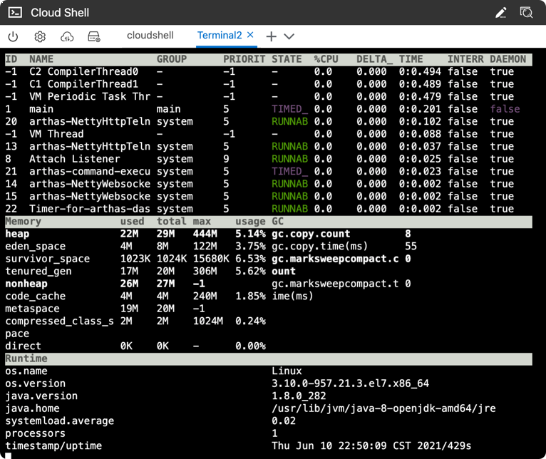
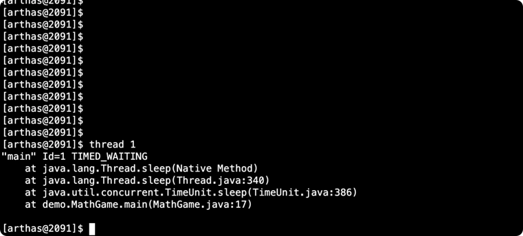
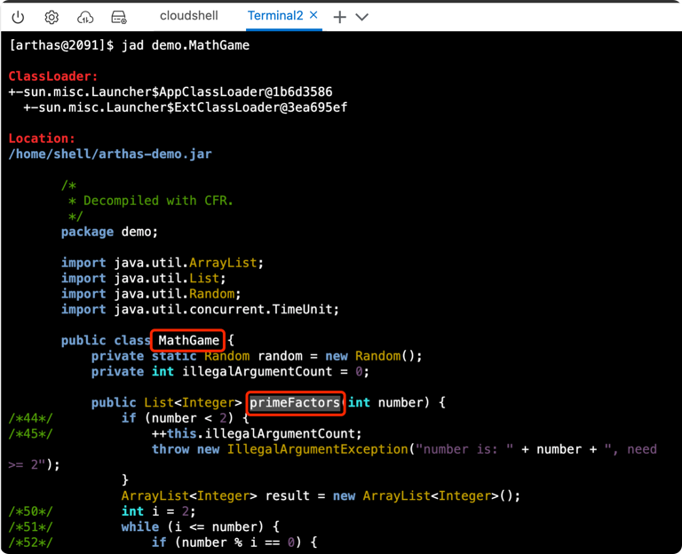

# 1、启动arthas-demo
下载`arthas-demo.jar`，再用`java -jar`命令启动：
```dtd
wget https://arthas.aliyun.com/arthas-demo.jar;java -jar arthas-demo.jar
```
`arthas-demo`是一个很简单的程序，它随机生成整数，再执行因式分解，把结果打印出来。如果生成的随机数是负数，则会打印提示信息。


# 2、启动arthas-boot
在新的Terminal 2里，下载`arthas-boot.jar`，再用`java -jar`命令启动：
```dtd
wget https://arthas.aliyun.com/arthas-boot.jar;java -jar arthas-boot.jar
```
arthas-boot是Arthas的启动程序，它启动后，会列出所有的Java进程，用户可以选择需要诊断的目标进程。

选择第一个进程，输入 `1` ，再`Enter/回车`：
```dtd
1
```
Attach成功之后，会打印Arthas LOGO。输入 `help` 可以获取到更多的帮助信息。


# 3、打开Dashboard
`dashboard` 命令可以查看当前系统的实时数据面板。
```dtd
dashboard
```
输入 `q` 或者 `Ctrl+C` 可以退出dashboard命令。



# 4、thread查看线程
`thread 1` 可以看`ID=1`的线程：


# 5、sc查看JVM里已加载的类
可以通过 sc 命令来查找JVM里已加载的类：
```dtd
sc -d *MathGame
```


# 6、Jad反编译类

可以通过 jad 命令来反编译代码：
```dtd
jad demo.MathGame
```


# 7、watch看函数返回值
通过watch命令可以查看函数的参数/返回值/异常信息。
```dtd
watch demo.MathGame primeFactors returnObj
```
输入 `q` 或者 `Ctrl+C` 退出`watch`命令。


# 8、链接
* 阿里动手实验室，(传送门)[https://start.aliyun.com/handson/qDlgqpBT/arthas-basics-cn]
