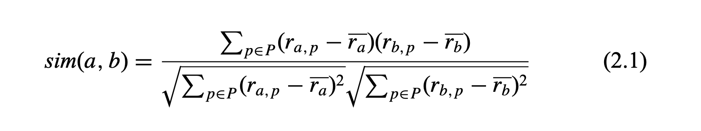
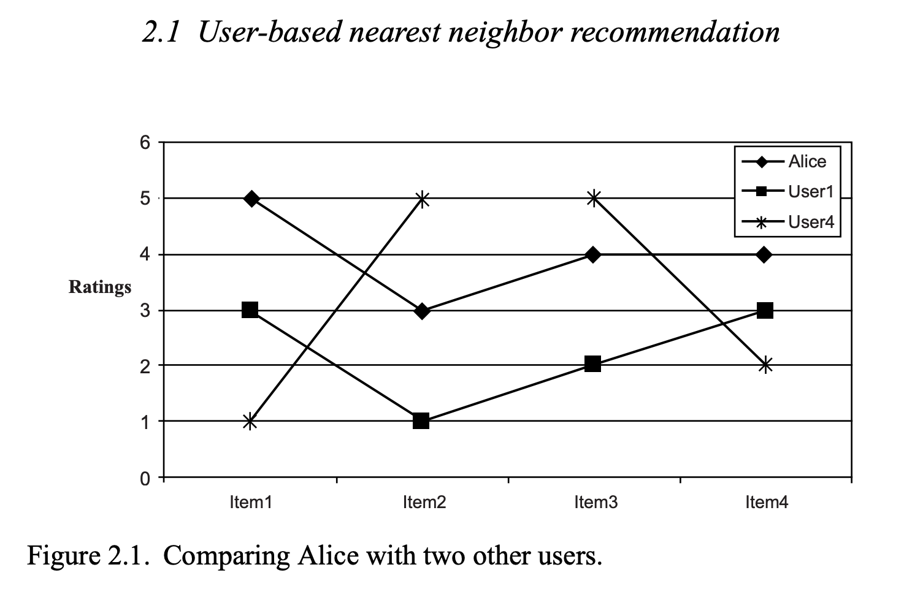
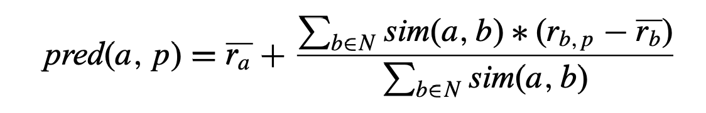
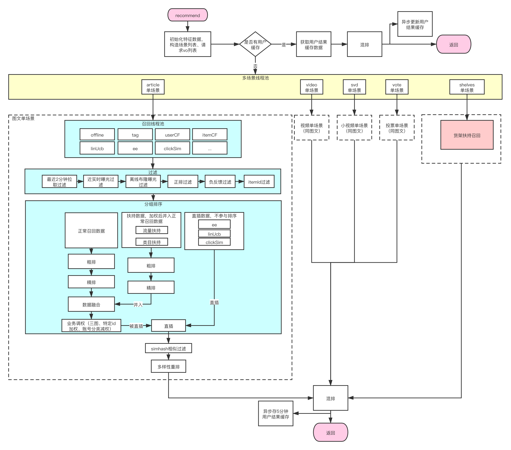
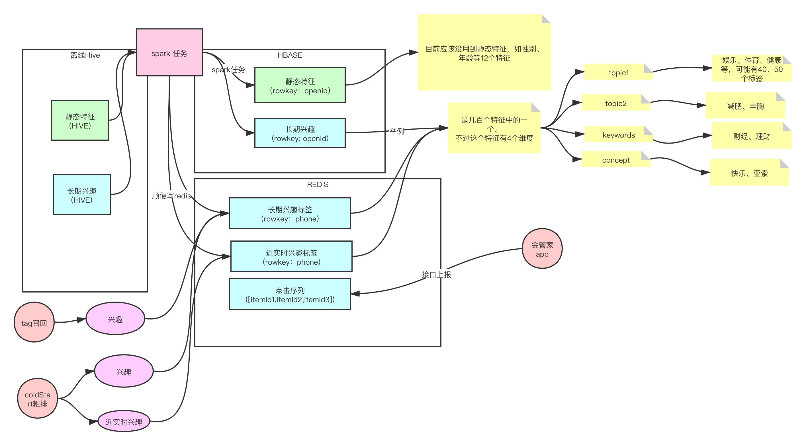
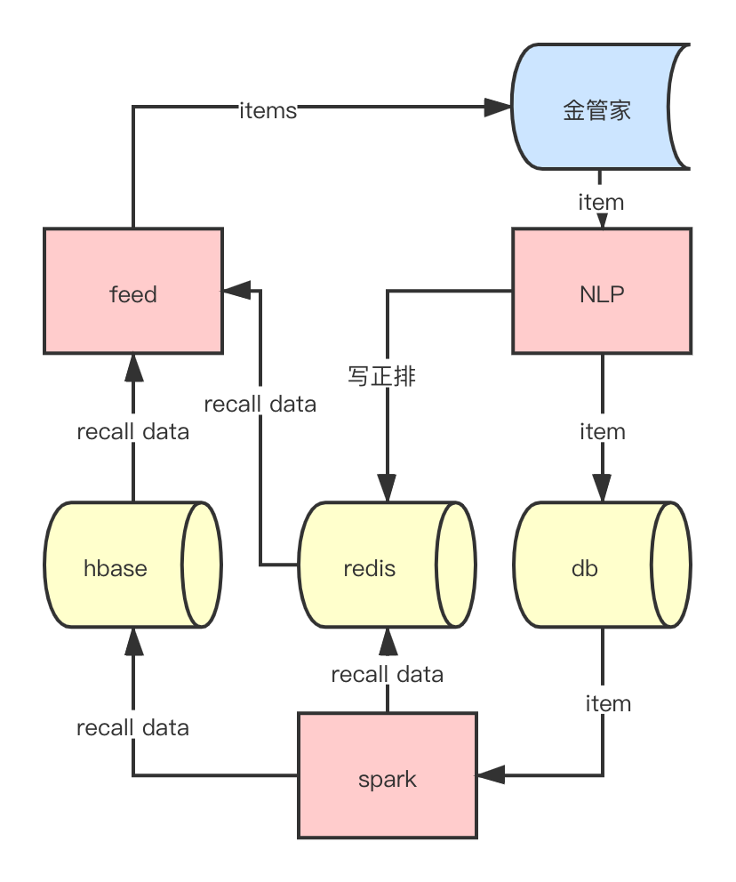
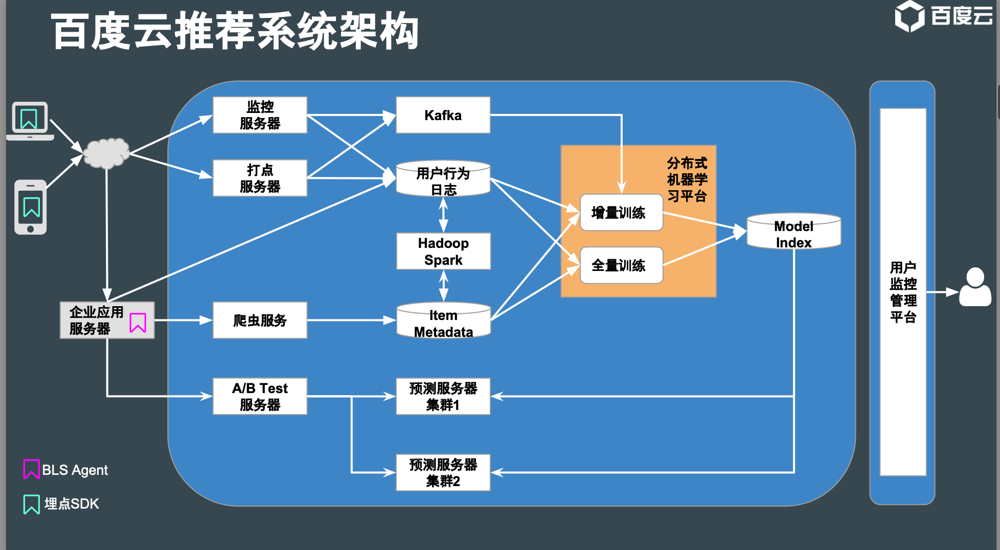
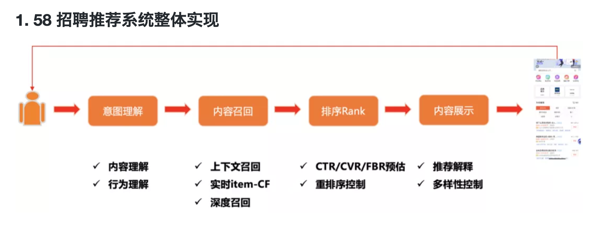
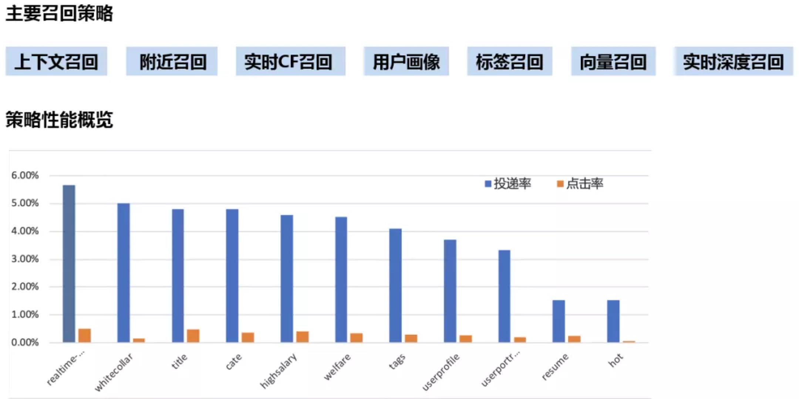

# 一、做个推荐小游戏

## 1.1、帮忙国哥打分
现在有5个用户，5个商品，每个用户对商品的打分如下：


|用户\内容|Item1 |Item2 |Item3 |Item4 |Item5|
|:---|---|---|---|---|---|
|国哥| 5 |3 |4 |4 |<font color='red'>?</font>|
|User1| 3 |1 |2 |3 |3|
|User2| 4 |3 |4 |3 |5|
|User3| 3 |3 |1 |5 |4|
|User4| 1 |5 |5 |2 |1|

国哥对item5还没打分，请你帮帮他。

## 1.2、用户协同推荐
有一个打分思路就是，虽然我不知道国哥对item5是什么看法，但是我可以看看和国哥类似的人对item5有什么看法。

用国哥的`邻居`去推测国哥的判断。

### 1.2.1、 找到和国哥相似的用户
找相似有很多解决方案，这里用相关系数的公式（协方差/标准差，就能把相关系数锁定在[-1,1]区间，更直观）：



python代码：
```java
def cosin_distance(vector1, vector2):
    dot_product = 0.0
    normA = 0.0
    normB = 0.0

    avg1 = sum(vector1) / len(vector1)
    avg2 = sum(vector2) / len(vector2)

    for a, b in zip(vector1, vector2):
        dot_product += (a - avg1) * (b - avg2)
        normA += (a - avg1) ** 2
        normB += (b - avg2) ** 2
    if normA == 0.0 or normB == 0.0:
        return None
    else:
        return dot_product / ((normA * normB) ** 0.5)


if __name__ == '__main__':
    # 5个用户对5个商品的打分
    r = [[5, 3, 4, 4, None], [3, 1, 2, 3, 3], [4, 3, 4, 3, 5], [3, 3, 1, 5, 4], [1, 5, 5, 2, 1]]

    # 找出和用户1相似的用户
    for u in range(1, 5):
        print(f"cosin_distance: alice + user{u}:  {cosin_distance(r[0][:-1], r[u][:-1])}")

```
结果：
```
cosin_distance: alice + user1:  0.8528028654224417
cosin_distance: alice + user2:  0.7071067811865475
cosin_distance: alice + user3:  0.0
cosin_distance: alice + user4:  -0.7921180343813395
```
说明：
```
和user1是最相似的用户，和user2是第二相似的用户，而user4是最不相似的用户。
```
用图表来模拟就是:


解释下公式，是`皮尔逊积矩相关系数`。

#### 1.2.1.1、皮尔逊相关系数是啥：

由公式可知，Pearson 相关系数是用`协方差`除以`两个变量的标准差`得到的，

虽然协方差能反映两个随机变量的相关程度（协方差大于0的时候表示两者正相关，小于0的时候表示两者负相关），

但其数值上`受量纲的影响很大`（可能出现300，15000，931这些数值，不够直观），不能简单地从协方差的数值大小给出变量相关程度的判断。

为了消除这种量纲的影响，于是就有了相关系数的概念，除以两个变量的标准差，`把相关系数控制在[-1, 1]之间`。

#### 1.2.1.2、为什么选择皮尔逊相关系数

实际上目前求相似度的手段有：
* Pearson’s correlation coefficient  皮尔逊相关系数
* adjusted cosine similarity 调整的余弦相似度
* Spearman’s rank correlation coefficient 斯皮尔曼等级相关系数
* mean squared difference 均方差

但是推荐圣经《System Recommender - An Introduction》说在基于用户的推荐策略上面，皮尔逊相关系数是最屌的：
```
However, empirical analyses show that for user-based recommender systems – and at least for the best
studied recommendation domains – the Pearson coefficient outperforms other
measures of comparing users.
```


### 1.2.2、用最相似的2个用户去推测国哥的item5评分
公式如下：


```
Alice的预计分数 
= Alice的平均打分 + 1/(和用户1的相似度 + 和用户2的相似度) * ((用户1相似度 * 用户1对item5的打分差) + （用户2的相似度 * 用户2对item5的打分差）)
= 4 + 1/(0.85 + 0.7) ∗ (0.85 ∗ (3 − 2.4) + 0.70 ∗ (5 − 3.8)) 
= 4.87
```

## 1.3、参考资料

* [皮尔逊积矩相关系数](https://zh.wikipedia.org/wiki/%E7%9A%AE%E5%B0%94%E9%80%8A%E7%A7%AF%E7%9F%A9%E7%9B%B8%E5%85%B3%E7%B3%BB%E6%95%B0)
* [知乎：如何通俗易懂地解释「协方差」与「相关系数」的概念？](https://www.zhihu.com/question/20852004/answer/16393656)
* [recommender Systems An Introduction.pdf](https://www.amazon.com/Recommender-Systems-Introduction-Dietmar-Jannach/dp/0521493366)
* [CSDN-余弦相似度 —— Cosine Similarity](https://blog.csdn.net/ifnoelse/article/details/7766123)

# 二、我们自己的推荐架构图
## 2.1、实时推荐架构图


## 2.2、特征流程图


## 2.3、推荐数据流转图



# 三、别人家的推荐架构图
## 3.1、百度云



## 3.2、58同城


* 58 招聘推荐系统的整体处理流程和其他场景的推荐系统大同小异。

* 在用户到来后首先进行用户意图理解，从职位池中多路召回职位，对召回职位根据优化目标进行精排和重排序，最后加入多样性等策略将最终内容展现给用户。
    * 意图理解：C 端用户进入后通过内容理解、行为理解
    * 内容召回：上下文召回、实时 item-CF、深度召回以及粗排的等多种召回方式
    * 排序 Rank：优化目标有很多，除了传统的 CTR 预估、CVR 预估，还有招聘场景下针对 B 端用户进行的 FBR ( FeedBack Rate ) 预估；重排序控制
    * 内容展示：针对业务考虑推荐的解释性及多样性，进行排序并最终展现

# 四、我们怎么搞召回
很可惜，很多都是基于离线处理：
* redis热度召回
* hbase热度召回

实时也有：
* 用户协同过滤
* 基于item的协同过滤
* UEE 新用户探索-1
* itemEE 新用户探索-2

向量的也有：
* annoy 召回，但是还没大幅度推广，性能问题，模型更新问题...

# 五、业界怎么搞召回

## 5.1、百度云

### 5.1.1、针对用户推荐物品，例如
* 基于Model based CF算法，离线分解 [用户，物品] 打分矩阵，对任一用户，离线计算Top N的推
荐列表，并存储到Index文件
* 基于用户画像的推荐算法 (用户画像可以用带权重的物品列表表示 )，对任一用户，离线计算待
推荐物品和用户画像物品的相似度，获得Top N的推荐列表，并存储到Index文件
* 针对新用户，使用基于Popularity的算法，获得推荐Top N的推荐列表，并存储到Index文件
* ......
### 5.1.2、针对物品推荐相关物品，例如
* 基于Item based CF算法，离线使用kNN算法 (可预处理，以减少计算量)，对每个Item，获得Top
N的推荐列表
* 基于Model based CF算法，如ALS，可以把分解后的物品矩 阵向量当做物品的向量表示，向量的
相似度即为物品的相似度，对每个Item，获得Top N的推荐列表
* 新闻、咨询也可以使用TF-IDF、PLSA、Word2Vec等方法获得向量表达，然后对每个Item，获得
Top N的推荐列表
* ......

## 5.2、58同城



### 5.2.1、基于行为的向量召回

* 不论传统或深度召回方法，都要先构建物品的索引和理解用户的请求，对用户的请求返回匹配的物品。不同处在于深度召回中物品索引和用户请求表现为向量的形式。

* 离线使用 DNN 对招聘帖向量化，保存向量至 KNN 检索引擎：

    该检索引擎参考了 Facebook 的开源项目 Faiss，目前 58 内部已应用到生产并且有完备的中台支持
    招聘帖的特征包括：内容、企业信息、企业联系方式等，将多个特征经过相同的 Embedding 层后再通过一个平均池化作为招聘帖最终的向量表示
    用户的招聘帖历史行为可转化为一个行为链，在多条行为链上使用自然语言处理中常见的 Skip-Gram 加负采样的做法训练招聘帖的向量表示
    在线依历史行为生产用户兴趣向量：

* 用户特征，包括：用户的历史行为、用户的上下文、用户自身属性等。

### 5.2.2、实时深度召回

* 使用双塔架构进行实时召回在业界得到了极为广泛的使用，Facebook、微软、百度等公司都针对自身业务提出了各自的双塔网络架构。58 招聘则参考了 YouTube 技术团队 19 年提出的双塔架构[1]。

* 用户侧的处理流程：

    用户侧信息：用户特征如简历信息、画像信息等，上下文信息如位置、种类等，以及用户点击行为链和用户投递行为链；
    用户特征和上下文特征等多种信息以独立向量的形式输入 Embedding 层后进行平均池化；
    用户行为链中每一个招聘帖信息经过 Item Embedding 层后进行平均池化；
    上述两个经过平均池化的向量连接后输入一个 DNN ( Deep Neural networks )，58 招聘在 DNN 的选择上进行了多种尝试，如 projection ( 单层神经网络 )、DCN[2]和 PNN[3]；
    最终经过一个 L2 归一化操作，得到用户侧的表示向量；
    特别的，Item Embedding 层由用户侧和物品侧共享。

* 物品侧的处理流程：
    
    招聘帖信息经过与用户侧共享的 Item Embedding 层后再进行一次 L2 的归一化操作。
    
    其中，共享 Item Embedding 层的操作为：
    
    对招聘帖的 ID 进行 ID Embedding，对招聘帖的特征进行 Feature Embedding；
    对上述两个 Embedding 向量进行一次加和池化。


# 六、参考文献
* [58 同城 | 深度召回在招聘推荐系统中的挑战和实践](https://www.6aiq.com/article/1592434472555)