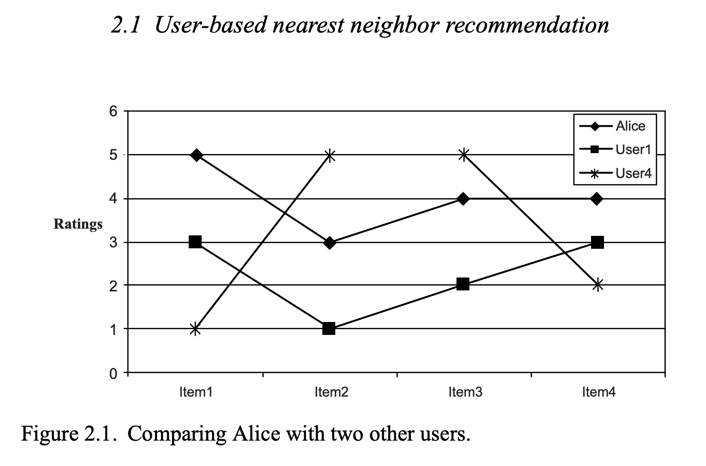

# 帮忙国哥打分
现在有5个用户，5个商品，每个用户对商品的打分如下：


|用户\内容|Item1 |Item2 |Item3 |Item4 |Item5|
|:---|---|---|---|---|---|
|国哥| 5 |3 |4 |4 |<font color='red'>?</font>|
|User1| 3 |1 |2 |3 |3|
|User2| 4 |3 |4 |3 |5|
|User3| 3 |3 |1 |5 |4|
|User4| 1 |5 |5 |2 |1|

国哥对item5还没打分，请你帮帮他。

# 用户协同推荐
有一个打分思路就是，虽然我不知道国哥对item5是什么看法，但是我可以看看和国哥类似的人对item5有什么看法。
那么国哥估计大差不差。

## 找到和国哥相似的用户
找相似有很多解决方案，这里用相关系数的公式（协方差/标准差，就能把相关系数锁定在[-1,1]区间，更直观）：


python代码：
```python
def cosin_distance(vector1, vector2):
    dot_product = 0.0
    normA = 0.0
    normB = 0.0

    avg1 = sum(vector1) / len(vector1)
    avg2 = sum(vector2) / len(vector2)

    for a, b in zip(vector1, vector2):
        dot_product += (a - avg1) * (b - avg2)
        normA += (a - avg1) ** 2
        normB += (b - avg2) ** 2
    if normA == 0.0 or normB == 0.0:
        return None
    else:
        return dot_product / ((normA * normB) ** 0.5)


if __name__ == '__main__':
    # 5个用户对5个商品的打分
    r = [[5, 3, 4, 4, None], [3, 1, 2, 3, 3], [4, 3, 4, 3, 5], [3, 3, 1, 5, 4], [1, 5, 5, 2, 1]]

    # 找出和用户1相似的用户
    for u in range(1, 5):
        print(f"cosin_distance: alice + user{u}:  {cosin_distance(r[0][:-1], r[u][:-1])}")

```
结果：
```
cosin_distance: alice + user1:  0.8528028654224417
cosin_distance: alice + user2:  0.7071067811865475
cosin_distance: alice + user3:  0.0
cosin_distance: alice + user4:  -0.7921180343813395
```
说明：
```
和user1是最相似的用户，和user2是第二相似的用户，而user4是最不相似的用户。
```
用图表来模拟就是:



## 用最相似的2个用户去推测国哥的item5评分
公式如下：


```
Alice的预计分数 
= Alice的平均打分 + 1/(和用户1的相似度 + 和用户2的相似度) * ((用户1相似度 * 用户1对item5的打分差) + （用户2的相似度 * 用户2对item5的打分差）)
= 4 + 1/(0.85 + 0.7) ∗ (0.85 ∗ (3 − 2.4) + 0.70 ∗ (5 − 3.8)) 
= 4.87
```


# 参考资料

* [知乎：如何通俗易懂地解释「协方差」与「相关系数」的概念？](https://www.zhihu.com/question/20852004/answer/16393656)
* [recommender Systems An Introduction.pdf](recommender Systems An Introduction.pdf)