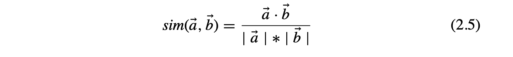
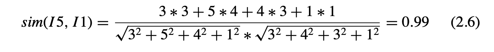
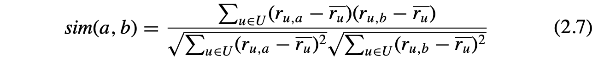
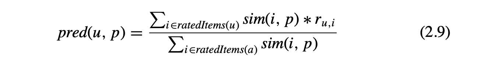

# 1-item协同过滤背景


亚马逊公司在2003年，拥有2300w用户，上百万的商品内容。

如果想要在这个数据规模上面，做用户协同过滤，操作的数据规模是 = 2300w * 100w = 23000亿，算法效率过低。

数据规模大，很难online处理。

而且这2300w的用户中，找到相似的邻居比较困难，很多人的购物item都没怎么交叉覆盖。
在很少的交叉集下，一旦来一个商品，两个用户都点赞，那么会极大地影响用户协同过滤的分数。

所以推出了item协同过滤。

# 2-还是来帮国哥评个分
现在有5个用户，5个商品，每个用户对商品的打分如下：

|用户\内容|Item1 |Item2 |Item3 |Item4 |Item5|
|:---|---|---|---|---|---|
|国哥| 5 |3 |4 |4 |<font color='red'>?</font>|
|User1| 3 |1 |2 |3 |3|
|User2| 4 |3 |4 |3 |5|
|User3| 3 |3 |1 |5 |4|
|User4| 1 |5 |5 |2 |1|

国哥对item5还没打分，请你帮帮他。

## 2.1-计算每两个item之间的相似度

### 2.1.1-余弦相似度


取值范围是[-1, 1]，越接近1就越相似。比如：item5和item1的相似度如下：


但是如果用余弦相似度，会导致一个问题：
```
每个人打分习惯不同，有的人打1，2，3分，有的人打4，5，6分，可能他们表达的是同一个评分："一般般，没意思"。
```

### 2.1.2-调整后的余弦相似度
调整后的余弦相似度 `adjusted cosine` 这个算是对消除用户打分习惯的解决方案。

引入了平均数后，相似度公式如下：


因此，消除完用户评分习惯后的评分矩阵调整为：

|用户\内容|Item1 |Item2 |Item3 |Item4 |Item5|
|:---|---|---|---|---|---|
|国哥| 1 |-1 |0 |0 |<font color='red'>?</font>|
|User1| 0.6 |-1.4 |-0.4 |0.6 |0.6|
|User2| 0.2 |-0.8 |0.2 |-0.8 |1.2|
|User3| -0.2 |-0.2 |-2.2 |2.8 |0.8|
|User4| -1.8 |2.2 |2.2 |-0.8 |-1.8|

我们计算下 item1和item5的调整余弦相似度： 
```
item1与item2的调整余弦相似度
=(0.6 * 0.6 + 0.2 * 1.2 + -0.2 * 0.8 + -1.8 * -1.8) /( (0.6 * 0.6 + 0.2 * 0.2 + -0.2 * -0.2 + -1.8 * -1.8) ** 0.5 * (0.6 * 0.6 + 1.2 * 1.2 + 0.8 * 0.8 + -1.8 * -1.8) ** 0.5 )
=0.8049144823791297
```

## 2.2-计算国哥的评分
公式:


ps:
```
我觉得这个公式的a变量没有得到解释，不排除是印错啦。
```

计算代码：
```python
import copy
from pprint import pprint


def cosine(a, b):
    c = 0
    d = 0
    e = 0
    for x, y in zip(a, b):
        if x and y:
            c += x * y
            d += x ** 2
            e += y ** 2

    return c / (d ** 0.5 * e ** 0.5)


def adjusted_cosine(a, b):
    print(f"adjusted_cosine before: {a}")
    print(f"adjusted_cosine before: {b}")

    sum1 = 0
    len1 = 0
    for i in a:
        if i:
            len1 += 1
            sum1 += i
    avg_a = sum1 / len1

    sum2 = 0
    len2 = 0
    for i in b:
        if i:
            len2 += 1
            sum2 += i
    avg_b = sum2 / len2

    print(f"adjusted_cosine avg_a: {avg_a}")
    print(f"adjusted_cosine avg_b: {avg_b}")

    a = [x - avg_a for x in a]
    b = [x - avg_b for x in b]

    print(f"adjusted_cosine after: {a}")
    print(f"adjusted_cosine after: {b}")
    return cosine(a, b)


def item_co_recommend(origin_data: list, predict_item_index: int):
    # 对数据处理， for adjusted_cosine
    prehandled_data = copy.deepcopy(origin_data)
    for vector in prehandled_data:
        sum = 0
        len = 0
        for i in vector:
            if i:
                len += 1
                sum += i
        avg = sum / len

        for index, i in enumerate(vector):
            if i:
                vector[index] = round(i - avg, 3)

    print("before prehanding data for adjusted cosine:")
    pprint(origin_data)

    print("after prehanding data for adjusted cosine:")
    pprint(prehandled_data)

    # adjusted_cosine
    item_co_score_1 = 0
    item_co_score_2 = 0
    item_p = [y for x in prehandled_data for index2, y in enumerate(x) if index2 == predict_item_index]

    for i in range(4):
        print("*" * 100)
        item_i = [y for x in prehandled_data for index2, y in enumerate(x) if index2 == i]
        print(f"item:{predict_item_index + 1} item_p: {item_p}")
        print(f"item:{i + 1}, item_i: {item_i}")
        sim_i_p = cosine(item_p, item_i)
        print(f"cosine sim_i_p: {sim_i_p}")

        ranking_score = origin_data[0][i]
        print(f"ranking_score={ranking_score}")
        item_co_score_1 += sim_i_p * ranking_score
        item_co_score_2 += sim_i_p

    print("*" * 100)
    print(f"final predict score: {item_co_score_1 / item_co_score_2}")


if __name__ == '__main__':
    # 5个用户对5个商品的打分
    r = [[5, 3, 4, 4, None], [3, 1, 2, 3, 3], [4, 3, 4, 3, 5], [3, 3, 1, 5, 4], [1, 5, 5, 2, 1]]
    #
    # # 找出和用户1相似的用户
    # for u in range(1, 5):
    #     print(f"cosin_distance: alice + user{u}:  {cosin_distance(r[0][:-1], r[u][:-1])}")

    # item 协同过滤
    item_co_recommend(r, 4)

```

计算结果：
```
/usr/local/bin/python3.8 /Users/ouyang/PycharmProjects/VirtualSIM_BackEnd/test.py
before prehanding data for adjusted cosine:
[[5, 3, 4, 4, None],
 [3, 1, 2, 3, 3],
 [4, 3, 4, 3, 5],
 [3, 3, 1, 5, 4],
 [1, 5, 5, 2, 1]]
after prehanding data for adjusted cosine:
[[1.0, -1.0, 0.0, 0.0, None],
 [0.6, -1.4, -0.4, 0.6, 0.6],
 [0.2, -0.8, 0.2, -0.8, 1.2],
 [-0.2, -0.2, -2.2, 1.8, 0.8],
 [-1.8, 2.2, 2.2, -0.8, -1.8]]
****************************************************************************************************
item:5 item_p: [None, 0.6, 1.2, 0.8, -1.8]
item:1, item_i: [1.0, 0.6, 0.2, -0.2, -1.8]
cosine sim_i_p: 0.8049144823791297
ranking_score=5
****************************************************************************************************
item:5 item_p: [None, 0.6, 1.2, 0.8, -1.8]
item:2, item_i: [-1.0, -1.4, -0.8, -0.2, 2.2]
cosine sim_i_p: -0.9082318755225987
ranking_score=3
****************************************************************************************************
item:5 item_p: [None, 0.6, 1.2, 0.8, -1.8]
item:3, item_i: [0.0, -0.4, 0.2, -2.2, 2.2]
cosine sim_i_p: -0.7635603856702251
ranking_score=4
****************************************************************************************************
item:5 item_p: [None, 0.6, 1.2, 0.8, -1.8]
item:4, item_i: [0.0, 0.6, -0.8, 1.8, -0.8]
cosine sim_i_p: 0.4330626889286794
ranking_score=4
****************************************************************************************************
final predict score: 0.050975639515425795

Process finished with exit code 0

```
得到的预测分数： `0.05`?? 不可能吧，用户协同过滤得分是4.58，为什么差距这么大！？
