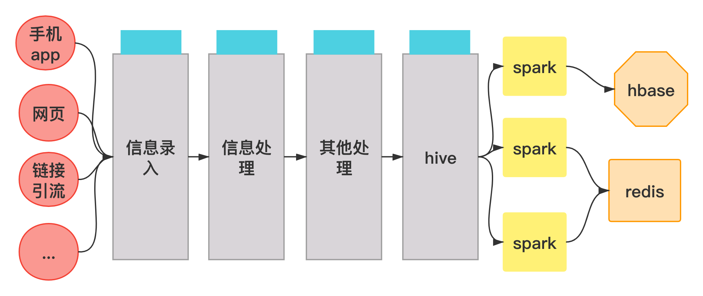
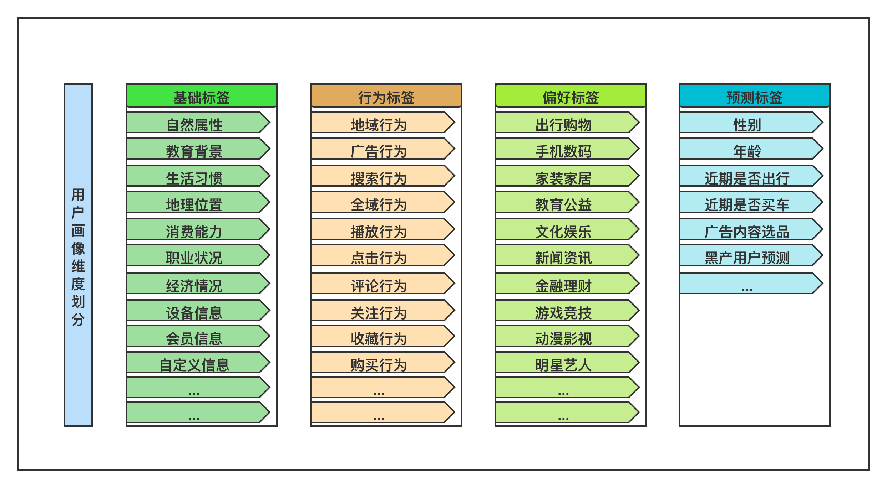
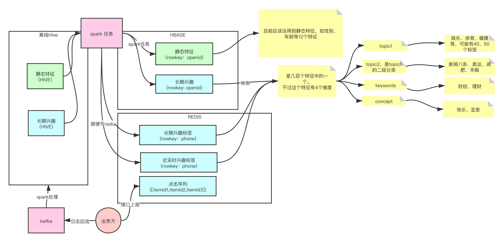
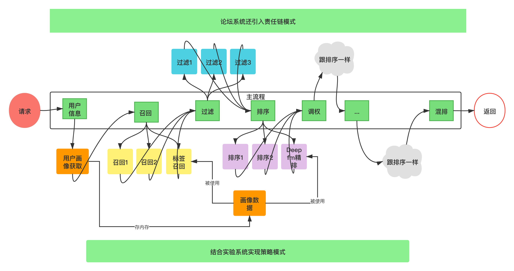
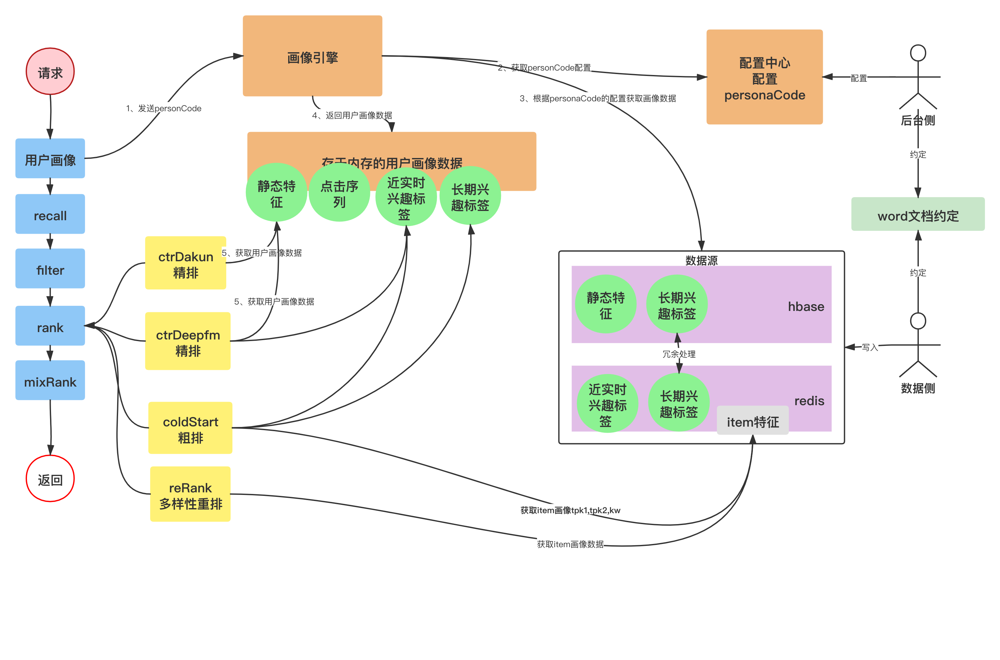
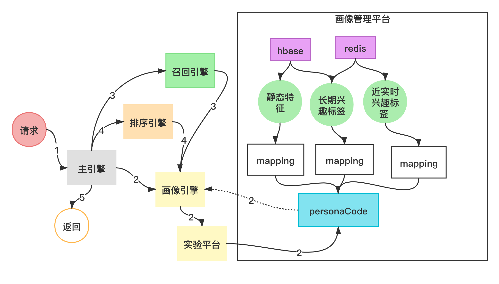
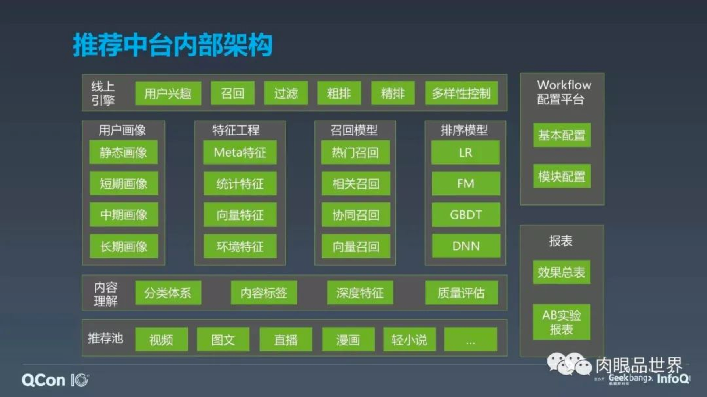

# 0、用户画像是什么

用户画像，就是用户信息标签化，是基于数据挖掘的用户特征提取以及需求深度挖掘。

是大数据时代围绕"用户为中心"开展的个性化服务。

标签化的模型是从用户社交属性、生活习惯、消费者行为等信息中抽象出来的产物，使用户"特征标签"的集合。

用户画像的内涵包含3个要素：用户属性、用户特征、用户标签，且具有标签化、时效性、动态性三大特征。

# 1、用户画像来源

推荐主要服务的是看业务方怎么搞了，我们也只是提出需求，拿到想要的数据。

# 2、用户画像维度划分

一般而言，业务对用户画像维度划分如下：

我们推荐组的画像维度大差不差：

主要有：
* 静态特征
* 长期兴趣
* 近实时兴趣
* 点击序列

和别人比少了一个：
* 中期兴趣

# 3、我们推荐怎么玩画像

## 3.1、推荐项目哪里用到画像

## 3.2、推荐项目怎么用到画像

## 3.3、画像中台 personaCode
初代的画像中台，主要贡献是：引入personaCode，解耦业务侧和推荐侧：

## 3.4、迭代历史

* 我们的推荐系统引入了用户缓存、线程池、guava本地缓存等技术主要是为了提升系统性能。

* 早期的推荐系统硬编码极多，代码可读性极差，低内聚，高耦合。这里要感谢`陈志伟、何宇蛟、胡弦、我自己、杨必宇、卢志锦`等推荐壮士。
    他们一边用极少的人力应付多业务项目，一边不断迭代升级，不断造轮子，不断用新技术达到"高内聚"、"低耦合"的目标。

* 用户画像主要是数据侧处理，推荐系统分3个大组：算法组、后台组、数据组，我们后台侧主要是和数据侧做好文档上面的约定，就能进行开发了。

* 我们输出过画像中台，其实就是早期的"画像引擎"，它引入了一个"personaCode"概念，把业务方的配置和推荐侧解耦开，是一个伟大的进步。

* 推荐后期采用画像引擎，算是画像中台的升级，由主引擎协调：召回引擎、排序引擎、画像引擎等。

* 在新推荐项目（通用推荐平台）采用新技术栈，成熟后又反馈给老的项目feeds、circle等，整体推荐不断迭代向上攀岩。

# 4、爱奇艺的推荐画像体系
其实真的很相似，推荐中台嘛，都大差不差，堆人力，我感觉我都可以从0到1再弄一个出来：

