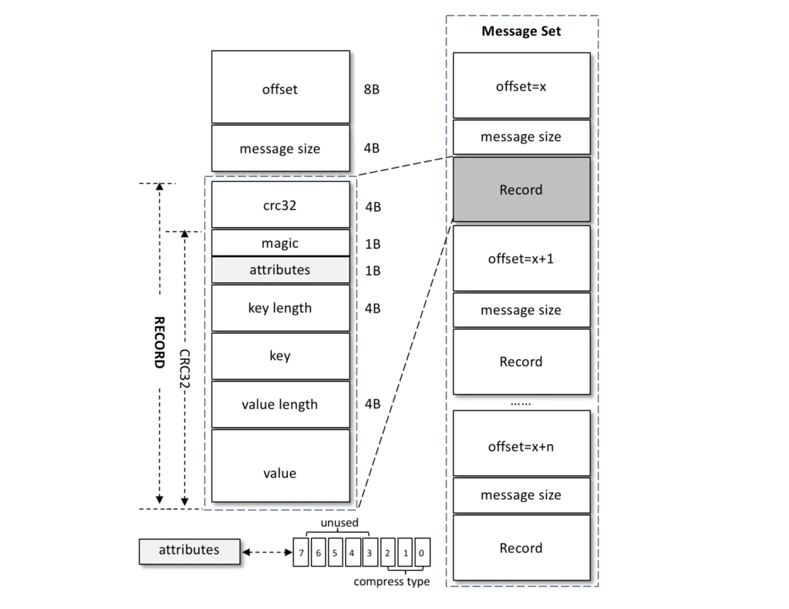
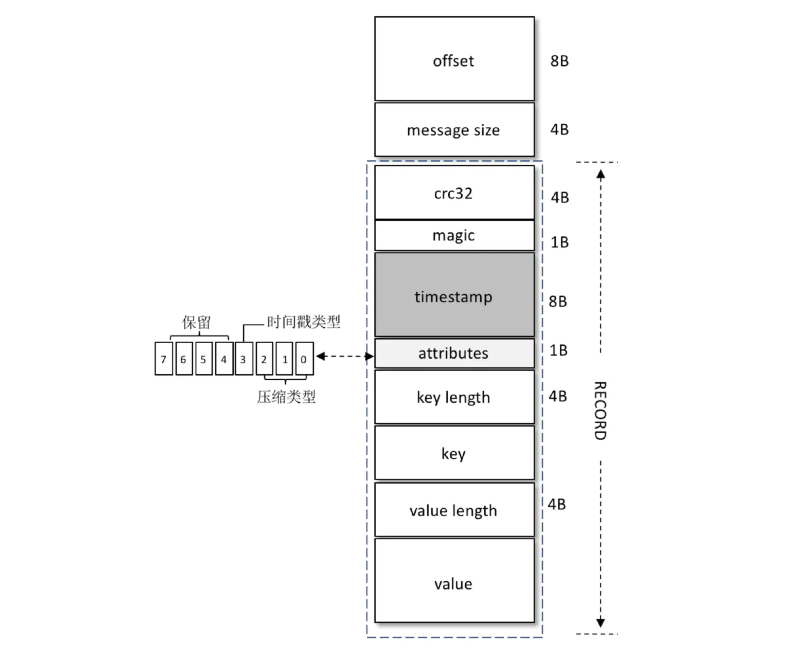

# vo版本
offset + message size + record



## LOG_OVERHEAD
日志头部 = LOG_OVERHEAD = offset + message size = 12B（固定）

## RECORD_OVERHEAD_V0
* crc32（4B）：crc32 校验值。校验范围为 magic 至 value 之间。
* magic（1B）：消息格式版本号，此版本的 magic 值为0。
* attributes（1B）：消息的属性。总共占1个字节，低3位表示压缩类型：0表示 NONE、1表示 GZIP、2表示 SNAPPY、3表示 LZ4（LZ4 自 Kafka 0.9.x引入），其余位保留。
* key length（4B）：表示消息的 key 的长度。如果为-1，则表示没有设置 key，即 key = null。
* key：可选，如果没有 key 则无此字段。
* value length（4B）：实际消息体的长度。如果为-1，则表示消息为空。
* value：消息体。可以为空，比如墓碑（tombstone）消息。

请问，kafka最小的一条消息多大？
```
RECORD_OVERHEAD_V0 = crc32（4B） + magic（1B） + attributes（1B） + key length（4B）+ value length（4B） = 14B
```

# v1版本



## 时间戳
* v1版本的record新增时间戳：8B。

## magic
* v1版本的magic=1，v0版本的magic=0。

## attributes
* v1版本的 attributes 字段中的低3位和 v0 版本的一样，还是表示压缩类型；
* 而第4个位（bit）也被利用了起来：0表示 timestamp 类型为 CreateTime，而1表示 timestamp 类型为 LogAppendTime，其他位保留。

