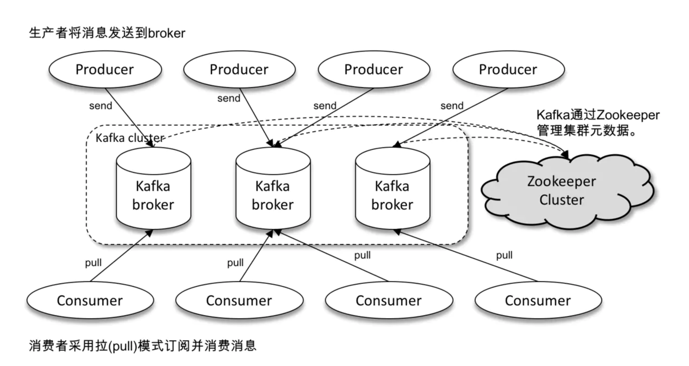
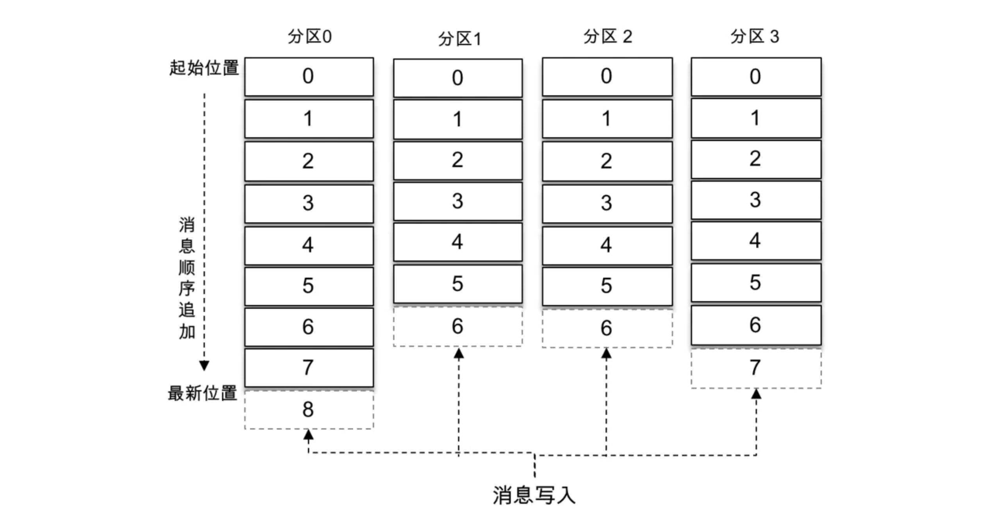
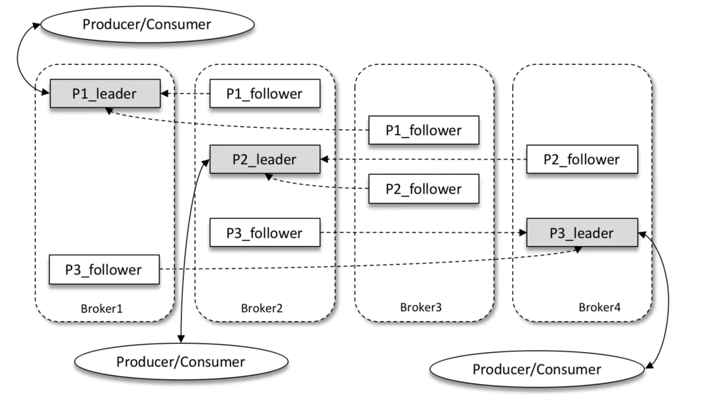
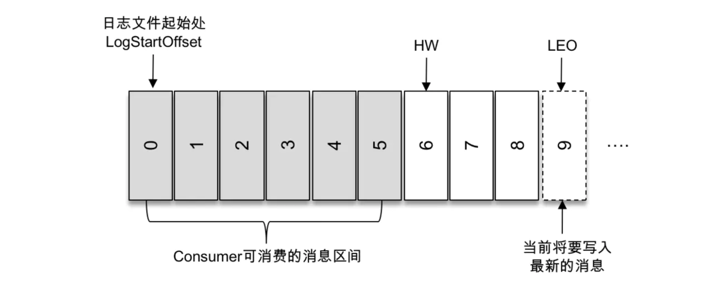
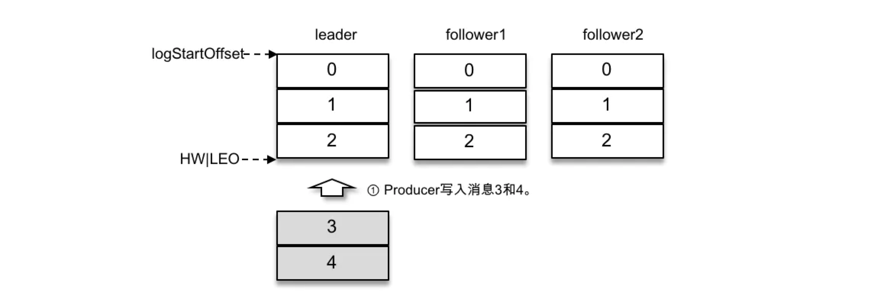
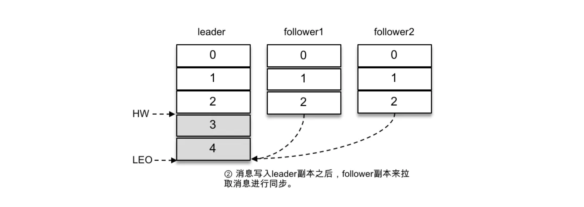
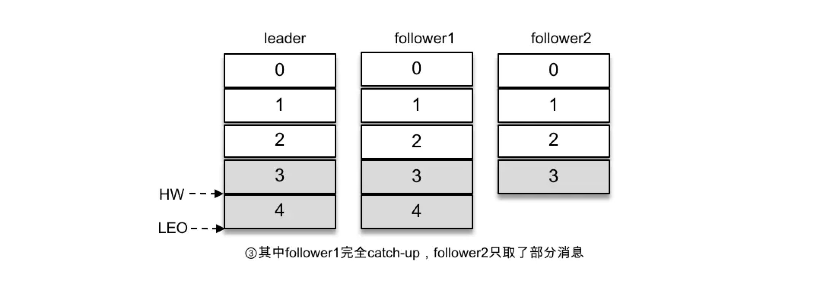
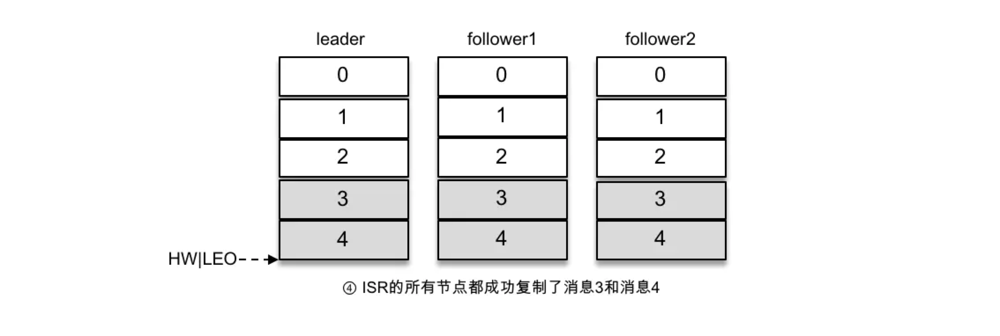

# kafka基本架构


# 主题和分区和打破IO瓶颈
除了上面的`producer`、`consumer`、`broker`三者外，还有2个比较重要概念：
* `topic` 主题：大概念，可以细分多个小分区
* `partition` 分区：只能属于一个主题



`offset`是分区的一个偏移量，保证了消息在**分区的有序性，而不是主题的有序性**。

这里有个很不错的点，就是假设topic有4个分区，每个分区都可以放在不同的broker。
那么本来很容易追加文件log导致的IO性能瓶颈，就可以通过水平拓展分区数而解决。


# 副本和容灾

了解了`topic`和`partition`，为了容灾，引入一个"副本" `Replica` 概念。

假设有一个主题，它有3个分区，设置的副本因子是3，也就是每个分区有1主2从。

leader副本处理生产消费的读写请求、follow副本只做同步。



基本上任何一台broker挂了，都不会影响大局，起到了容灾作用。

# 客户端的容灾
客户端消费者都是采用pull拉模式从broker拿数据，消费者本地存有消息的具体位置，当它挂了重新恢复后，可以从具体的位置继续消费。

# AR和LSR和OSR
AR = Assigned Replicas： 所有副本。

LSR = In-Sync Replicas： 所有与leader副本保持同步的副本。

OSR = Out-Sync Replicas：还没同步leader副本的副本们。
```
AR = LSR + OSR
```
话说重新选举leader时，只有LSR集合内的副本有资格竞选。

LSR和OSR的动态变化由leader副本维护： 
```
滞后副本从 ISR 集合中剔除 + 跟上同步节奏副本的OSR 集合转移至 ISR 集合。
```

# HW和LEO
HW = High Water = 高水位

LEO = Log End Offset = 最后偏移量



分区 ISR 集合中的每个副本都会维护自身的 LEO，而 ISR 集合中最小的 LEO 即为分区的 HW，对消费者而言只能消费 HW 之前的消息。










由此可见，Kafka 的复制机制既不是完全的同步复制，也不是单纯的异步复制。

事实上，同步复制要求所有能工作的 follower 副本都复制完，这条消息才会被确认为已成功提交，这种复制方式极大地影响了性能。

而在异步复制方式下，follower 副本异步地从 leader 副本中复制数据，数据只要被 leader 副本写入就被认为已经成功提交。

在这种情况下，如果 follower 副本都还没有复制完而落后于 leader 副本，突然 leader 副本宕机，则会造成数据丢失。

Kafka 使用的这种 ISR 的方式则有效地权衡了**数据可靠性和性能**之间的关系。