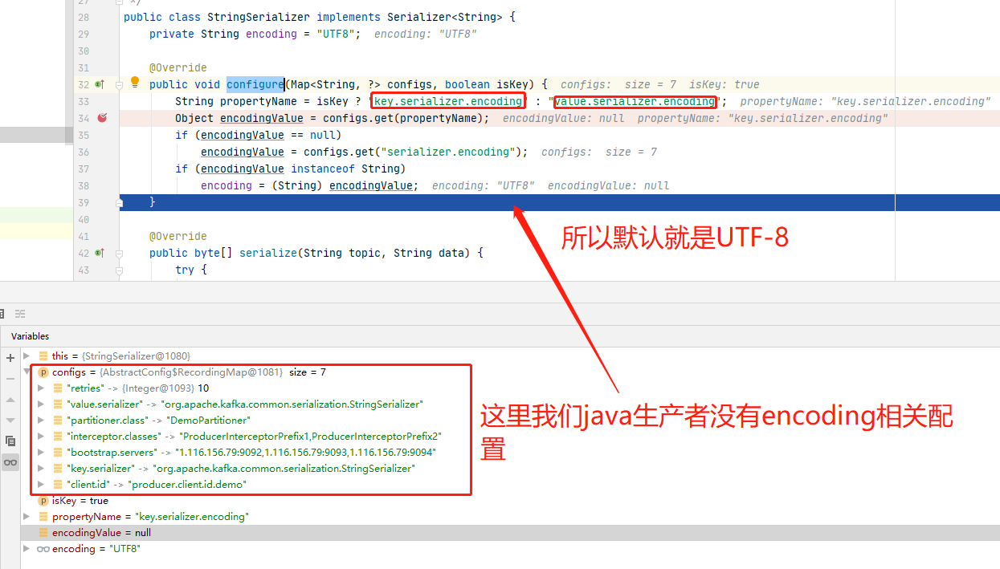

# 1、序列化器的作用
国哥就一个总结：`序列化和反序列化`。

不管如何，记住kafka只能接受byte[]，实际上不仅kafka，别的什么组件网络数据传输也是byte[]啊。

# 2、默认序列化器
```java
/*
 * Licensed to the Apache Software Foundation (ASF) under one or more
 * contributor license agreements. See the NOTICE file distributed with
 * this work for additional information regarding copyright ownership.
 * The ASF licenses this file to You under the Apache License, Version 2.0
 * (the "License"); you may not use this file except in compliance with
 * the License. You may obtain a copy of the License at
 *
 *    http://www.apache.org/licenses/LICENSE-2.0
 *
 * Unless required by applicable law or agreed to in writing, software
 * distributed under the License is distributed on an "AS IS" BASIS,
 * WITHOUT WARRANTIES OR CONDITIONS OF ANY KIND, either express or implied.
 * See the License for the specific language governing permissions and
 * limitations under the License.
 */
package org.apache.kafka.common.serialization;

import org.apache.kafka.common.errors.SerializationException;

import java.io.UnsupportedEncodingException;
import java.util.Map;

/**
 *  String encoding defaults to UTF8 and can be customized by setting the property key.serializer.encoding,
 *  value.serializer.encoding or serializer.encoding. The first two take precedence over the last.
 */
public class StringSerializer implements Serializer<String> {
    private String encoding = "UTF8";

    @Override
    public void configure(Map<String, ?> configs, boolean isKey) {
        String propertyName = isKey ? "key.serializer.encoding" : "value.serializer.encoding";
        Object encodingValue = configs.get(propertyName);
        if (encodingValue == null)
            encodingValue = configs.get("serializer.encoding");
        if (encodingValue instanceof String)
            encoding = (String) encodingValue;
    }

    @Override
    public byte[] serialize(String topic, String data) {
        try {
            if (data == null)
                return null;
            else
                return data.getBytes(encoding);
        } catch (UnsupportedEncodingException e) {
            throw new SerializationException("Error when serializing string to byte[] due to unsupported encoding " + encoding);
        }
    }

    @Override
    public void close() {
        // nothing to do
    }
}
```

## 2.1 序列化接口
序列化器主要是 `serialize`接口，能输出`byte[]`数据即可。

无需赘言。

## 2.2 配置接口
```java
@Override
public void configure(Map<String, ?> configs, boolean isKey) {
    String propertyName = isKey ? "key.serializer.encoding" : "value.serializer.encoding";
    Object encodingValue = configs.get(propertyName);
    if (encodingValue == null)
        encodingValue = configs.get("serializer.encoding");
    if (encodingValue instanceof String)
        encoding = (String) encodingValue;
}
```
这个代码段看起来不够明了，我直接截个图：


所以这个接口就是搞encoding用的。

