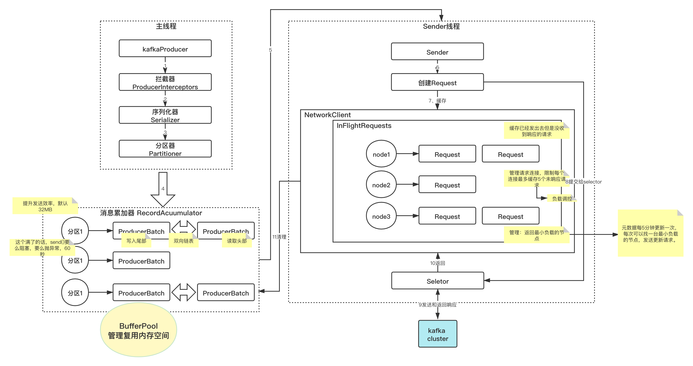
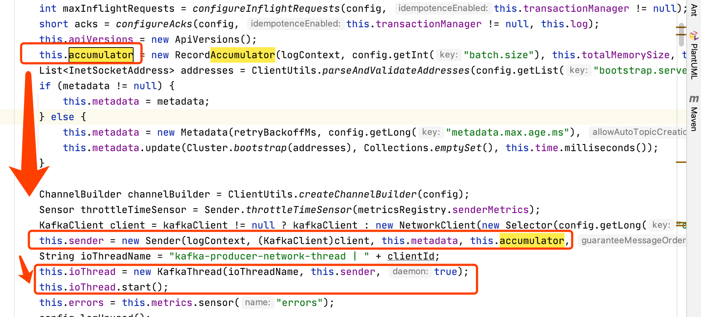

# 1、背景
前面我们大致了解了：拦截器、序列化器、分区器的使用，也大概知道怎么发送消息，怎么消费。

细心的孩子们，能注意到，我的笔记顺序，是`拦截器 -> 序列化器 -> 分区器`。

那么他们具体底层怎么回事呢？

# 2、流程图


* 01、拦截器onSend()处理消息
* 02、序列化器Serializer()
* 03、分区 partitioner()
* 04、进入消息累加器的双向队列
* 05、发送到sender线程
* 06、创建request
* 07、数据转换成 InFlightRequest<Node, (Request,Request, ...) > 缓存起来
* 08、发送到selector发送数据
* 09、拿到响应数据后，返回
* 10、返回到sender线程，清理InFlightRequests里面已经收到响应的request
* 11、处理消息累加器的消息

# 3、代码解析
## 3.1、拦截器、序列化器、分区器的顺序
我们点一下 producer.send() 方法跳进去看看：
```
public Future<RecordMetadata> send(ProducerRecord<K, V> record, Callback callback) {
    ProducerRecord<K, V> interceptedRecord = this.interceptors.onSend(record);
    return this.doSend(interceptedRecord, callback);
}
```
可以看到先用拦截器列表处理了一波消息后，继续调用`onSend()`：
```
// 序列化 key
// 序列化 value
// 计算分区号
// 加到累加器
// ...
```
从代码能看出来，确实是符合： `拦截器 -> 序列化器 -> 分区器`的顺序。

## 3.2、消息累加器属于发送线程管理
我们先看看这个累加器是属于 `主线程` 还是`发送线程`， 根据代码可以判定是`发送线程`：



## 3.3、消息累加器怎么添加消息
满足了好奇心后，继续往下看，想知道累加器怎么加消息，怎么发送到selector。

加消息：
```
// 先来搞一个deque，不存在则创建
 Deque<ProducerBatch> dq = this.getOrCreateDeque(tp);

// 用synchronized 给dq加一个record
synchronized(dq) {
    if (this.closed) {
        throw new KafkaException("Producer closed while send in progress");
    }

    RecordAccumulator.RecordAppendResult appendResult = this.tryAppend(timestamp, key, value, headers, callback, dq);
    if (appendResult != null) {
        RecordAccumulator.RecordAppendResult var14 = appendResult;
        return var14;
    }
}
```
当然这里只是尝试去添加record: tryAppend()，当尝试失败，也会申请一波空间，再添加一次，问题不大。

## 3.4、拦截器的onAcknowledgement()是在发送线程上处理
我们可以看到这个 `interceptCallback` 是被传到累加器里面处理，累加器是发送线程的，所以之前的教程诚不我欺啊。

这个 `onAcknowledgement()` 确实要逻辑精简，否则会影响发送消息效率。

```
Callback interceptCallback = new KafkaProducer.InterceptorCallback(callback, this.interceptors, tp);
if (this.transactionManager != null && this.transactionManager.isTransactional()) {
    this.transactionManager.maybeAddPartitionToTransaction(tp);
}
RecordAppendResult result = this.accumulator.append(tp, timestamp, serializedKey, serializedValue, headers, interceptCallback, remainingWaitMs);         
```

## 3.5、消息累加器怎么把消息包装成InFlightRequest
主线程什么时候把球交给sender线程？

从下面代码可看到，当累加器满了或者是一个新的batch被创建，就会唤醒sender线程去处理：
```
RecordAccumulator.RecordAppendResult result = accumulator.append(tp, timestamp, serializedKey,
        serializedValue, headers, interceptCallback, remainingWaitMs);
if (result.batchIsFull || result.newBatchCreated) {
    log.trace("Waking up the sender since topic {} partition {} is either full or getting a new batch", record.topic(), partition);
    this.sender.wakeup();
}
```


那就是看 `sender.run()` 方法，国哥稍微去掉事务型的代码，精简下run方法:
```java
void run(long now) {
    long pollTimeout = sendProducerData(now);
    client.poll(pollTimeout, now);
}
```
发现就是在 `sendProducerData()` 完成了 InFlightRequests的包装：
```
// 拿到消息累加器的数据

// 消息累加器剔除还没ready累加器节点

// 消息累加器数据转换成：  Map<Integer, List<ProducerBatch>> batches

// 拿到在消息累加器呆了很久的数据，进行failBatch()， 细节不care，调用了deallocate()，可能是释放

// 真正发送  sendProduceRequests(batches, now);
```

## 3.6、消息回应后sender线程做了啥
我们看看消息kafka回应后，那些消除操作在哪里做的？

继续看 `sendProduceRequest()`：
```
// 1、整理下要发送的数据
// 2、创建发送 requestBuilder，这里设置了callback： handleProduceResponse()
// 3、真正发送到kafka： client.send(clientRequest, now);
```

其实第二步就是我们关于`kafka消息回应后，sender线程做了啥`的答案：
```
ProduceRequest.Builder requestBuilder = ProduceRequest.Builder.forMagic(minUsedMagic, acks, timeout,
          produceRecordsByPartition, transactionalId);
  RequestCompletionHandler callback = new RequestCompletionHandler() {
      public void onComplete(ClientResponse response) {
          handleProduceResponse(response, recordsByPartition, time.milliseconds());
      }
  };
```
`handleProduceResponse`这里面就一个核心函数 `completeBatch()`：
```
// 处理一些错误信息
// 消息累加器对分区静音取消： Unmute the completed partition.
```

至此，代码不再细看了，不是专业开发消息中间件的，没必要太关注细节。

大致和最上面的流程图能对的上，心中了然即可。