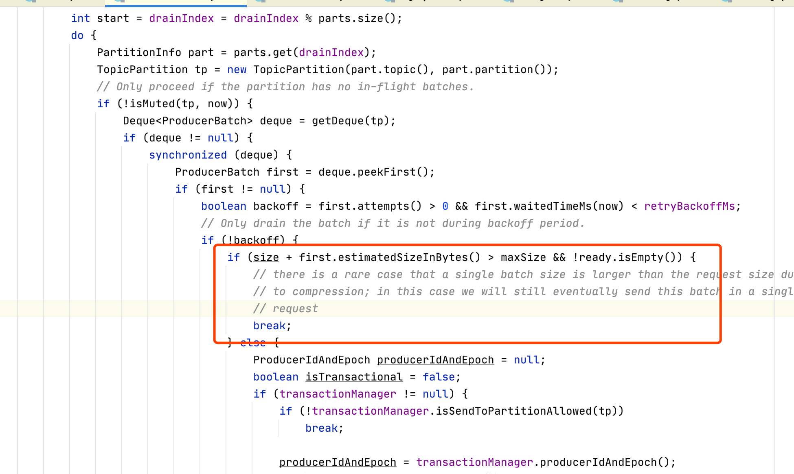

# 1、配置在哪里

吐槽下，我使用的包是：`kafka_2.11-2.0.0`，我在包的config文件夹的各个配置文件中，压根就找不到消息相关配置。

我一直以为有额外的地方放broker配置、topic配置、生产者配置等，实际上我看到的配置文件是`省略版`，很多配置项没有写入配置文件而已（这里不得不说redis的配置就很好）。
还是去官网看文档靠谱：
* [broker配置](https://kafka.apache.org/20/documentation.html#brokerconfigs)
* [topic配置](https://kafka.apache.org/20/documentation.html#topicconfigs)
* [producer配置](https://kafka.apache.org/20/documentation.html#producerconfigs)
* [consumer配置](https://kafka.apache.org/20/documentation.html#consumerconfigs)

# 2、消息大小
`消息的大小`是kafka绕不开的一个重要配置。

它非常复杂，分为：
* broker消息大小
* topic消息大小
* 生产者消息大小
* 消费者消息大小
* 同步副本时消息大小


# 3、broker 消息大小

message.max.bytes: 
```text
The largest record batch size allowed by Kafka. 

If this is increased and there are consumers older than 0.10.2, 
the consumers' fetch size must also be increased 
so that the they can fetch record batches this large.

In the latest message format version, records are always grouped into batches for efficiency. 
In previous message format versions, uncompressed records are not grouped into batches 
and this limit only applies to a single record in that case.

This can be set per topic with the topic level max.message.bytes config.
```
翻译下：
```text
Kafka 允许的最大记录批量。如果增加此数量，并且有一些消费者的年龄大于 0.10.2，则消费者的获取大小也必须增加，以便他们可以获取如此大的记录批次。

在最新的消息格式版本中，为了提高效率，始终将记录分组。在以前的消息格式版本中，未压缩的记录不会分组，并且在这种情况下，此限制仅适用于单个记录。

可以使用主题级别 "max.message.bytes" 配置针对每个主题进行设置。
```
默认1MB，Kafka 允许的最大 record batch size，什么是 record batch size ？

简单来说就是 Kafka 的消息集合批次，一个批次当中会包含多条消息，生产者中有个参数 batch.size，指的是生产者可以进行消息批次发送，提高吞吐量。

message.max.bytes 并不是限制消息体大小的，而是限制一个批次的消息大小，所以我们需要注意：
生产端对于 batch.size 的参数设置需要小于 broker对于message.max.bytes的参数。

命名来看也是尴尬， `broker的message.max.bytes` vs `topic的max.messages.bytes` ，到底是哪一只呢？


# 4、topic消息大小
max.message.bytes: 
```
The largest record batch size allowed by Kafka. If this is increased and there are consumers older than 0.10.2, 
the consumers' fetch size must also be increased so that the they can fetch record batches this large.

In the latest message format version, records are always grouped into batches for efficiency. 
In previous message format versions, uncompressed records are not grouped into batches 
and this limit only applies to a single record in that case.
```
这个参数和broker的`message.max.bytes` 类似，只不过`max.message.bytes`作用于topic，`message.max.bytes`作用于全局。

# 5、producer消息大小

## 5.1、 max.request.size
max.request.size: 这个默认也是1M。
```text
The maximum size of a request in bytes. 

This setting will limit the number of record batches the producer will send in a single request to avoid sending huge requests. 

This is also effectively a cap on the maximum record batch size. 

Note that the server has its own cap on record batch size which may be different from this.
```
翻译下:
```text
请求的最大大小（以字节为单位）。
此设置将限制生产者将在单个请求中发送的记录批次数，以避免发送大量请求。 
这实际上也是最大记录批量大小的上限。 
请注意，服务器有自己的记录批量大小上限，可能与此不同。
```
这里总算能看生产者客户端代码了，我们看看生产者的`doSend()`：
```java
private Future<RecordMetadata> doSend(ProducerRecord<K, V> record, Callback callback) {
    // 1、序列化key
    // 2、序列化value
    // 3、分区

    // 4、计算总的size，并送到 ensureValidRecordSize() 去判断下是否合法
    int serializedSize = AbstractRecords.estimateSizeInBytesUpperBound(apiVersions.maxUsableProduceMagic(),
            compressionType, serializedKey, serializedValue, headers);
    ensureValidRecordSize(serializedSize);

    // 5、发送到消息累加器
}
```
检查size大小，主要是看 `ensureValidRecordSize()`：
```java
/**
 * Validate that the record size isn't too large
 */
private void ensureValidRecordSize(int size) {
    if (size > this.maxRequestSize)
        throw new RecordTooLargeException("The message is " + size +
                " bytes when serialized which is larger than the maximum request size you have configured with the " +
                ProducerConfig.MAX_REQUEST_SIZE_CONFIG +
                " configuration.");
    if (size > this.totalMemorySize)
        throw new RecordTooLargeException("The message is " + size +
                " bytes when serialized which is larger than the total memory buffer you have configured with the " +
                ProducerConfig.BUFFER_MEMORY_CONFIG +
                " configuration.");
}
```
这里看到了我们关键的:`maxRequestSize`，一旦溢出直接报错。

跟了下代码，发现 `maxRequestSize` 不仅在producer.onSend()，还在sender线程中的发送逻辑，进行一波判断：
```java
sender线程的run(){
    // main loop, runs until close is called
    while (running) {
        try {
            run(time.milliseconds());
        } catch (Exception e) {
            log.error("Uncaught error in kafka producer I/O thread: ", e);
        }
    }
}

void run(long now){
    // 各种检查
    long pollTimeout = sendProducerData(now);
    client.poll(pollTimeout, now);
}

private long sendProducerData(long now) {
    // 从消息累加器拿数据
    // create produce requests 这里把 maxRequestSize 传进去了！
    Map<Integer, List<ProducerBatch>> batches = this.accumulator.drain(cluster, result.readyNodes,
            this.maxRequestSize, now);
    // 发送
}
```
具体怎么判断这个`maxRequestSize`：


所以总结下，producer的`max.request.size`有两个作用：
```
1）限制单条消息大小
2）限制发送请求大小
```

# 参考资料
* [彻底搞懂 Kafka 消息大小相关参数设置的规则](https://cloud.tencent.com/developer/article/1633494)
* [kafka官网配置](https://kafka.apache.org/20/documentation.html#brokerconfigs)
* [how-to-send-large-messages-in-kafka](https://www.hadoopinrealworld.com/how-to-send-large-messages-in-kafka/)
* [kafka生产者客户端发送逻辑简析](http://chow.ink/2020/04/09/kafka生产者客户端发送逻辑简析/)