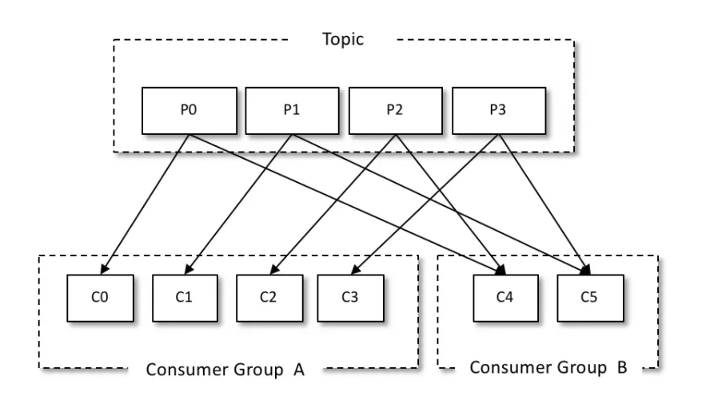

# 1、消费者和消费组的图解


看图说话：
* 一个topic有4个分区，被2个消费组订阅了。
* 一个分区的消息只会给消费组一次，如果有N个组，分区消息就会被消费N次。
* 每个消费组的消费能力和消费者数量成正比（在消费者数量 <= 分区数量时）。

有个隐含的东东：
* 如果一个topic有10个分区，被一个组订阅了，那么它就会被这个组消费10次。
* 消费组有自动均衡的能力，当有10个消费者要消费这个topic的10分区的消息时，那么就是一一对应了，一个消费者消费一个分区，俗称`点对点`，也就是`p2p模式`。
* 如果这个消费组有11个消费者，那么第11个消费者会浪费。所以`看图说话`第三点，有个限制：`在消费者数量 <= 分区数量时`。

# 2、消费组
是个逻辑概念，别的中间件都没有，就kafka特殊。
```
通过消费者客户端参数 group.id 来配置，默认值为空字符串。
```
# 3、消费者
是个物理概念，确实是个进程，是个消费者程序。

# 4、怎么实现消息投递模式的点对点
两个必要条件：
* 只让一个消费组去消费topic
* 让topic的分区数量 == 消费组内的消费者数量

有杠精会说，我就不用一个组，我就用多个消费组，╭(╯^╰)╮：
```
比如用下面的模式也能实现点对点：
* 我就用2个（或多个）消费组，A和B，去消费topic
* 让消费组A的消费者数量 == topic的分区数量，消费组B随意分配消费者

嗯，确实能，毕竟消费组A是点对点，消费组B就看情况而定了，但实际上，这不是浪费钱嘛。

做架构设计的，还是要综合现实场景，在满足业务需求基础上，不要浪费钱。

只有一种情况下是合理的，就是`防止单点故障`，消费者分布在两个机房，防挂了，但实际上，还是要考虑消息处理的`幂等性`，比如不能`写两次DB`吧。
* 只让2个消费组去消费topic
* 让topic的分区数量 == 每个消费组内的消费者数量

嗯，有钱真好。
```

# 5、怎么设计Pub/Sub消息投递模式
两个必要条件：
* 所有的消费者属于不同的组
* 那么生产者往topic生产消息时，所有监听（也就是订阅了）了这个topic的消费组（里面就一个消费者）都能收到消息