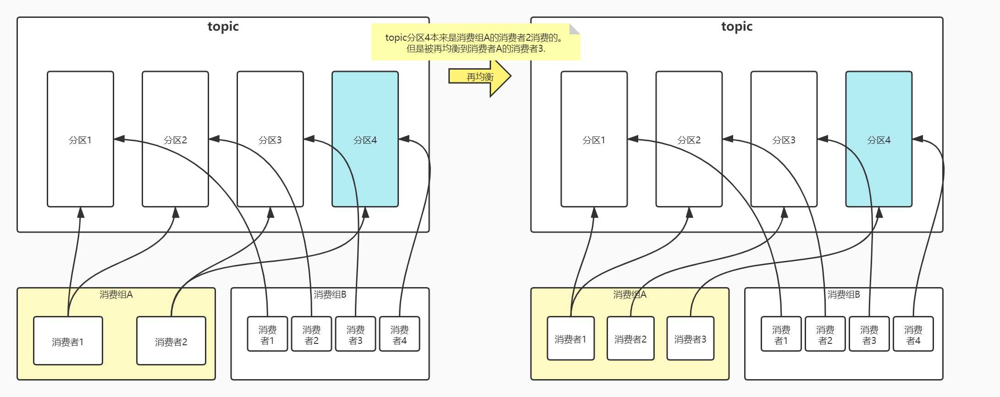

# 1、什么是再均衡
再均衡是指分区的所属权从一个消费者转移到另一消费者的行为。



# 2、再均衡会引发重复消费

再均衡，消费者会消除位移状态，也就是消费者当前的状态也会`丢失`。
    
如图浅蓝色所示：


    比如消费组A的消费者2，本来消费者2 ->（分区3，分区4）。

    现在消费组A增加一个消费者3，那么再均衡，消费者2 ->（分区3），消费者3 ->（分区4）。

    消费者2的消费状态万一没有及时提交，就把分区4交给了消费者3。

    消费者3会把刚刚消费者2已经消费的消息，再来一次，这就是`重复消费`了。

# 3、解决再均衡导致重复消费-方案1
定义一个全局的分区->位移的 map：
```text
Map<TopicPartition, OffsetAndMetadata> currentOffsets = new HashMap<>();
```
启动监听器，如果再均衡触发回调，把`currentOffsets`再手动提交一次：
```java
Map<TopicPartition, OffsetAndMetadata> currentOffsets = new HashMap<>();
consumer.subscribe(Arrays.asList(topic), new ConsumerRebalanceListener() {
    // 这个方法会在再均衡开始之前和消费者停止读取消息之后被调用
    @Override
    public void onPartitionsRevoked(Collection<TopicPartition> partitions) {
        // 为了防止消费者重新消费，赶紧手动提交一波
        consumer.commitSync(currentOffsets);
        // 手动提交后，清空全局的分区位移信息
        currentOffsets.clear();
    }
    
    // 这个方法会在重新分配分区之后和消费者开始读取消费之前被调用
    @Override
    public void onPartitionsAssigned(Collection<TopicPartition> partitions) {
        //do nothing.
    }
});

try {
    while (isRunning.get()) {
        ConsumerRecords<String, String> records =
                consumer.poll(Duration.ofMillis(100));
        for (ConsumerRecord<String, String> record : records) {
            //process the record.
            currentOffsets.put(
                    new TopicPartition(record.topic(), record.partition()),
                    new OffsetAndMetadata(record.offset() + 1));
        }
        consumer.commitAsync(currentOffsets, null);
    }
} finally {
    consumer.close();
}
```

# 4、解决再均衡导致重复消费-方案2
```java
consumer.subscribe(Arrays.asList(topic), new ConsumerRebalanceListener() {
    // 这个方法会在再均衡开始之前和消费者停止读取消息之后被调用
    @Override
    public void onPartitionsRevoked(Collection<TopicPartition> partitions) {
        //store offset in DB （storeOffsetToDB）
    }
    // 这个方法会在重新分配分区之后和消费者开始读取消费之前被调用
    @Override
    public void onPartitionsAssigned(Collection<TopicPartition> partitions) {
        for(TopicPartition tp: partitions){
            consumer.seek(tp, getOffsetFromDB(tp));//从DB中读取消费位移
        }
    }
});
```
这个也不错。