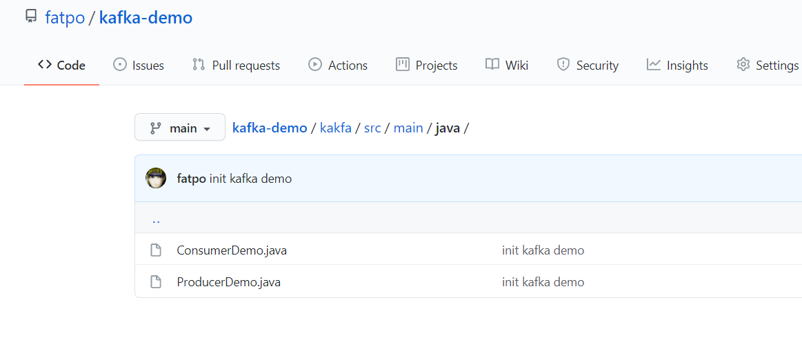

# 0、demo的git代码库
* [ssh git](git@github.com:fatpo/kafka-demo.git)
* [http git](https://github.com/fatpo/kafka-demo.git)

代码截图：


公开声明:
```text
实际上，我外网地址，随便大家连，如果我有续费没关闭的话。
```


# 1、java客户端maven
pom.xml: 
```text
<?xml version="1.0" encoding="UTF-8"?>
<project xmlns="http://maven.apache.org/POM/4.0.0"
         xmlns:xsi="http://www.w3.org/2001/XMLSchema-instance"
         xsi:schemaLocation="http://maven.apache.org/POM/4.0.0 http://maven.apache.org/xsd/maven-4.0.0.xsd">
    <modelVersion>4.0.0</modelVersion>

    <groupId>org.example</groupId>
    <artifactId>kakfa</artifactId>
    <version>1.0-SNAPSHOT</version>

    <properties>
        <maven.compiler.target>1.8</maven.compiler.target>
        <maven.compiler.source>1.8</maven.compiler.source>
    </properties>

    <dependencies>
        <dependency>
            <groupId>org.apache.kafka</groupId>
            <artifactId>kafka-clients</artifactId>
            <version>2.0.0</version>
        </dependency>
    </dependencies>

</project>
```

# 2、java客户端消费者
```java
import org.apache.kafka.clients.consumer.ConsumerRecord;
import org.apache.kafka.clients.consumer.ConsumerRecords;
import org.apache.kafka.clients.consumer.KafkaConsumer;

import java.time.Duration;
import java.util.Collections;
import java.util.Properties;

public class ConsumerDemo {
    public static final String brokerList = "1.116.156.79:9092";
    public static final String topic = "test2";
    public static final String groupId = "group.demo";


    public static void main(String[] args) {
        Properties properties = new Properties();
        properties.put("key.deserializer",
                "org.apache.kafka.common.serialization.StringDeserializer");
        properties.put("value.deserializer",
                "org.apache.kafka.common.serialization.StringDeserializer");
        properties.put("bootstrap.servers", brokerList);
        //设置消费组的名称，具体的释义可以参见第3章
        properties.put("group.id", groupId);
        //创建一个消费者客户端实例
        KafkaConsumer<String, String> consumer = new KafkaConsumer<>(properties);
        //订阅主题
        consumer.subscribe(Collections.singletonList(topic));
        //循环消费消息
        while (true) {
            System.out.println("-------");
            ConsumerRecords<String, String> records =
                    consumer.poll(Duration.ofMillis(1000));
            for (ConsumerRecord<String, String> record : records) {
                System.out.println(record.value());
            }
        }
    }
}
```
消费者日志(消费者的日志是一直阻塞的，无限循环)：
```text
"D:\Program Files (x86)\Java\jdk1.8.0_111\bin\java.exe" "-javaagent:C:\Program Files\JetBrains\IntelliJ IDEA 2020.1\lib\idea_rt.jar=61815:C:\Program Files\JetBrains\IntelliJ IDEA 2020.1\bin" -Dfile.encoding=UTF-8 -classpath "D:\Program Files (x86)\Java\jdk1.8.0_111\jre\lib\charsets.jar;D:\Program Files (x86)\Java\jdk1.8.0_111\jre\lib\deploy.jar;D:\Program Files (x86)\Java\jdk1.8.0_111\jre\lib\ext\access-bridge-32.jar;D:\Program Files (x86)\Java\jdk1.8.0_111\jre\lib\ext\cldrdata.jar;D:\Program Files (x86)\Java\jdk1.8.0_111\jre\lib\ext\dnsns.jar;D:\Program Files (x86)\Java\jdk1.8.0_111\jre\lib\ext\jaccess.jar;D:\Program Files (x86)\Java\jdk1.8.0_111\jre\lib\ext\jfxrt.jar;D:\Program Files (x86)\Java\jdk1.8.0_111\jre\lib\ext\localedata.jar;D:\Program Files (x86)\Java\jdk1.8.0_111\jre\lib\ext\nashorn.jar;D:\Program Files (x86)\Java\jdk1.8.0_111\jre\lib\ext\sunec.jar;D:\Program Files (x86)\Java\jdk1.8.0_111\jre\lib\ext\sunjce_provider.jar;D:\Program Files (x86)\Java\jdk1.8.0_111\jre\lib\ext\sunmscapi.jar;D:\Program Files (x86)\Java\jdk1.8.0_111\jre\lib\ext\sunpkcs11.jar;D:\Program Files (x86)\Java\jdk1.8.0_111\jre\lib\ext\zipfs.jar;D:\Program Files (x86)\Java\jdk1.8.0_111\jre\lib\javaws.jar;D:\Program Files (x86)\Java\jdk1.8.0_111\jre\lib\jce.jar;D:\Program Files (x86)\Java\jdk1.8.0_111\jre\lib\jfr.jar;D:\Program Files (x86)\Java\jdk1.8.0_111\jre\lib\jfxswt.jar;D:\Program Files (x86)\Java\jdk1.8.0_111\jre\lib\jsse.jar;D:\Program Files (x86)\Java\jdk1.8.0_111\jre\lib\management-agent.jar;D:\Program Files (x86)\Java\jdk1.8.0_111\jre\lib\plugin.jar;D:\Program Files (x86)\Java\jdk1.8.0_111\jre\lib\resources.jar;D:\Program Files (x86)\Java\jdk1.8.0_111\jre\lib\rt.jar;D:\IdeaProjects\kafka-demo\kakfa\target\classes;D:\maven\repository\org\apache\kafka\kafka-clients\2.0.0\kafka-clients-2.0.0.jar;D:\maven\repository\org\lz4\lz4-java\1.4.1\lz4-java-1.4.1.jar;D:\maven\repository\org\xerial\snappy\snappy-java\1.1.7.1\snappy-java-1.1.7.1.jar;D:\maven\repository\org\slf4j\slf4j-api\1.7.25\slf4j-api-1.7.25.jar" ConsumerDemo
SLF4J: Failed to load class "org.slf4j.impl.StaticLoggerBinder".
SLF4J: Defaulting to no-operation (NOP) logger implementation
SLF4J: See http://www.slf4j.org/codes.html#StaticLoggerBinder for further details.
-------
-------
-------
-------
hello, Kafka!
-------
-------
```


# 3、java客户端生产者
```java
import org.apache.kafka.clients.producer.KafkaProducer;
import org.apache.kafka.clients.producer.ProducerRecord;

import java.util.Properties;

public class ProducerDemo {
    public static final String brokerList = "1.116.156.79:9092";
    public static final String topic = "test2";

    public static void main(String[] args) {
        Properties properties = new Properties();
        properties.put("key.serializer",
                "org.apache.kafka.common.serialization.StringSerializer");
        properties.put("value.serializer",
                "org.apache.kafka.common.serialization.StringSerializer");
        properties.put("bootstrap.servers", brokerList);

        System.out.println("send a message: hello, Kafka!");
        KafkaProducer<String, String> producer =
                new KafkaProducer<>(properties);
        ProducerRecord<String, String> record =
                new ProducerRecord<>(topic, "hello, Kafka!");
        try {
            producer.send(record);
        } catch (Exception e) {
            e.printStackTrace();
        }
        producer.close();
    }
}
```

生产者日志：
```text
"D:\Program Files (x86)\Java\jdk1.8.0_111\bin\java.exe" "-javaagent:C:\Program Files\JetBrains\IntelliJ IDEA 2020.1\lib\idea_rt.jar=62977:C:\Program Files\JetBrains\IntelliJ IDEA 2020.1\bin" -Dfile.encoding=UTF-8 -classpath "D:\Program Files (x86)\Java\jdk1.8.0_111\jre\lib\charsets.jar;D:\Program Files (x86)\Java\jdk1.8.0_111\jre\lib\deploy.jar;D:\Program Files (x86)\Java\jdk1.8.0_111\jre\lib\ext\access-bridge-32.jar;D:\Program Files (x86)\Java\jdk1.8.0_111\jre\lib\ext\cldrdata.jar;D:\Program Files (x86)\Java\jdk1.8.0_111\jre\lib\ext\dnsns.jar;D:\Program Files (x86)\Java\jdk1.8.0_111\jre\lib\ext\jaccess.jar;D:\Program Files (x86)\Java\jdk1.8.0_111\jre\lib\ext\jfxrt.jar;D:\Program Files (x86)\Java\jdk1.8.0_111\jre\lib\ext\localedata.jar;D:\Program Files (x86)\Java\jdk1.8.0_111\jre\lib\ext\nashorn.jar;D:\Program Files (x86)\Java\jdk1.8.0_111\jre\lib\ext\sunec.jar;D:\Program Files (x86)\Java\jdk1.8.0_111\jre\lib\ext\sunjce_provider.jar;D:\Program Files (x86)\Java\jdk1.8.0_111\jre\lib\ext\sunmscapi.jar;D:\Program Files (x86)\Java\jdk1.8.0_111\jre\lib\ext\sunpkcs11.jar;D:\Program Files (x86)\Java\jdk1.8.0_111\jre\lib\ext\zipfs.jar;D:\Program Files (x86)\Java\jdk1.8.0_111\jre\lib\javaws.jar;D:\Program Files (x86)\Java\jdk1.8.0_111\jre\lib\jce.jar;D:\Program Files (x86)\Java\jdk1.8.0_111\jre\lib\jfr.jar;D:\Program Files (x86)\Java\jdk1.8.0_111\jre\lib\jfxswt.jar;D:\Program Files (x86)\Java\jdk1.8.0_111\jre\lib\jsse.jar;D:\Program Files (x86)\Java\jdk1.8.0_111\jre\lib\management-agent.jar;D:\Program Files (x86)\Java\jdk1.8.0_111\jre\lib\plugin.jar;D:\Program Files (x86)\Java\jdk1.8.0_111\jre\lib\resources.jar;D:\Program Files (x86)\Java\jdk1.8.0_111\jre\lib\rt.jar;D:\IdeaProjects\kafka-demo\kakfa\target\classes;D:\maven\repository\org\apache\kafka\kafka-clients\2.0.0\kafka-clients-2.0.0.jar;D:\maven\repository\org\lz4\lz4-java\1.4.1\lz4-java-1.4.1.jar;D:\maven\repository\org\xerial\snappy\snappy-java\1.1.7.1\snappy-java-1.1.7.1.jar;D:\maven\repository\org\slf4j\slf4j-api\1.7.25\slf4j-api-1.7.25.jar" ProducerDemo
SLF4J: Failed to load class "org.slf4j.impl.StaticLoggerBinder".
SLF4J: Defaulting to no-operation (NOP) logger implementation
SLF4J: See http://www.slf4j.org/codes.html#StaticLoggerBinder for further details.
send a message: hello, Kafka!

Process finished with exit code 0

```

