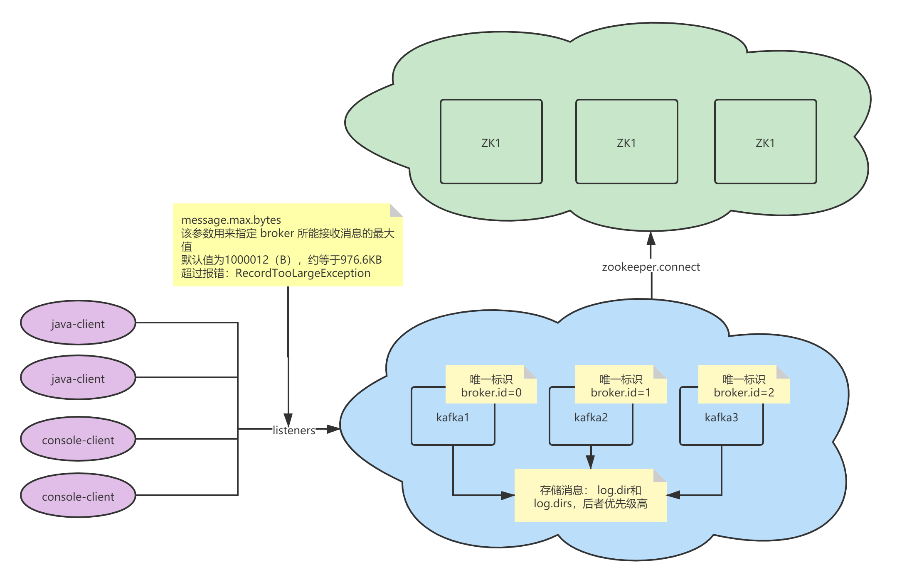

# 0、画了个图



下面就是对《图解kafka实战》的搬运了。

参数路径：
```text
$KAFKA_HOME/config/server.properties
```

# 1、zookeeper.connect
该参数指明 broker 要连接的 ZooKeeper 集群的服务地址（包含端口号），没有默认值，且此参数为必填项。

可以配置为 `localhost:2181`，如果 ZooKeeper 集群中有多个节点，则可以用逗号将每个节点隔开，类似于 `localhost1:2181,localhost2:2181,localhost3:2181` 这种格式。

最佳的实践方式是再加一个 `chroot 路径`，这样既可以明确指明该 chroot 路径下的节点是为 Kafka 所用的，也可以实现多个 Kafka 集群复用一套 ZooKeeper 集群，这样可以节省更多的硬件资源。

包含 chroot 路径的配置类似于 `localhost1:2181,localhost2:2181,localhost3:2181/kafka` 这种，如果不指定 chroot，那么默认使用 ZooKeeper 的根路径。

# 2、listeners
该参数指明 broker 监听客户端连接的地址列表，即为客户端要连接 broker 的入口地址列表，

配置格式为 `protocol1://hostname1:port1,protocol2://hostname2:port2`，

其中 protocol 代表协议类型，Kafka 当前支持的协议类型有 `PLAINTEXT、SSL、SASL_SSL` 等， 如果未开启安全认证，则使用简单的 PLAINTEXT 即可。

hostname 代表主机名，port 代表服务端口，此参数的默认值为 null。

比如此参数配置为 `PLAINTEXT://198.162.0.2:9092`，如果有多个地址，则中间以逗号隔开。

如果不指定主机名，则表示绑定默认网卡，注意有可能会绑定到`127.0.0.1`，这样无法对外提供服务，所以主机名最好不要为空；如果主机名是0.0.0.0，则表示绑定所有的网卡。


与此参数关联的还有 advertised.listeners，作用和 listeners 类似，默认值也为 null。

不过 advertised.listeners 主要用于 IaaS（Infrastructure as a Service）环境，

比如公有云上的机器通常配备有多块网卡，即包含私网网卡和公网网卡，对于这种情况而言， `可以设置 advertised.listeners 参数绑定公网IP供外部客户端使用`（国哥就设置了），

而配置 listeners 参数来绑定私网IP地址供 broker 间通信使用。

# 3、broker.id
该参数用来指定 Kafka 集群中 broker 的唯一标识，默认值为-1。

如果没有设置，那么 Kafka 会自动生成一个。

这个参数还和 `meta.properties` 文件及服务端参数 `broker.id.generation. enable 和 reserved.broker.max.id` 有关，

相关深度解析可以参考`《图解Kafka之核心原理》`的相关内容。

# 4、log.dir和log.dirs
Kafka 把所有的消息都保存在磁盘上，而这两个参数用来配置 Kafka 日志文件存放的根目录。

一般情况下，log.dir 用来配置单个根目录，而 log.dirs 用来配置多个根目录（以逗号分隔），

但是 Kafka 并没有对此做强制性限制，也就是说，log.dir 和 log.dirs 都可以用来配置单个或多个根目录。

`log.dirs 的优先级比 log.dir 高`，但是如果没有配置 log.dirs，则会以 log.dir 配置为准。

默认情况下只配置了 log.dir 参数，其默认值为 `/tmp/kafka-logs`。

# 5、message.max.bytes
该参数用来指定 broker 所能接收消息的最大值，默认值为1000012（B），约等于`976.6KB`。

如果 Producer 发送的消息大于这个参数所设置的值，那么（Producer）就会报出 `RecordTooLargeException` 的异常。

如果需要修改这个参数，那么还要考虑 `max.request.size（客户端参数`）、`max.message.bytes（topic端参数）`等参数的影响。

为了避免修改此参数而引起级联的影响，建议在修改此参数之前考虑分拆消息的可行性。
