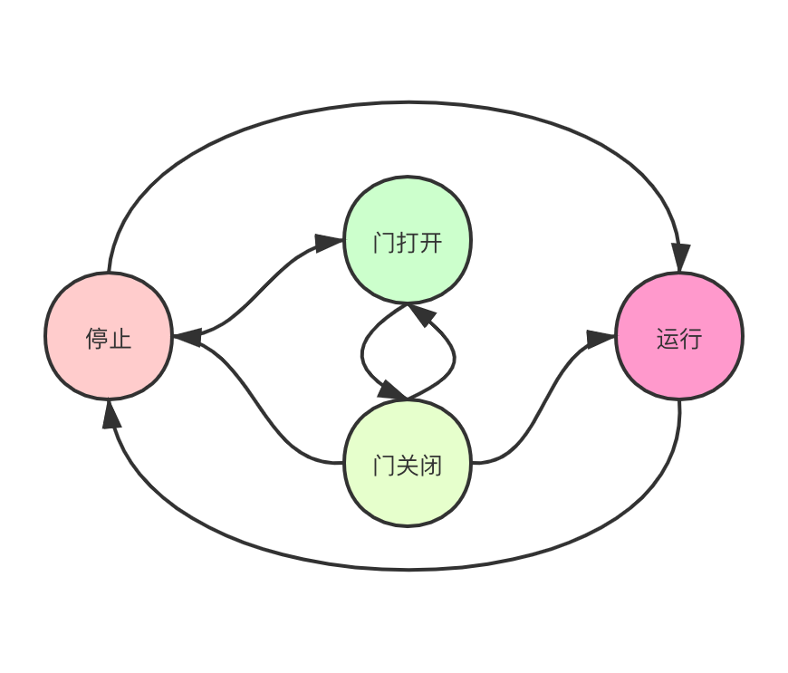
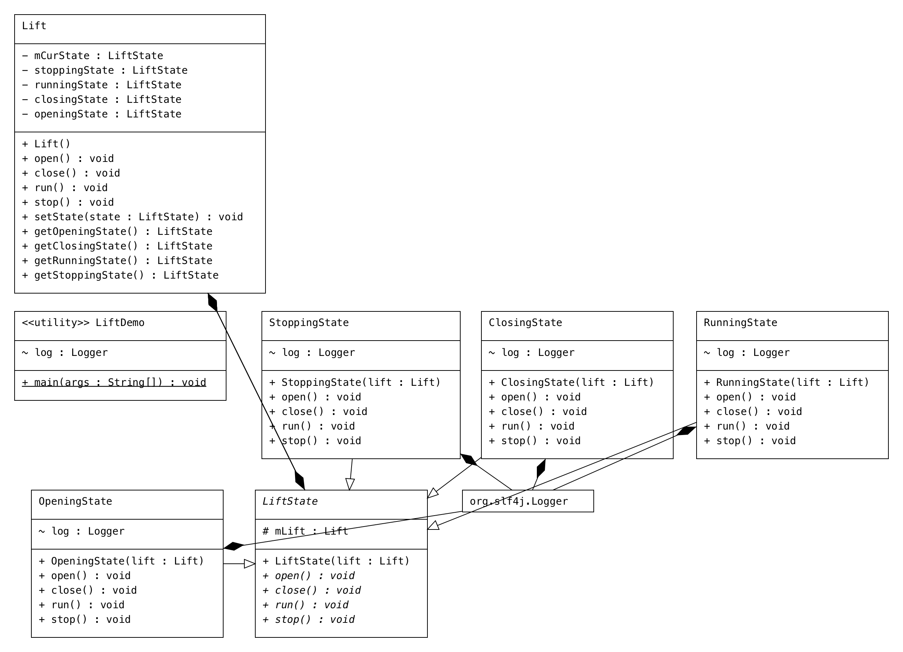

## 1 写在前面
状态机是一个很有启发性的设计模型，让人耳目一新。

本来最近实在搞`并发编程`的学习笔记，但是感谢小组内`邹老师`的状态机分享，就抄袭借鉴一下。

## 2 项目背景
有一个电梯，有四个状态：
- 门打开
- 门关闭
- 运行
- 停止

现在有一只`猴子`，能绝对的控制这个电梯。

请问你要怎么写代码，才能让这个电梯在`猴子`控制下，安全运行呢？

## 3 不好的方案
```java
if 电梯状态 == 运行：
    if 操作状态 == 打开：
        不允许
    if 操作状态 == 关闭：
        不允许
    if 操作状态 == 运行：
        do nothing，本来就是运行
    if 操作状态 == 停止：
        可以，让它停止

if 电梯状态 == 打开：
    if 操作状态 == 打开：
        do nothing，本来就是打开
    if 操作状态 == 关闭：
        不允许
    if 操作状态 == 运行：
        不允许
    if 操作状态 == 停止：
        不允许，条件不对，必然是先停止了才能打开，不能打开了再停
...
...
```
好多if else，好多switch case，如果只有`4`个状态还好，如果有`20`个状态，难道要写`400`个分支？
## 4 好的方案



先看结果：
```dtd

/Library/Java/JavaVirtualMachines/jdk1.8.0_131.jdk/Contents/Home/bin/java -javaagent:/Applications/IntelliJ IDEA CE.app/Contents/lib/idea_rt.jar=57655:/Applications/IntelliJ IDEA CE.app/Contents/bin -Dfile.encoding=UTF-8 -classpath /Library/Java/JavaVirtualMachines/jdk1.8.0_131.jdk/Contents/Home/jre/lib/charsets.jar:/Library/Java/JavaVirtualMachines/jdk1.8.0_131.jdk/Contents/Home/jre/lib/deploy.jar:/Library/Java/JavaVirtualMachines/jdk1.8.0_131.jdk/Contents/Home/jre/lib/ext/cldrdata.jar:/Library/Java/JavaVirtualMachines/jdk1.8.0_131.jdk/Contents/Home/jre/lib/ext/dnsns.jar:/Library/Java/JavaVirtualMachines/jdk1.8.0_131.jdk/Contents/Home/jre/lib/ext/jaccess.jar:/Library/Java/JavaVirtualMachines/jdk1.8.0_131.jdk/Contents/Home/jre/lib/ext/jfxrt.jar:/Library/Java/JavaVirtualMachines/jdk1.8.0_131.jdk/Contents/Home/jre/lib/ext/localedata.jar:/Library/Java/JavaVirtualMachines/jdk1.8.0_131.jdk/Contents/Home/jre/lib/ext/nashorn.jar:/Library/Java/JavaVirtualMachines/jdk1.8.0_131.jdk/Contents/Home/jre/lib/ext/sunec.jar:/Library/Java/JavaVirtualMachines/jdk1.8.0_131.jdk/Contents/Home/jre/lib/ext/sunjce_provider.jar:/Library/Java/JavaVirtualMachines/jdk1.8.0_131.jdk/Contents/Home/jre/lib/ext/sunpkcs11.jar:/Library/Java/JavaVirtualMachines/jdk1.8.0_131.jdk/Contents/Home/jre/lib/ext/zipfs.jar:/Library/Java/JavaVirtualMachines/jdk1.8.0_131.jdk/Contents/Home/jre/lib/javaws.jar:/Library/Java/JavaVirtualMachines/jdk1.8.0_131.jdk/Contents/Home/jre/lib/jce.jar:/Library/Java/JavaVirtualMachines/jdk1.8.0_131.jdk/Contents/Home/jre/lib/jfr.jar:/Library/Java/JavaVirtualMachines/jdk1.8.0_131.jdk/Contents/Home/jre/lib/jfxswt.jar:/Library/Java/JavaVirtualMachines/jdk1.8.0_131.jdk/Contents/Home/jre/lib/jsse.jar:/Library/Java/JavaVirtualMachines/jdk1.8.0_131.jdk/Contents/Home/jre/lib/management-agent.jar:/Library/Java/JavaVirtualMachines/jdk1.8.0_131.jdk/Contents/Home/jre/lib/plugin.jar:/Library/Java/JavaVirtualMachines/jdk1.8.0_131.jdk/Contents/Home/jre/lib/resources.jar:/Library/Java/JavaVirtualMachines/jdk1.8.0_131.jdk/Contents/Home/jre/lib/rt.jar:/Library/Java/JavaVirtualMachines/jdk1.8.0_131.jdk/Contents/Home/lib/ant-javafx.jar:/Library/Java/JavaVirtualMachines/jdk1.8.0_131.jdk/Contents/Home/lib/dt.jar:/Library/Java/JavaVirtualMachines/jdk1.8.0_131.jdk/Contents/Home/lib/javafx-mx.jar:/Library/Java/JavaVirtualMachines/jdk1.8.0_131.jdk/Contents/Home/lib/jconsole.jar:/Library/Java/JavaVirtualMachines/jdk1.8.0_131.jdk/Contents/Home/lib/packager.jar:/Library/Java/JavaVirtualMachines/jdk1.8.0_131.jdk/Contents/Home/lib/sa-jdi.jar:/Library/Java/JavaVirtualMachines/jdk1.8.0_131.jdk/Contents/Home/lib/tools.jar:/Users/ouyang/IdeaProjects/future/designDemo/target/classes:/Users/ouyang/.m2/repository/org/springframework/boot/spring-boot-starter-web/2.4.0/spring-boot-starter-web-2.4.0.jar:/Users/ouyang/.m2/repository/org/springframework/boot/spring-boot-starter/2.4.0/spring-boot-starter-2.4.0.jar:/Users/ouyang/.m2/repository/org/springframework/boot/spring-boot-starter-logging/2.4.0/spring-boot-starter-logging-2.4.0.jar:/Users/ouyang/.m2/repository/ch/qos/logback/logback-classic/1.2.3/logback-classic-1.2.3.jar:/Users/ouyang/.m2/repository/ch/qos/logback/logback-core/1.2.3/logback-core-1.2.3.jar:/Users/ouyang/.m2/repository/org/apache/logging/log4j/log4j-to-slf4j/2.13.3/log4j-to-slf4j-2.13.3.jar:/Users/ouyang/.m2/repository/org/apache/logging/log4j/log4j-api/2.13.3/log4j-api-2.13.3.jar:/Users/ouyang/.m2/repository/org/slf4j/jul-to-slf4j/1.7.30/jul-to-slf4j-1.7.30.jar:/Users/ouyang/.m2/repository/jakarta/annotation/jakarta.annotation-api/1.3.5/jakarta.annotation-api-1.3.5.jar:/Users/ouyang/.m2/repository/org/yaml/snakeyaml/1.27/snakeyaml-1.27.jar:/Users/ouyang/.m2/repository/org/springframework/boot/spring-boot-starter-json/2.4.0/spring-boot-starter-json-2.4.0.jar:/Users/ouyang/.m2/repository/com/fasterxml/jackson/core/jackson-databind/2.11.3/jackson-databind-2.11.3.jar:/Users/ouyang/.m2/repository/com/fasterxml/jackson/core/jackson-annotations/2.11.3/jackson-annotations-2.11.3.jar:/Users/ouyang/.m2/repository/com/fasterxml/jackson/core/jackson-core/2.11.3/jackson-core-2.11.3.jar:/Users/ouyang/.m2/repository/com/fasterxml/jackson/datatype/jackson-datatype-jdk8/2.11.3/jackson-datatype-jdk8-2.11.3.jar:/Users/ouyang/.m2/repository/com/fasterxml/jackson/datatype/jackson-datatype-jsr310/2.11.3/jackson-datatype-jsr310-2.11.3.jar:/Users/ouyang/.m2/repository/com/fasterxml/jackson/module/jackson-module-parameter-names/2.11.3/jackson-module-parameter-names-2.11.3.jar:/Users/ouyang/.m2/repository/org/springframework/boot/spring-boot-starter-tomcat/2.4.0/spring-boot-starter-tomcat-2.4.0.jar:/Users/ouyang/.m2/repository/org/apache/tomcat/embed/tomcat-embed-core/9.0.39/tomcat-embed-core-9.0.39.jar:/Users/ouyang/.m2/repository/org/glassfish/jakarta.el/3.0.3/jakarta.el-3.0.3.jar:/Users/ouyang/.m2/repository/org/apache/tomcat/embed/tomcat-embed-websocket/9.0.39/tomcat-embed-websocket-9.0.39.jar:/Users/ouyang/.m2/repository/org/springframework/spring-web/5.3.1/spring-web-5.3.1.jar:/Users/ouyang/.m2/repository/org/springframework/spring-webmvc/5.3.1/spring-webmvc-5.3.1.jar:/Users/ouyang/.m2/repository/org/springframework/spring-context/5.1.7.RELEASE/spring-context-5.1.7.RELEASE.jar:/Users/ouyang/.m2/repository/org/springframework/spring-aop/5.1.7.RELEASE/spring-aop-5.1.7.RELEASE.jar:/Users/ouyang/.m2/repository/org/springframework/spring-beans/5.1.7.RELEASE/spring-beans-5.1.7.RELEASE.jar:/Users/ouyang/.m2/repository/org/springframework/spring-core/5.1.7.RELEASE/spring-core-5.1.7.RELEASE.jar:/Users/ouyang/.m2/repository/org/springframework/spring-jcl/5.1.7.RELEASE/spring-jcl-5.1.7.RELEASE.jar:/Users/ouyang/.m2/repository/org/springframework/spring-expression/5.1.7.RELEASE/spring-expression-5.1.7.RELEASE.jar:/Users/ouyang/.m2/repository/org/springframework/amqp/spring-rabbit/2.1.8.RELEASE/spring-rabbit-2.1.8.RELEASE.jar:/Users/ouyang/.m2/repository/org/springframework/amqp/spring-amqp/2.1.8.RELEASE/spring-amqp-2.1.8.RELEASE.jar:/Users/ouyang/.m2/repository/org/springframework/retry/spring-retry/1.2.4.RELEASE/spring-retry-1.2.4.RELEASE.jar:/Users/ouyang/.m2/repository/org/springframework/spring-messaging/5.1.9.RELEASE/spring-messaging-5.1.9.RELEASE.jar:/Users/ouyang/.m2/repository/org/springframework/spring-tx/5.1.9.RELEASE/spring-tx-5.1.9.RELEASE.jar:/Users/ouyang/.m2/repository/junit/junit/4.12/junit-4.12.jar:/Users/ouyang/.m2/repository/org/hamcrest/hamcrest-core/1.3/hamcrest-core-1.3.jar:/Users/ouyang/.m2/repository/org/springframework/spring-test/5.1.7.RELEASE/spring-test-5.1.7.RELEASE.jar:/Users/ouyang/.m2/repository/org/projectlombok/lombok/1.18.16/lombok-1.18.16.jar:/Users/ouyang/.m2/repository/com/rabbitmq/amqp-client/5.3.0/amqp-client-5.3.0.jar:/Users/ouyang/.m2/repository/org/slf4j/slf4j-api/1.7.25/slf4j-api-1.7.25.jar:/Users/ouyang/.m2/repository/com/google/code/gson/gson/2.8.6/gson-2.8.6.jar:/Users/ouyang/.m2/repository/org/springframework/boot/spring-boot-autoconfigure/2.4.0/spring-boot-autoconfigure-2.4.0.jar:/Users/ouyang/.m2/repository/org/springframework/boot/spring-boot/2.4.0/spring-boot-2.4.0.jar lift.LiftDemo
objc[25974]: Class JavaLaunchHelper is implemented in both /Library/Java/JavaVirtualMachines/jdk1.8.0_131.jdk/Contents/Home/bin/java (0x108dac4c0) and /Library/Java/JavaVirtualMachines/jdk1.8.0_131.jdk/Contents/Home/jre/lib/libinstrument.dylib (0x10a5f14e0). One of the two will be used. Which one is undefined.
15:10:23.882 [main] INFO lift.LiftDemo - 尝试停止
15:10:23.895 [main] INFO lift.StoppingState - 电梯停止运行...
15:10:23.895 [main] INFO lift.LiftDemo - 尝试打开
15:10:23.895 [main] INFO lift.OpeningState - 电梯正在打开...
15:10:23.895 [main] INFO lift.LiftDemo - 尝试运行
15:10:23.905 [main] ERROR lift.LiftDemo - 
java.lang.IllegalThreadStateException: 电梯打开状态下，不可以让电梯运行!!
	at lift.OpeningState.run(OpeningState.java:24)
	at lift.Lift.run(Lift.java:29)
	at lift.LiftDemo.main(LiftDemo.java:24)
15:10:23.907 [main] INFO lift.LiftDemo - 尝试打开
15:10:23.909 [main] INFO lift.OpeningState - 电梯正在打开...
15:10:23.909 [main] INFO lift.LiftDemo - 尝试停止
15:10:23.909 [main] ERROR lift.LiftDemo - 
java.lang.IllegalThreadStateException: 电梯打开状态下，本来就是停止，哪能让电梯停止!!
	at lift.OpeningState.stop(OpeningState.java:29)
	at lift.Lift.stop(Lift.java:33)
	at lift.LiftDemo.main(LiftDemo.java:36)
15:10:23.909 [main] INFO lift.LiftDemo - 尝试运行
15:10:23.909 [main] ERROR lift.LiftDemo - 
java.lang.IllegalThreadStateException: 电梯打开状态下，不可以让电梯运行!!
	at lift.OpeningState.run(OpeningState.java:24)
	at lift.Lift.run(Lift.java:29)
	at lift.LiftDemo.main(LiftDemo.java:43)
15:10:23.910 [main] INFO lift.LiftDemo - 尝试关闭
15:10:23.910 [main] INFO lift.ClosingState - 电梯已经是关闭状态啦...
15:10:23.910 [main] INFO lift.LiftDemo - 尝试停止
15:10:23.910 [main] INFO lift.StoppingState - 电梯停止运行...

Process finished with exit code 0

```

核心类图如下：



给UML文盲普及下：

- <b> 空心三角箭头 </b>: 概念：泛化表示一个更泛化的元素和一个更具体的元素之间的关系。泛化是用于对继承进行建模的UML元素。在Java中，用extends关键字表示。
- <b>实线+实心菱形</b>: 则表示组合的关系。部分和整体的关系，并且生命周期是相同的。例如:人与手。

---

优点：
- <b>有限状态，不会笛卡尔乘积爆炸</b>
- <b>单一职责，互不干扰</b>

---

代码就不放太多了：
```
https://github.com/fatpo/future/tree/main/designDemo/src/main/java/lift
```