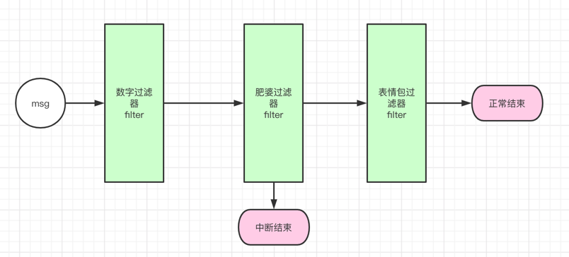

# 背景
推荐系统最近新开一个项目，可以逃离那恐怖的旧代码"屎山"了。

目前有如下需要的业务模块：
```dtd
流量降级：超过一定的 qps，直接走热度兜底

热度兜底：当新项目有需要的时候，并且配置的开关打开了，那么当返回空推荐时，返回热度数据。

用户缓存：当请求进来时，如果有缓存就处理下回去，没有缓存就正经走推荐逻辑。
```

之前的代码可能都是一条路莽夫，倒也好使，就是代码耦合度极其高，可读性很差，哎，每次读代码都要脑溢血。

借着这个新项目机会，觉得这个好像可以搞一波责任链试试看。

# 责任链demo


代码 demo：
```java

import java.util.ArrayList;
import java.util.List;

public class ChainOfResponsibility {
    public static void main(String[] args) {
        Msg msg = new Msg();
        msg.str = "hello world! fatpo! 996.icu!  - v -";

        FilterChain filterChain = new FilterChain();
        filterChain.addFilter(new DigitFilter())
            .addFilter(new FatpoFilter())
            .addFilter(new FaceFilter());
        filterChain.doFilter(msg);

        System.out.println(msg.str);
    }
}

class Msg {
    String str;
}

interface Filter {
    boolean doFilter(Msg msg);
}

/**
 * 过滤数字
 */
class DigitFilter implements Filter {
    @Override
    public boolean doFilter(Msg msg) {
        System.out.println("数字过滤器...");
        msg.str = msg.str.replaceAll("996", "855");
        return true;
    }
}

/**
 * 过滤表情
 */
class FaceFilter implements Filter {
    @Override
    public boolean doFilter(Msg msg) {
        System.out.println("表情过滤器...");
        msg.str = msg.str.replaceAll("- v -", "￥-￥");
        return true;
    }
}

/**
 * 过滤肥婆
 */
class FatpoFilter implements Filter {
    @Override
    public boolean doFilter(Msg msg) {
        System.out.println("肥婆过滤器...");
        // 出现肥婆，就中断责任链
        if (msg.str.contains( "fatpo")){
            msg.str = msg.str.replaceAll("fatpo", "肥婆");
            return false;
        }
        return true;
    }
}

class FilterChain  implements Filter{
    List<Filter> filters = new ArrayList<>();

    @Override
    public boolean doFilter(Msg msg) {
        for (Filter filter : filters) {
            if (!filter.doFilter(msg)) {
                return false;
            }
        }
        return true;
    }

    public FilterChain addFilter(Filter filter) {
        this.filters.add(filter);
        return this;
    }
}
```

# 推荐项目接入责任链

上面那个 demo 其实对我想要的业务需求，没什么卵用，真的打算接入的时候，spring 里面不好接入，失败。

不过我们项目的各种过滤器，确实用到了上面 demo 的责任链：
```dtd
曝光过滤 -> 最近推荐过滤 -> 正排过滤 -> 负反馈过滤 -> 业务方指定内容过滤 ...
```

代码和上面的 demo 大同小异，就不赘言。

我要的